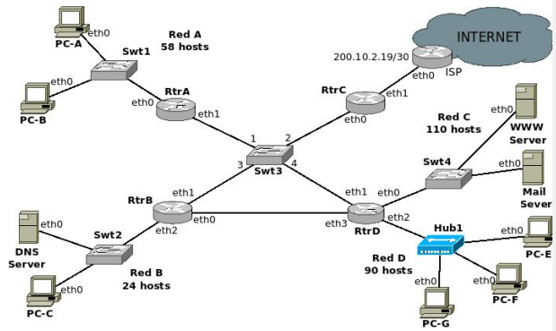
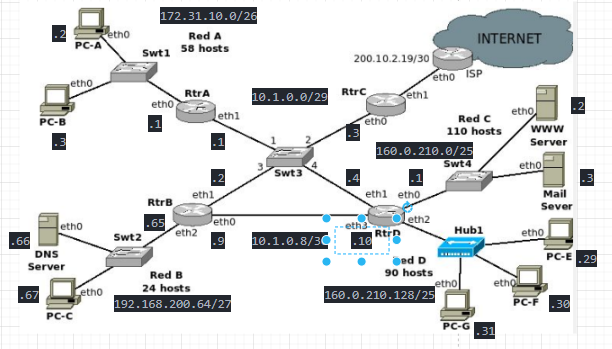
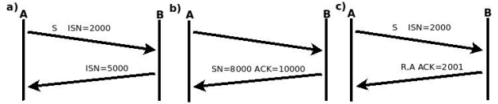

- TODAS las respuestas deben estar justificadas, caso contrario se considerarán incorrectas.
- En los ejercicios de subnetting se deberá justificar por qué se seleccionó cada red y deben dejarse expresados los cálculos o explicado el proceso para obtener el resultado. Debe ser posible llegar a todas las redes del gráfico (incluyendo los enlaces punto a punto).
- Salvo que se indique lo contrario todas las tablas ARP y de switch están vacías.
- El servidor de correo saliente para todos los dispositivos de la red es Mail Server y el DNS recursivo es DNS Server. DNS Server es, a su vez, el servidor de DNS autoritativo para el dominio.
- Indicar la MAC con el formato: MAC_NombreEquipo_Interface. Por ej.: MAC_RtrA_Eth0

# 1. Utilizando únicamente direcciones de los rangos que se muestran debajo, asignar IPs a las redes del gráfico anterior, desaprovechando la menor cantidad de direcciones posibles:

## a. Tener en cuenta las siguientes condiciones:

### i. Red A, clase B y privada.

### ii. Red B, clase C y privada.

### iii. Red C y D: clase B y pública.

## b. Redes entre routers, clase A y privada.

## c. Asignar IP a todos los dispositivos en cada red (asignar la primera IP disponible a las interfaces de los routers, siempre que sea posible):

- 224.1.0.0/24
- 198.10.10.64/26
- 172.32.0.64/26
- 10.1.0.0/27
- 192.168.200.64/26
- 172.31.10.0/24
- 160.0.210.0/23
- 240.10.0.128/25

En base a los puntos anteriores:
- 224.1.0.0/24 y 240.10.0.128/25 no las podemos usar porque son de clase D y clase E.

Para la Red A que debe ser de clase B y privada, debemos usar el segmento 172.31.10.0/24, que es un rango de direcciones IP privadas de clase B.
- Red A necesita 58 hosts, para eso necesitamos 6 bits de host (62 hosts posibles).
  - Dir. IP: 172.31.10.0/24 = 10101100 00011111 00001010 00000000
  - Mask: /24 = 11111111 11111111 11111111 00000000
  - New Mask: /26 = 11111111 11111111 11111111 11000000
- Nos quedaron 2 bits para subred, por lo tanto tenemos 4 subredes.
  - Red A -> 172.31.10.0/26
  - Libres -> 172.31.64/26, 172.31.10.128/26, 172.31.10.192/26

Para la Red B que debe ser de clase C y privada podemos usar el bloque 192.168.200.64/26, que es un bloque de direcciones privado y de clase C.
- Red B necesita 24 hosts, para eso necesitamos 5 bits de host (30 hosts posibles).
  - Dir. IP: 192.168.200.64/26 = 11000000 10101000 11001000 01000000
  - Mask: /26 = 11111111 11111111 11111111 11000000
  - New Mask: /27 = 11111111 11111111 11111111 11100000
- Nos quedó un bit para subred, por lo tanto tenemos 2 subredes.
  - Red B -> 192.168.200.64/27
  - Libre -> 192.168.200.96/27

Para la Red C, que debe ser de clase B y pública, podemos usar el bloque 160.0.210.0/23, que es un bloque de direcciones público y de clase B.
- Red C necesita 110 hosts, para eso usamos 7 bits de host (126 hosts posibles).
  - Dir. IP: 160.0.210.0/23 = 10100000 00000000 11010010 00000000
  - Mask: /23 = 11111111 11111111 11111110 00000000
  - New Mask: /25 = 11111111 11111111 11111111 10000000
- Nos quedaron 2 bits para subred, por lo tanto tenemos 4 subredes.
  - Red C -> 160.0.210.0/25
  - Libres -> 160.0.210.128/25, 160.0.211.0/25, 160.0.211.128/25

Para la Red D, que debe ser de clase B y pública, podemos usar alguno de los bloques libres que quedaron cuando se subneteó para la Red C, 160.0.210.128/25 por ejemplo.
- Red D necesita 90 hosts, para eso necesitamos 7 bits de host (126 hosts posibles).
- Como ese bloque ya ocupa los 7 bits de host, no es necesario alterar su máscara, por lo tanto solo se le asigna a la red D.
  - Red D -> 160.0.210.128/25

Para las redes entre los routers, que deben ser de clase A y privadas, podemos usar el bloque 10.1.0.0/27, ya que el bloque pertenece a la clase A y al rango de direcciones privadas para esa clase.
- Tenemos 2 redes entre routers, una con los 4 routers y una entre 2 routers.
  - Para la primera, necesitamos 3 bits de host (2^3 = 8 - 2 = 6 hosts posibles).
    - Dir IP: 10.1.0.0 = 00001010 00000001 00000000 00000000
    - Mask: /27 = 11111111 11111111 11111111 11100000
    - New Mask: /29 = 11111111 11111111 11111111 11111000
  - Nos quedaron 2 bits para subred, por lo tanto tenemos 4 subredes.
    - Red de 4 routers -> 10.1.0.0/29
    - Libres = 10.1.0.8/29, 10.1.0.16/29, 10.1.0.24/29
  - Para la segunda necesitamos 2 bits de host (2 hosts posibles). Partimos del bloque libre 10.1.0.8/29
    - Dir IP: 10.1.0.8 = 00001010 00000001 00000000 00001000
    - Mask: /29 = 11111111 11111111 11111111 11111000
    - New Mask: /30 = 11111111 11111111 11111111 11111100
  - Nos quedó 1 bit para subred, por lo tanto tenemos 2 subredes.
    - Red RtrB-RtrD -> 10.1.0.8/30
    - Libre -> 10.1.0.12/30

# 2. Armar la tabla de ruteo de los routers RtrC y RtrB, teniendo en cuenta:

## a. Entre Red B y Red D no debe pasar por Swt3 y entre Red B y Red C sí debe pasar.

## b. Sumarizar donde sea posible.

## c. Siempre que sea posible elegir el camino más corto (menos cantidad de routers).

RtrB:

| Dir. Destino | Mask | Next Hop | Iface |
|--------------|------|----------|-------|
| 10.1.0.8 | /30 | 0.0.0.0 | eth0 |
| 10.1.0.0 | /29 | 0.0.0.0 | eth1 |
| 192.168.200.64 | /27 | 0.0.0.0 | eth2 |
| 172.31.10.0 | /26 | 10.1.0.1 | eth1 |
| 160.0.210.0 | /25 | 10.1.0.4 | eth1 |
| 160.0.210.128 | /25 | 10.1.0.10 | eth0 |
| 0.0.0.0 | /0 | 10.1.0.3 | eth1 |

- No agrego 200.10.2.16/30 porque entra dentro de la default.

RtrC:

| Dir. Destino | Mask | Next Hop | Iface |
|--------------|------|----------|-------|
| 10.1.0.0 | /29 | 0.0.0.0 | eth0 |
| 200.10.2.19 | /0 | 0.0.0.0 | eth1 |
| 10.0.1.8 | /30 | 10.1.0.2 | eth0 |
| 172.31.10.0 | /26 | 10.1.0.1 | eth0 |
| 192.168.200.64 | /27 | 10.1.0.2 | eth0 |
| 160.0.210.0 | /24 | 10.1.0.4 | eth0 |
| 0.0.0.0 | /0 | 200.10.2.20 | eth1 |

- 160.0.210.0/24 sumariza 160.0.210.0/25 y 160.0.210.128/25

# 3. Suponiendo que todas las tablas están vacías y si PC-A desea acceder a la página web www.example.com.ar alojada en el WWW Server, responder:

## a. Indicar, en forma ordenada, todos los mensajes que serán enviados por RtrA. Para cada mensaje detallar los campos más importante de cada capa involucrada (Direcciones MAC, direcciones IPs, Puertos, Protocolos, etc).

Al principio, PC-A no conoce la IP de WWW Server, por lo tanto debe hacer una consulta DNS al DNS Server.
- El 1er mensaje que sería enviado por RtrA es la trama Ethernet con el ARP Request para saber la IP de RtrB.
  - Ethernet:
    - MAC Origen: MAC_RtrA_eth1
    - MAC Destino: FF:FF:FF:FF:FF:FF
    - ARP Request:
      - MAC Origen: MAC_RtrA_eth1
      - IP Origen: 10.1.0.1
      - MAC Destino: 00:00:00:00:00:00
      - IP Destino: 10.1.0.2
- Una vez que RtrA sabe la MAC de 10.1.0.2, los mensajes que envía son:
  - Ethernet:
    - MAC Origen: MAC_RtrA_eth1
    - MAC Destino: MAC_RtrB_eth1
  - IP:
    - IP Origen: 172.31.10.2
    - IP Destino: 192.168.200.66
  - UDP:
    - Puerto Origen: Uno no privilegiado, mayor a 1023
    - Puerto Destino: 53
  - DNS:
    - 'WWW Server' IN A

- Una vez que se sabe la IP de WWW Server, se procede a hacer el requerimiento HTTP, pero nuevamente, RtrA no sabe la MAC de RtrD (10.1.0.4), por lo que se debe hacer la consulta ARP.
  - Ethernet:
    - MAC Origen: MAC_RtrA_eth1
    - MAC Destino: FF:FF:FF:FF:FF:FF
    - ARP Request:
      - MAC Origen: MAC_RtrA_eth1
      - IP Origen: 10.1.0.1
      - MAC Destino: 00:00:00:00:00:00
      - IP Destino: 10.1.0.4
- Ahora RtrA sabe la MAC de 10.1.0.4, entonces, los mensajes que siguen son:
  - Ethernet:
    - MAC Origen: MAC_RtrA_eth1
    - MAC Destino: MAC_RtrD_eth1
  - IP:
    - IP Origen: 171.31.10.2
    - IP Destino: 160.0.210.2
  - TCP (suponiendo que es HTTP y no HTTPS, además que envía los segmentos del 3WH):
    - Puerto Origen: Mayor a 1023
    - Puerto Destino: 80
  - HTTP:
    - GET / HTTP1.0
    - ACCEPT: '*/*'
    - HOST: www.example.com.ar

## b. ¿Cómo quedaría la tabla de Swt3 una vez finalizado todo el proceso o sea cuando recibe lo solicitado?

| MAC | Port |
|-----|------|
| MAC_RtrA_eth1 | e1 |
| MAC_RtrB_eth1 | e3 |
| MAC_RtrD_eth1 | e4 |

## c. ¿Cómo quedaría la tabla ARP de RtrA una vez finalizado todo el proceso?

| MAC | IP |
|-----|----|
| MAC_RtrB_eth1 | 10.1.0.2 |
| MAC_RtrD_eth1 | 10.1.0.4 |

# 4. Para cada uno de los siguiente casos, responder:

## a. En a) completar la respuesta de host B indicando flags y número de ACK. ¿Qué parte de una sesión TCP se está ejecutando?

- Flags: SYN y ACK
- ACK = 2001
- Corresponde al 2do mensaje que se envía en el 3 Way-Handshake

## b. En b) completar número de secuencia y de ACK del segmento enviado por el host A si este le envió 100 bytes.

- SEQ = 9900, ACK = 8000, Len = 100

## c. En c), ¿qué es posible inferir en base a la respuesta de B?

- Es posible que en B no haya ningun proceso escuchando para en un puerto e IP a los que el host A se quiera conectar.

# 5. Si PC-B desea enviar un mail a pepe@gmail.com y sabiendo que su servidor de correo saliente está configurado con el nombre DNS, responda indicando registros DNS que consulta, respuesta recibida y si la misma es autoritativa o no. Justifique.

## a. Consultas realizadas y respuestas recibidas por PC-B.

- Consulta DNS: 'Mail Server' IN A
- Respuesta DNS: 'Mail Server' IN A 160.0.210.2

## b. Consultas realizadas y respuestas recibidas por MailServer.

Suponiendo que 'mail.gmail.com' es un servidor de correo de gmail que puede recibir mails.
- Consulta DNS: gmail.com IN MX
- Respuesta DNS: gmail.com IN MX 5 mail.gmail.com
- Consulta DNS: mail.gmail.com IN A
- Respuesta DNS: mail.gmail.com IN A [ip de mail.gmail.com]

## c. Si gmail.com tuviera más de un servidor de correo, ¿en base a qué elegirá MailServer a qué servidor enviar el correo destinado a pepe@gmail.com?

- Los registros MX tiene asignada una prioridad según el servidor de correo que representen. MailServer eligirá al servidor de correo que más prioridad tenga y que se encuentre disponible.

## d. Detalle puertos y protocolos utilizados en el proceso de envío y recepción de mail (sólo los protocolos correspondiente al envío de mail en capa de aplicación y los correspondiente en la capa de transporte, no es necesario indicar consultas DNS u otro protocolo que no se haya solicitado).

- PC-B envía el mail a MailServer a través del protocolo SMTP, en el puerto 25 con TCP.
- MailServer también con el protocolo SMTP en el puerto 25 con TCP, le envía el mail al servidor de correo de gmail.com 
- Para la recepción del mail:
  - Si el servidor de correo de google usa POP, usará el puerto 110 con TCP.
  - Si usa IMAP será el puerto 143 con TCP.

# 6. Responda V o F y justifique:

## a. Si en una red se tiene un HUB con varios puertos y se reemplaza ese dispositivo por un SWITCH, la cantidad de dominios de colisión aumentará. ✅

- Verdadero. El Switch, a diferencia del HUB, tiene un dominio de colisión por cada puerto.

## b. Si un servidor de correo no tiene demasiado espacio de almacenamiento es recomendable utilizar el protocolo IMAP para gestionar los correos. ❌

- Falso. IMAP consume muchos más recursos, ya que los mails por defecto no se descargan, además los usuarios pueden gestionar y crear directorios. Sería más apropiado usar POP, ya que este hace que los usuarios descargen los mails y los elimina del servidor.

## c. Los datos de la cabecera agregados por una capa serán analizados por todas las capas inferiores en el nodo destino. ❌

- Falso. Los datos de la cabecera agregados por X capa, serán analizados por la capa correspondiente en el otro extremo.

## d. En DNS, si la respuesta no es autoritativa no es posible asegurar que la información sea correcta. ✅

- Verdadero. Si la respuesta DNS no es autoritativa, es posible que haya venido desde la caché, podría pasar que la información de cierto dominio se actualize, y por lo tanto estar recibiendo información pasada hasta que su TTL venza.

## e. Una de las ventajas de HTTP 1.1 sobre HTTP 1.0 es que el servidor mantiene el estado de todas las sesiones con sus clientes. ❌

- Falso. HTTP es un protocolo stateless, lo que nos permite mantener un cierto registro de los usuarios son las cookies.
