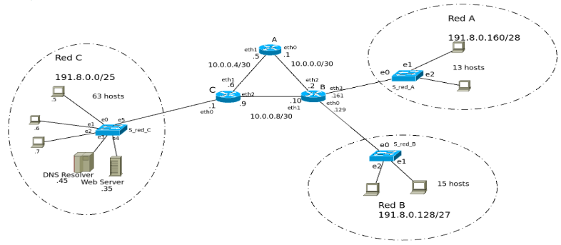
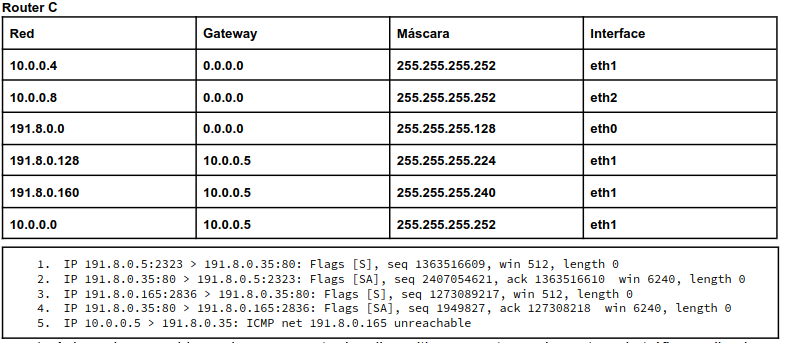
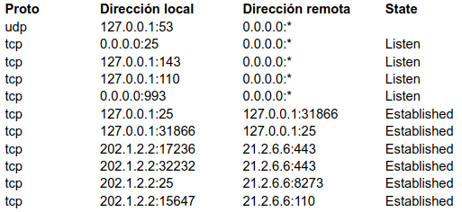
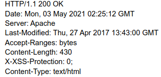

# 1. En base a la siguiente topología y la tabla de ruteo del router C, responder:

## a. Avisan de un problema de acceso entre los dispositivos y contamos la captura de tráfico realizada en el Web Server. Asumiendo que las IP están correctamente asignadas en los dispositivos de toda la topología, indique qué problemas podrían estar ocurriendo y cuáles serían las soluciones posibles.

- Podría ser que no exista una ruta válida entre 10.0.0.5 y 191.8.0.165, que 191.8.0.165 tenga una configuración en su firewall que bloquee las comunicaciones con 10.0.0.5, o podría ser un problema general de la red (enlace roto por ejemplo).
- Las soluciones serían revisar las tablas de ruteo para verificar si existe una ruta válida entre ambos hosts (en caso de no haber, realizar la configuración necesaria), revisar la configuración del firewall de 191.8.0.165 y/o verificar el estado general de la red y enlaces.

## b. Asumiendo que la red está funcionando correctamente, sin tener en cuenta lo evaluado en el punto a, indique de qué forma se podría reducir la tabla de ruteo del router C que se visualiza manteniendo el acceso a todas las redes.

- Si bien 191.8.0.128 y 191.8.0.160 comparten gateway e interfaz, no tienen la misma máscara. Por lo tanto no la puedo sumarizar
- 10.0.0.0 no porque no es consecutiva.
- Como no hay salida a internet, podemos reducir la tabla con un default gateway

| Red destino | Gateway | Máscara | Interface |
|-------------|---------|---------|-----------|
| 10.0.0.4 | 0.0.0.0 | 255.255.255.252 | eth1 |
| 10.0.0.8 | 0.0.0.0 | 255.255.255.252 | eth2 |
| 191.8.0.0 | 0.0.0.0 | 255.255.255.128 | eth0 |
| 0.0.0.0 | 10.0.0.5 | 0.0.0.0 | eth1 |

## c. La empresa decidió migrar únicamente los servidores de la Red C a una nueva red, Red D, conectada al router B usando alguna de las redes disponibles teniendo en cuenta que la dirección inicial a partir de la cual se realizó el subnetting es 191.8.0.0/23. Se debe asignar una de las redes libres de forma que se pueda aplicar CIDR en el router A desperdiciando la menor cantidad posible de direcciones y con la capacidad de asignar direcciónes IPs como máximo a 14 hosts.

### i. Indique la dirección de red que se asignará detallando el desarrollo para su obtención.

Tenemos 191.8.0.0/23
- La red C tenía 191.8.0.0/25, por lo que podemos deducir que necesitaba al menos 126 hosts. Por el subnneting aplicado, quedaron 4 subredes (contanto la asignada a Red C)
  - 191.8.0.0/25 -> Red C
  - 191.8.1.0/25 -> Libre
  - 191.8.0.128/25 -> Usada para subnetear para Red B
  - 191.8.1.128/25 -> Libre
- Ninguna de estas me sirve para aplicar CIDR en el Router A.

- La red B tiene 191.8.0.128/27, por la máscara, podemos deducir que dicha red necesitaba al menos de 30 hosts. Igual que antes, quedaron 4 subredes.
  - 191.8.0.128/27 -> Red B
  - 191.8.0.160/27 -> Usada para subnetear para Red A
  - 191.8.0.192/27 -> Libre
  - 191.8.0.224/27 -> Libre

- La Red A tiene 191.8.0.160/28, por la máscara, podemos deducir que dicha red necesitaba al menos de 14 hosts. Ahora quedaron 2 subredes.
  - 191.8.0.160/28 -> Red A
  - 191.8.0.176/28 -> Libre

Entonces, podríamos usar la red libre 191.8.0.176/28 que necesita 14 hosts, pero también tenemos que asignarle una dirección al router B, por eso me decanto por usar la red libre 191.8.0.192/27.

### ii. Realice tabla de ruteo del router A de forma que se pueda acceder a todas las redes por el camino más corto, indicando las redes que se simplificaron.

Sabiendo que la Red D está conectada al router B y que la Red C ya no está (migración hecha):

| Red Destino | Mask | Next Hop | IFace |
|-------------|------|----------|-------|
| 191.8.0.128 | /27 | 0.0.0.0 | eth0 |
| 10.0.0.8 | /30 | 0.0.0.0 | eth1 |
| 10.0.0.0 | /30 | 0.0.0.0 | eth2 |
| 191.8.0.160 | /28 | 0.0.0.0 | eth3 |
| 191.8.0.192 | /27 | 0.0.0.0 | eth4 |

# 2. ¿Cómo quedaría la tabla CAM del switch S_red_C luego del intercambio de la captura del webserver? (solo tener en cuenta los mensajes que se muestran en la captura)

Después de los 5 mensajes, la tabla CAM del switch s_red_c quedaría:

| MAC | Port |
|-----|------|
| MAC_191.8.0.5 | e0 |
| MAC_Web_Server | e4 |
| MAC_router_C | e5 |

# 3. Se desea agregar un servicio de mail para los usuarios de todas las redes. Para asegurarse un buen servicio se agregarán 2 servidores de mail.

## a. Indique todos los registros que se deberán agregar en el servidor de DNS teniendo en cuenta que el dominio es campeones.com y los servidores mailreda.campeones.com (principal) se encuentra en la red D y alt1.mailreda.campeones.com (secundario) en la red A.

## b. Al momento que el cliente desea recibir sus mails el servicio deberá cumplir con los siguientes requisitos: no guardar copia de los mails en el servidor por defecto, permitir enviar correos cifrados. Indique cuál es el protocolo elegido.

Teniendo en cuenta los puntos mencionados en A y B:
- Vamos a usar POP (podría ser IMAP, ya que no se menciona nada si debe gestionar carpetas, consumir menos recursos, etc.), por defecto tendrá la opción de descargar y borrar, pero también estará disponible la opción de descargar y guardar.
- Vamos a usar SMTP pero con TLS/SSL para enviar correos cifrados (STARTTTLS).

Los registros DNS que tendríamos serían:

- campeones.com IN MX 5 mailreda.campeones.com
- campeones.com IN MX 10 alt1.mailreda.campeones.com
- mailreda.campeones.com IN A 191.8.0.197
- alt1.mailreda.campeones.com IN A 191.8.0.165

# 4. Teniendo en cuenta la tabla de ruteo y captura que se muestran en el punto 1, y asumiendo que desde el router B se accede a la Red C por router C, indique qué evento/s de la captura producirán tráfico ARP entre los routers B y C y cuáles serían los ARP Request (indicar datos de Ethernet y ARP) enviados.

- Los eventos que producirán tráfico ARP entre el router B y el router C son: 3 y 4.
- (3) 191.8.0.165 -> 191.8.0.35 (ARP Request):
  - Ethernet:
    - MAC Origen: MAC_RouterB_eth1
    - MAC Destino: FF:FF:FF:FF:FF:FF
  - ARP Request.
    - MAC Origen: MAC_RouterB_eth1
    - IP Origen: 10.0.0.10
    - MAC Destino: 00:00:00:00:00:00
    - IP Destino: 10.0.0.9
- (4) 191.8.0.35 -> 191.8.0.165 (ARP Request):
  - Ethernet:
    - MAC Origen: MAC_RouterC_eth2
    - MAC Destino: FF:FF:FF:FF:FF:FF
  - ARP Request:
    - MAC Origen: MAC_RouterC_eth2
    - IP Origen: 10.0.0.9
    - MAC Destino: 00:00:00:00:00:00
    - IP Destino: 10.0.0.10

# 5. En base a la siguiente salida de un comando ejecutado en PC-A, seleccione las opciones verdaderas.

## a. Si otra PC en la red de PC-A envía un segmento a PC-A con el flag SYN y puerto destino 110, recibirá como respuesta un RST/ACK. ✅

## b. La PC-A tiene establecida una conexión IMAP. ✅

## c. La PC-A tiene establecida una conexión POP. ✅

## d. Hay un total de 6 conexiones TCP establecidas.

## e. La PC-A tiene la IP 127.0.0.1 ✅

## f. La PC-A tiene la IP 21.2.6.6

# 6. En base a la salida completa, seleccione una o más de una respuesta correcta:

## a. Se utilizó el método HEAD para realizar la consulta.

## b. Si la consulta hubiese llevado la cabecera “If-Modified-Since: Thu, 29 Apr 2017 17:31:00 GMT” el servidor habría respondido con el código “HTTP/1.1 304 Not Modified”. ✅

## c. Tiene un total de 8 cabeceras.

## d. Se utilizó el método GET para realizar la consulta. ✅

## e. La respuesta incluye el recurso solicitado. ✅

## f. El servidor solo devolvió los encabezados de la página.

# 7. Indique cuáles de las siguientes opciones son correctas en relación a IPv6.

## a. La dirección ff00::4437:39ff:fe65:f518 es una dirección IPv6 válida para asignar a un servidor web que deba ser accesible en Internet.

## b. La dirección ::/128 hace referencia a la máquina local (localhost). ✅

## c. El checksum en IPv6 permite detectar errores en un paquete.

## d. El protocolo Neighbour Discovery requiere ICMPv6 para funcionar. ✅

## e. Es posible comunicar dos redes IPv6 por medio de una red IPv4. ✅