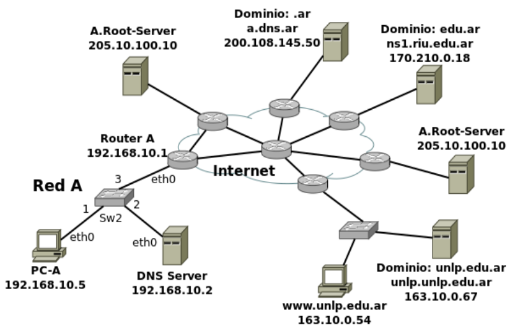
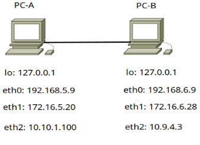
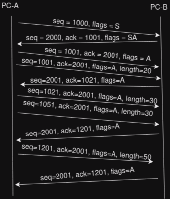
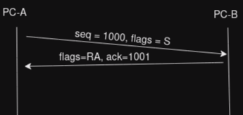
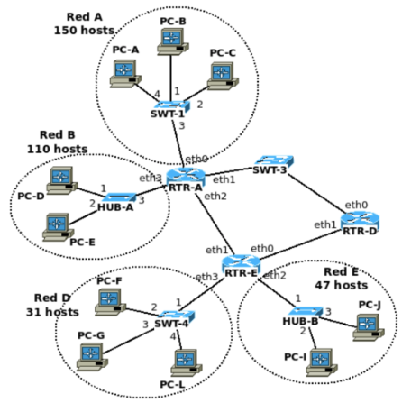

# 1. Dada la siguiente topología y considerando que

- DNS Server es resolver solo para su red.
- unlp.unlp.edu.ar es resolver solo para su red y autoritativo para el espacio de nombres unlp.edu.ar.
- El resto de servidores DNS son solo autoritativos para los dominios que indican

## a. El servidor unlp.unlp.edu.ar perdió conectividad con Internet. PC-A accede mediante un navegador a www.unlp.edu.ar.

### i. ¿Qué respuestas TCP y HTTP obtendrá PC-A por parte del servidor?

- No obtendría respuestas HTTP ni TCP, ya que unlp.unlp.edu.ar está sin internet, es decir, ni siquiera podría hacer la resolución del nombre "www.unlp.edu.ar" (salvo que DNS Server tenga la IP en caché, pero al comienzo del parcial dice que todo está vacío).

### ii. ¿Podría obtenerse de algún servidor DNS información autoritativa sobre el nombre unlp.edu.ar?

- Podría si es que tienen cacheada la respuesta, sino no, ya que el único servidor DNS autoritativo para ese dominio es "unlp.unlp.edu.ar" (que justamente se quedó sin conectividad con Internet).

## b. El servidor unlp.unlp.edu.ar recuperó conectividad con Internet y se plantean mejoras a las que deberá indicar qué modificaciones son necesarias realizar tanto en la topología como las configuraciones (de red y registros DNS):

### i. Incorporar en la Red A un segundo servidor DNS autoritativo para unlp.edu.ar.

Notación: Las redes son privadas, pero es un error del examen, no prestarle atención a ese detalle.

- Para agregar un servidor DNS autoritativo para unlp.edu.ar en la Red A es necesario agregar un NS y un A al servidor autoritativo ns1.riu.edu.ar (autoritativo de edu.ar) y al servidor unlp.unlp.edu.ar
- Los registros en concreto serían:
  - unlp.edu.ar IN NS unlpseg.unlp.edu.ar
  - unlpseg.edu.ar IN A 192.168.10.3
- Le asignaría la dirección IP 192.168.10.3 en la Red A.

### ii. Incorporar en la misma red un servidor de correo saliente que será utilizado por la aplicación www.unlp.edu.ar.

Como el servidor de correo es únicamente saliente, basta con declarar un registro A.
- mail.unlp.edu.ar IN A 192.168.10.4
- Le asignaría la dirección IP 192.168.10.4 de la Red A. 

### iii. Incorporar en la misma red dos servidores (mail-uno y mail-dos) de correo entrante para los usuarios del dominio unlp.edu.ar. Mail-dos debe recibir los correos solo si mail-uno se encuentra fuera de servicio.

Los registros DNS que debería declarar son:
- unlp.edu.ar IN MX 5 mail-uno.unlp.edu.ar
- unlp.edu.ar IN MX 10 mail-dos.unlp.edu.ar
- mail-uno.unlp.edu.ar IN A 192.168.10.6
- mail-dos.unlp.edu.ar IN A 192.168.10.7

### iv. Ayudar a servidores de correo de otros dominios a identificar servidores de correo autorizados para el envío de correo bajo el dominio unlp.edu.ar.

- Para esto es necesario declarar un registro SPF donde se declaren estos servidores de correo que serán los autorizados para el envío de correos bajo el dominio.

# 2. PC-A y PC-B disponen de múltiples adaptadores de red configuradas con una IP y la máscara de clase. Cada adaptador físico PC-A está conectado directamente con un cable a su respectivo PC-B. Adicionalmente tenemos los siguientes ejecutables que implementan un cliente y servidor TCP:

- cliente.exe: acepta los parámetros -s <ip_servidor> -p <puerto_servidor>
- servidor.exe: acepta los parámetros -l <ip_escucha> -p <puerto_servidor>

## a. Indique todas las posibilidades en las que puede ejecutar tanto el cliente como el servidor en PC-A utilizando el puerto 3306 como puerto_escucha sin que sea alcanzable por PC-B.

- `servidor.exe -l 127.0.0.1 -p 3306`
- `cliente.exe -s 127.0.0.1 -p 3306` 

## b. PC-B está ejecutando el servidor utilizando -p 80 y en -l se indicó la primera dirección alcanzable por PC-A.

- La conexión iniciada por PC-A (ISN: 1000) a PC-B (ISN: 2000).
- PC-A envía un segmento con 20 bytes.
- PC-B reconoce el segmento de 20 bytes
- PC-A envía dos segmentos de 30 bytes.
- PC-B responde reconociendo el segmento nuevamente el segmento de 20 bytes.
- PC-A envía un segmento de 50 bytes.
- PC-B responde reconociendo el segmento nuevamente el segmento de 20 bytes.

Haga un diagrama en el que se refleje el flujo de intercambios, indicando (seq, ack, flags, length). Y
explique qué suceso está ocurriendo en la red ¿en que parte de la comunicación ubicaría el problema?.

- El problema de la comunicación empieza después de que PC-A envía los dos segmentos de 30 bytes. Al parecer nunca llegan (o llegan mal) a PC-B. Parecería que hay algún problema de congestión en la red, ya que PC-B sigue pidiendo el siguiente segmento.

## c. Haga un diagrama en el que se refleje el flujo de intercambios en el que PC-A envía un segmento a PC-B al puerto 88 en el que ningún proceso está escuchando.

# 3. La siguiente organización dispone de dos bloques de direcciones libres: el primero es 190.10.2.0/23 y solo en caso agotarse disponible de un segundo bloque de direcciones 180.0.0.0/26. Asigne direcciones a todas las redes utilizando VLSM.

La red A necesita 150 hosts. Para abarcar eso necesitamos de 8 bits (254 hosts posibles). Partimos del segmento dado 190.10.2.0/23

- Dir. IP: 190.10.2.0 = 10111110 00001010 00000010 00000000
- Mask: /23 = 11111111 11111111 11111110 00000000
- New Mask: /24 = 11111111 11111111 11111111 000000000

Nos quedó un bit para subred, por lo tanto tenemos 2 subredes.

- Red A -> 190.10.2.0/24
- Libre -> 190.10.3.0/24

La Red B necesita 110 hosts. Para abarcar eso necesitamos de 7 bits (126 hosts posibles). Partimos de la subred que nos quedó libre 190.10.3.0/24

- Dir. IP: 190.10.3.0 = 10111110 00001010 00000011 00000000
- Mask: /24 = 11111111 11111111 11111111 00000000
- New Mask: /25 = 11111111 11111111 11111111 10000000

Nos quedó un bit para subred, por lo tanto tenemos 2 subredes.

- Red B -> 190.10.3.0/25
- Libre -> 190.10.3.128/25

La Red E necesita 47 hosts, para eso necesitamos 6 bits (62 hosts posibles). Partimos de la subred que nos quedó libre 190.10.3.128/25

- Dir. IP: 190.10.3.128 = 10111110 00001010 00000011 10000000
- Mask: /25 = 11111111 11111111 11111111 10000000
- Mask: /26 => 11111111 11111111 11111111 11000000

Nos quedó un bit para subred, por lo tanto tenemos 2 subredes.

- Red E -> 190.10.3.128/26
- Libre -> 190.10.3.192/26

La Red D necesita 31 hosts, para eso necesitamos también 6 bits. Como ya tenemos la subred 190.10.3.192/26 que usa 6 bits para host, no necesitamos subnetear y directamente se la asignamos a la Red D.

- Red D -> 190.10.3.192/26

Tenemos 3 redes punto a punto entre routers. Como el segmento inicial se terminó, usamos el segmento 180.0.0.0/26. Las redes punto a punto requieren de 2 hosts, para eso usamos 2 bits de host (2 hosts posibles).

- Dir. IP: 180.0.0.0 = 10110100 00000000 00000000 00000000
- Mask: /26 = 11111111 11111111 11111111 11000000
- New Mask: /30 = 11111111 11111111 11111111 11111100

Nos quedaron 4 bits de subred, por lo tanto tenemos 16 subredes.

- RTR-A & RTR-D -> 180.0.0.0/30
- RTR-A & RTR-E -> 180.0.0.4/30
- RTR-D & RTR-E -> 180.0.0.8/30
- Libres:
  - 180.0.0.12/30
  - 180.0.0.16/30
  - 180.0.0.20/30
  - ...
  - 180.0.0.52/30
  - 180.0.0.56/30
  - 180.0.0.60/30

# 4. Sobre el mismo gráfico del ejercicio 3, escriba la tabla de ruteo de RTR-E.

- El tráfico hacía y desde Red B no debe pasar por RTR-D.
- El tráfico hacía y desde Red A debe pasar por RTR-D.

| Red Destino | Mask | Next Hop | Iface |
|-------------|------|----------|-------|
| 190.10.3.128 | /26 | 0.0.0.0 | eth2 |
| 190.10.3.192 | /26 | 0.0.0.0 | eth3 |
| 180.0.0.4 | /30 | 0.0.0.0 | eth1 |
| 180.0.0.8 | /30 | 0.0.0.0 | eth0 |
| 190.10.2.0 | /24 | 180.0.0.9 | eth0 |
| 190.10.3.0 | /25 | 180.0.0.5 | eth1 |
| 180.0.0.0 | /30 | 180.0.0.9 | eth0 | 

# 5. Sobre el mismo gráfico del ejercicio 3, indique:

## a. Cantidad de dominios de broadcast y de colisión.

- Dominios de broadcast: 7
- Dominios de colisión: 14

## b. PC-D envía un PING satisfactorio a PC-G. Enumere todos los mensajes recibidos por PC-E durante el evento mencionado

- Si contamos tanto el Echo Request como el Echo Reply, PC-E recibirá 2 mensajes.

## c. PC-B envía un PING a PC-F. Indique los campos de capa de red (origen y destino) y de enlace (origen y destino) cuando el mensaje sale de RTR-A.

- Campos de Capa de Red:
  - Dirección IP origen: PC-B_IP
  - Dirección IP destino: PC-F_IP
- Campos de Capa de Enlace:
  - Dirección MAC origen: MAC_RTR-A_eth2
  - Dirección MAC destino: FF:FF:FF:FF:FF:FF
  - Pongo la MAC de broadcast porque el enunciado dice que al principio las tablas están vacías. Después del ARP Request y ARP Reply si iría la MAC de RTR-D eth1.

# 6. Indique verdadero o falso para cada una de las siguientes afirmaciones.

## a. Un nodo con una dirección IP 180.10.80.68/26 y con su default gateway 180.10.80.127 no puede navegar en Internet

✅

## b. Al pertenecer a la familia de estándares 802.11, un dispositivo wireless se puede comunicar directamente con un dispositivo Ethernet

✅

## c. En IPv6 no es necesario usar ARP porque eso se resuelve con el uso de la direcciones de link-local.

❌
