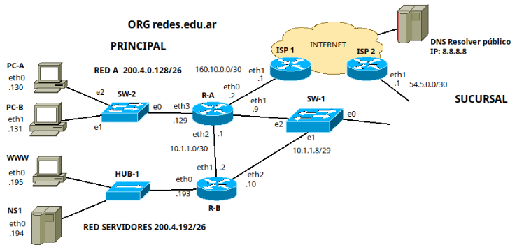

- Al comenzar cada ejercicio todas las tablas de caché, arp, cam… están vacías salvo que se indique lo contrario.
- Todas las respuestas deberán ser debidamente justificadas. En cualquier otro caso serán consideradas incorrectas. La justificación debe constar de información que demuestre dominio del área.
- El parcial debe realizarse con lapicera.

# 1. Diseñar la red de la sucursal, indicando dispositivos y direccionamiento, siguiendo los lineamientos indicados debajo.

- Dispone de la red 50.0.0.0/16.
- Se requieren dos redes "Red B” y “Servidores Sucursal”, ambas de 62 hosts.
- Habrá una conexión a la Sede Principal mediante SW-1-e0.
- NS1 es el DNS autoritativo para el dominio redes.edu.ar, no hace recursión.

Partiendo del bloque 50.0.0.0/16, necesitamos 2 redes de 62 hosts cada una. Para eso, necesitamos 6 bits de host (62 hosts posibles).
- Dir. IP: 50.0.0.0 = 00110010 00000000 00000000 00000000
- Mask: /16 = 11111111 11111111 00000000 000000000
- New Mask: /26 = 11111111 11111111 11111111 11000000

Entonces, tenemos 6 bits para host y nos quedaron 10 bits para subred, por lo tanto tenemos 1024 subredes.
- Red B -> 50.0.0.0/26
- Servidores Sucursal -> 50.0.0.64/26
- Libres -> 50.0.0.192/16 ... 50.0.255.192/26

La topología quedaría de la siguiente forma:

# 2. Escriba las rutas incluídas en R-A para alcanzar todas las redes. Siempre que sea posible, sumarizar y utilizar los caminos más cortos.

## a. Suponiendo que todos los enlaces están activos.

| Dir. Destino | Mask | Next Hop | IFace |
|--------------|------|----------|-------|
| 160.10.0.0 | /30 | 0.0.0.0 | eth0 |
| 10.1.1.8 | /29 | 0.0.0.0 | eth1 |
| 10.1.1.0 | /30 | 0.0.0.0 | eth2 |
| 200.4.0.128 | /26 | 0.0.0.0 | eth3 |
| 200.4.0.192 | /26 | 10.1.1.2 | eth2 |
| 54.5.0.0 | /30 | 10.1.1.10 | eth1 |
| 50.0.0.0 | /25 | 10.1.1.10 | eth1 |

- La entrada 50.0.0.0/25 sumariza las redes 50.0.0.0/26 y 50.0.0.64/26

## b. Sólo los cambios que considere necesarios si la interfaz eth1 de R-A se desactiva.

| Dir. Destino | Mask | Next Hop | IFace |
|--------------|------|----------|-------|
| 160.10.0.0 | /30 | 0.0.0.0 | eth0 |
| 10.1.1.8 | /29 | 10.1.1.2 | eth2 |
| 10.1.1.0 | /30 | 0.0.0.0 | eth2 |
| 200.4.0.128 | /26 | 0.0.0.0 | eth3 |
| 200.4.0.192 | /26 | 10.1.1.2 | eth2 |
| 54.5.0.0 | /30 | 10.1.1.2 | eth2 |
| 50.0.0.0 | /25 | 10.1.1.2 | eth2 |

# 3. En base a la siguiente salida completa en PC-A responder y justificar en todos los casos.

## a. Con los datos en las cabeceras completar el comando curl.

`curl -X GET -v https://www.info.unlp.edu.ar/index.html`

## b. Teniendo en cuenta los protocolos intervinientes, ¿Qué protocolo de capa de aplicación fue el primero en salir? ¿Qué información fue solicitada? ¿Y cuál fue la respuesta recibida?

- El primer protocolo de la capa de aplicación es salir es DNS, ya que primero se debe consultar la dirección IP de www.info.unlp.edu.ar
- La información que solicita, justamente, es la IP del nombre www.info.unlp.edu.ar
- La respuesta recibida es la dirección IP de www.info.unlp.edu.ar, esto es así porque después se hace el requerimiento HTTP.

## c. En base a la respuesta recibida por el comando, ¿se obtuvo el recurso solicitado?

- No, no se obtuvo el recurso solicitado. Lo que se obtuvo fue una respuesta HTTP 301 diciendo que el recurso solicitado no está en la URL especificada.

## d. Con la información disponible, ¿es posible deducir si la conexión es persistente o no?

- Si, la conexión es persistente. Como podemos ver, se uso HTTP/1.1, donde las conexiones son persistentes por defecto.

# 4. Dada la salida del comando ss, responda y justifique las preguntas.

## a. ¿Cuántas conexiones establecidas hay? ¿En cuáles actúa como servidor y en cuáles como cliente?

- En total tenemos 5 conexiones. Si bien la conexión 211.10.2.2:37610 con 211.10.2.2:38696 aparece dos veces, al final se trata de la misma conexión pero desde ambos sentidos, ya que es en el mismo host.
- En una conexión hace de servidor (la conexión que aparece dos veces en la sálida del ss)

## b. ¿Qué respuesta dará al recibir un segmento TCP desde otro host en la misma red, al puerto 993 con el flag S seteado?

- La respuesta que recibiría ese otro host en la misma red sería un segmento TCP con los flags SYN y ACK activados.

## c. ¿Qué respuesta dará al recibir un datagrama UDP desde otro host en la misma red con destino al puerto 53?

- La respuesta que recibiría ese otro host en esa misma red es un mensaje ICMP Port Unreacheable, ya que no hay un proceso escuchando en el socket UDP puerto 53 con la IP del host que estamos viendo (hay uno escuchando pero en la dirección de Loopback, que no cuenta).

## d. ¿Qué respuesta dará al recibir un segmento TCP desde otro host en la misma red al puerto 8080 con el flag S seteado?

- Parecido al caso anterior. Si bien hay un proceso escuchando en el puerto 8080 con TCP, lo hace con la dirección de loopback, para que el otro host de la misma red se pueda conectar, un proceso debería estar escuchando en 8080 pero con la IP del host desde que estamos viendo la salida del comando `ss` (0.0.0.0).
- La respuesta que recibiría es un segmento TCP con los flags RST y ACK seteados.

# 5.

## a. Si PC-A tiene un valor de ISN=10000 (ISN=Número de secuencia inicial), ¿cómo quedarían las cabeceras TCP de los mensajes que enviaría PC-A en un saludo de 3 vías? (Defina Ud. los valores usados por el otro extremo)

Partiendo de que WWW tiene un ISN de 2999:

## b. Complete el siguiente gráfico con los valores correspondiente:

Quedaría de la siguiente forma:

# 6. Teniendo en cuenta las comunicaciones salientes de PC-A cuando ingresa mediante navegador a un sitio alojado en WWW, indique el contenido ARP request y ARP reply de la primera comunicación saliente luego de pasar por el primer router.

Partiendo de que PC-A no conoce la dirección IP del sitio alojado en WWW, y entonces debe hacer la consulta DNS al resolver público.

- Ethernet:
  - MAC Origen: MAC_R-A_eth0
  - MAC Destino: FF:FF:FF:FF:FF:FF
  - ARP Request
    - MAC Origen: MAC_R-A_eth0
    - IP Origen: 160.10.0.2
    - MAC Destino: 00:00:00:00:00:00
    - IP Destino: 160.10.0.1
- Ethernet:
  - MAC Origen: MAC_ISP1_eth1
  - MAC Destino: MAC_R-A_eth0
  - ARP Reply
    - MAC Origen: MAC_ISP1_eth1
    - IP Origen: 160.10.0.1
    - MAC Destino: MAC_R-A_eth0
    - IP Destino: 160.10.0.2

# 7. En una de las redes de la topología están experimentando problemas de red, específicamente el administrador notó un exceso de colisiones en la red. Considere sólo la topología de la organización base, sin lo que incluyó posteriormente.

## a. ¿Cuántos dominios de colisión hay en la topología?

- Considerando la topología inicial, tenemos 10 dominios de colisión (contando también los enlaces sueltos de ISP2 y SW-1)

## b. ¿Qué opción/es se le ocurre para resolver el problema?

- Podríamos cambiar el HUB-1 de la red de servidores por un switch.

## c. Para la acción que decidió tomar en la respuesta b) ¿afectó en la cantidad de dominios de broadcast y colisión de la topología?. Explique en términos cuantitativos.

- Si, a diferencia del HUB, el switch divide dominios de colisión pero no de broadcast (ese número no cambia). Pasaríamos a tener 12 dominios de colisión.

# 8. Responder V o F y justificar en ambos casos

## A. A menos que PC-A le dirija tráfico a PC-B, PC-B no podrá ver tráfico de ningún protocolo que provenga de PC-A. ✅

- Verdadero, esto sucedería en el caso de tener un HUB en lugar de un switch, pero ojo, PC-B podrá ver los ARP Request que se envíen.

## B. Durante una comunicación TCP, una vez que una parte finaliza la comunicación con FIN, no pueden enviarse más datos en ningún sentido. ❌

- Falso. Si uno de los extremos envía un segmento con el flag FIN, la conexión se cierra desde ese extremo, o sea, ese extremo no enviará más datos.

## C. El protocolo 802.11 utilizado para WIFI utiliza siempre 4 direcciones MAC. ❌

- No siempre. Cuando la comunicación se da entre dos SP, si se usan 4 direcciones MAC, pero si es entre dos nodos cualquieras o un nodo cualquiera y un SP, se usan 3 direcciones MAC.

## D. “::” es una dirección IPv6 válida, utilizada para referenciar a la dirección de loopback. ✅

- Verdadero, también es anotada como "::1/128"
