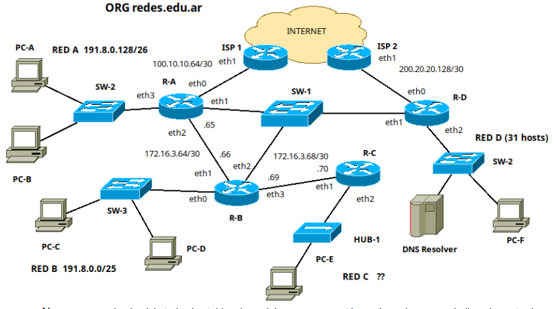
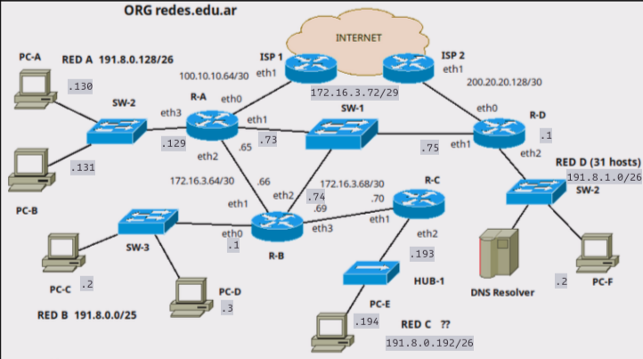
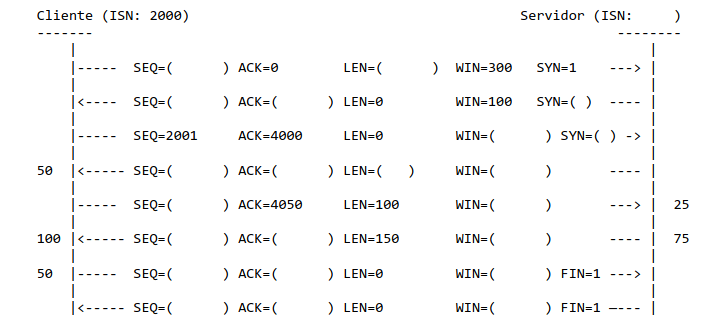
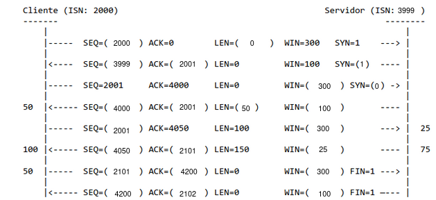

# Considerando las siguientes precondiciones siempre que sea posible cumplirlas:

- Todos los routers utilizan los caminos más cortos a excepción de los casos que se indiquen.
- Red A sale a internet vía ISP-1 y Red B, Red C y Red D via ISP-2.
- El tráfico entre Red A y Red D pasa por R-B.
- La organización dispone las redes 191.8.0.0/20 reservada para las redes de oficinas y la red 172.16.3.64/25 reservada para las redes entre entre dispositivos de red.

# 1. Completar el diseño de la red.

## A. Red C y D. Para ambos casos considerar desperdiciar la menor cantidad de direcciones posible y en especial para red C debe utilizarse una red que permita sumarizar las Redes A, B y C en la tabla de rutas de R-D. Indicar cómo quedaría dicha entrada en la tabla de R-D luego de la sumarización completa.

- Partiendo de la primisa de que para las redes de oficina se usa el bloque 191.8.0.0/20, y la Red B tiene el segmento 191.8.0.0/25 y la Red A el segmento 191.8.0.128/26
- Según las redes (basandome en sus máscaras), 191.8.0.128/26 usa 6 bits de host y uno para subred.
  - Mi justificación de que se usa un solo bit de subred es porque se usa el bloque 191.8.0.0/20, primero se segmento la Red B (podría tener más hosts) y se uso 191.8.0.0/25. Después se uso el segmento libre 191.8.0.128/25 para subnetear para Red A.
- Entonces, partiendo del segmento libre 191.8.0.192/26, segmentamos para Red C. Como no tenemos un indicio de la cantidad de hosts que esta red necesita, directamente podríamos asignarle ese segmento.
- Además, con esta asignación de las redes A, B y C, podemos sumarizar en la tabla de ruteo de R-D.

| Dir. Destino | Mask | Next Hop | Iface |
|--------------|------|----------|-------|
| 191.8.0.0 | /24 | IP_eth2_R-B | eth1 |

- La dirección IP de Next Hop se verá específicamente al final del ejercicio.

- Cuando se subneteo para la Red B, se obtuvieron 7 bits para host y 5 para subred (por la máscara). Podriamos usar alguno de esos segmentos libres para la Red D, 191.8.1.0/25 por ejemplo.
- Entonces, la Red D necesita 31 hosts, para eso necesitamos 6 bits (62 hosts).
  - Dirección IP: 191.8.1.0 => 10111111 00001000 00000001 00000000
  - Mask: /25 => 11111111 11111111 11111111 100000000
  - New Mask: 11111111 11111111 11111111 11000000 => /26
- Nos quedaron 6 bits de host y un bit de subred (tenemos 2 subredes).
  - Red D -> 191.8.1.0/26
  - Libre -> 191.8.1.64/26

## B. Redes de enlaces.

- Tenemos redes para R-B y R-C, ISP1 y R-A, ISP2 y R-D, R-A y R-B
- Nos falta para R-A, R-B y R-D

// Consultar lo siguiente:

- Partiendo de que para los enlaces se usa el bloque 172.16.3.64/25 y en la topología ya tenemos las redes 172.16.3.64/30 y 172.16.3.68/30.
- Para la 3ra red de enlaces, necesitamos 3 bits para 3 hosts (los 3 routers). Con 3 bits tenemos 6 hosts posibles.
- Partiendo de 172.16.3.68/30, el siguiente segmento a usar sería 172.16.3.72, con máscara /29 (por los 3 bits de host).

## C. Asigne direcciones de red a todos los dispositivos de la topología. La primera debe ser para el router y las consecutivas para el resto de los dispositivos. Preferentemente sobre el gráfico de la topología.

- La tabla de ruteo de R-D quedaría así:

| Dir. Destino | Mask | Next Hop | Iface |
|--------------|------|----------|-------|
| 191.8.0.0 | /24 | 172.16.3. | eth1 |

# 2. Todas las tablas están completas y configuradas adecuadamente.

## a. Escriba las rutas contenidas en R-B para llegar a todas las redes.

| Dir. Destino | Mask | Next Hop | Iface |
|--------------|------|----------|-------|
| 191.8.0.0 | /25 | 0.0.0.0 | eth0 |
| 172.16.3.64 | /30 | 0.0.0.0 | eth1 |
| 172.16.3.72 | /29 | 0.0.0.0 | eth2 |
| 172.16.3.68 | /30 | 0.0.0.0 | eth3 |
| 191.8.0.128 | /26 | 172.16.3.65 | eth1 |
| 191.8.0.192 | /26 | 172.16.3.70 | eth3 |
| 191.8.1.0 | /26 | 172.16.3.75 | eth2 |
| 100.10.10.64 | /30 | 172.16.3.65 | eth1 |
| 200.20.20.128 | /30 | 172.16.3.75 | eth2 |
| 0.0.0.0 | /0 | 172.16.3.75 | eth2 |

## b. Ocurre un evento y el enlace entre R-B y SW-1 queda fuera de servicio. Indique sólo los cambios que haría y en qué dispositivo, de manera que no se interrumpa el acceso a Internet.

- En el R-B, debería hacer estos cambios:

| Dir. Destino | Mask | Next Hop | Iface |
|--------------|------|----------|-------|
| 191.8.0.0 | /25 | 0.0.0.0 | eth0 |
| 172.16.3.64 | /30 | 0.0.0.0 | eth1 |
| 172.16.3.72 | /29 | 0.0.0.0 | eth2 |
| 172.16.3.68 | /30 | 0.0.0.0 | eth3 |
| 191.8.0.128 | /26 | 172.16.3.65 | eth1 |
| 191.8.0.192 | /26 | 172.16.3.70 | eth3 |
| 191.8.1.0 | /26 | 172.16.3.65 | eth1 |
| 100.10.10.64 | /30 | 172.16.3.65 | eth1 |
| 200.20.20.128 | /30 | 172.16.3.65 | eth1 |
| 0.0.0.0 | /0 | 172.16.3.65 | eth1 |

- Se manejaría a través del R-A. Podría seguir llegando a la Red D pero vía internet (ahora R-B saldría a internet a través del ISP1).
- También debería modificar R-A y R-D, ya que ambos se comunican por el R-B (cuyo enlace con SW1 ahora no funciona). La modificación que haría sería:
  - En R-A el tráfico a la Red D pase por el ISP1.
  - En R-D el tráfico a todas las redes pase por el ISP2.

# 3. Incluya un servidor de mail completo en la Red D aportando todas las configuraciones de red necesarias. Tenga en cuenta que se requiere que permita leer, enviar y recibir correos. Debido al bajo presupuesto, debe elegir los protocolos de correo más óptimos en uso de recursos. Mencione las desventajas de la solución propuesta.

- Para agregar un servidor de mail a la red D, debemos agregarle una dirección IP en dicha red (191.8.1.3/26, por ejemplo). Y R-D como default gateway.
- Según las condiciones dadas, el protocolo de envío de mails será SMTP y de recepción de mail será POP (servidor de mail completo).
  - Las desventajas del protocolo POP son que los mails se eliminan al descargarlos (se puede configurar) en el servidor. Además no provee mecanismos para gestionar los mails en el servidor.

# 4. Sabiendo que Cliente inició una comunicación FTP con Servidor. En los laterales se indica lo consumido por cada proceso cliente y servidor respectivamente, finalmente las flechas indican el sentido de la comunicación.

## A. Complete los datos faltantes (entre paréntesis) de la secuencia.

## B. ¿Cómo se determina y en qué se diferencia una conexión FTP Pasiva o Activa?. ¿Alcanza la información que se brindó para determinar de cuál modo se trata?.

- Una conexión FTP pasiva y activa se diferencian en función de qué puerto se establece la conexión de datos. Si la conexión es pasiva, el cliente se conecta con el servidor a través de un puerto no privilegiado; Mientras que FTP activo, el servidor se conecta con el cliente en el puerto 20.
- En este caso, como el cliente se conecta con el servidor, podemos decir que se trata de FTP pasivo.

# 6. En base a la topología del ejercicio 1. Si PC-A tiene que comunicarse con PC-F, realizará un requerimiento ARP. ¿Qué datos tiene el requerimiento y respuesta ARP que ocurrirá al salir de R-A? Indique de Ethernet (mac origen y destino) y de ARP (todos los campos).

- Suponiendo que PC-A conoce la IP de PC-F y el tráfico de la Red A a la Red D pasa por el R-B (según lo dicho al principio).
- Ethernet:
  - MAC Origen: MAC_R-A_eth2
  - MAC Destino: FF:FF:FF:FF:FF:FF
  - ARP Request:
    - MAC Origen: MAC_R-A_eth2
    - IP Origen: 172.16.3.65
    - MAC Destino: 00:00:00:00:00:00
    - IP Destino: 172.16.3.66
- Ethernet:
  - MAC Origen: MAC_R-B_eth1
  - MAC Destino: MAC_R-A_eth2
  - ARP Reply:
    - MAC Origen: MAC_R-B_eth1
    - IP Origen: 172.16.3.66
    - MAC Destino: MAC_R-A_eth2
    - IP Destino: 172.16.3.65

# 7. En base a la topología del ejercicio 1. ¿Cómo quedaría la tabla CAM de SW-1 luego de que ocurran todos los intercambios (final)?

- PC-B accede a www.google.com

| MAC | PORT |
|-----|------|
| MAC_R-A_eth1 | e0 |

- PC-C hace un intercambio satisfactorio DNS con DNS Resolver

| MAC | PORT |
|-----|------|
| MAC_R-A_eth1 | e0 |
| MAC_R-B_eth2 | e1 |
| MAC_R-D_eth1 | e2 |

# 8. Responder V o F y justificar en ambos casos

## A. Un segmento TCP con errores se descarta, cuando vence su RTO el emisor volverá a enviarlo. ✅

- Verdadero, cuando un segmento TCP tiene errores se descarta. Generalmente el proceso que recibió ese segmento puede esperar a que el RTo de timeout o enviar un ACK diciendo que sigue esperando por ese segmento.

## B. La saturación de buffers de un router disparará el control de flujo entre el emisor y receptor. ❌

- No. Si bien los routers pueden tener cierta intervención, solo aportan para el control de congestión.

## C. El registro SOA de un dominio indica entre otros datos la última actualización, TTL por defecto para los registros y el DNS primario. ✅

- Verdadero, permite tener una configuración DNS de cierto dominio.

## D. Hay casos en los que UDP responde con un protocolo auxiliar. ✅

- Verdadero. Por ejemplo, si ocurre cierto error, como por ejemplo, se quiere conectar a un socket UDP donde no hay un proceso escuchando, generalmente se genera un mensaje ICMP Port Unreacheable.

## E. Los headers en HTTP permiten optar la versión HTTP deseada del requerimiento. ✅

- Verdadero. En la consulta HTTP, se indica el método HTTP, la ruta del recurso, y la versión HTTP.