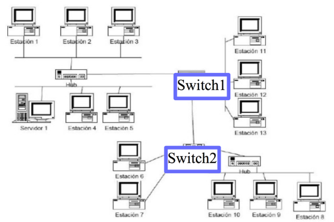
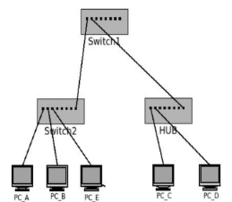
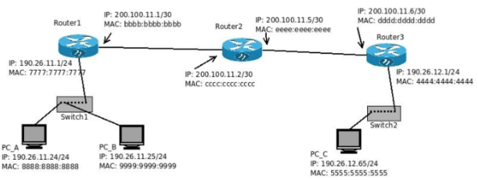

# Práctica 10 - Capa de Enlace (P1)

## 1. ¿Qué función cumple la capa de enlace? Indique qué servicios presta esta capa.

La función de la capa de enlace es mover un datagrama desde una interfaz a otra adyacente a través de un enlace. Su función principal es proporcionar una interfaz entre la capa de red y el medio físico.

Los servicios que presta son:
- **Entramado (framing):** Encapsulamiento del datagrama en la trama, agregando headers y cola (trailer).
- **Acceso al enlace:** Acceso al canal si es un medio compartido. En las tramas están las direcciones MAC para identificar el origen y el destino.
- **Entrega confiable:** Entre nodos adyacentes. Rara vez usados en enlaces de pocos errores.
- **Control de flujo:** Acuerdo entre nodos emisor y receptor (adyacentes).
- **Detección de errores:** Errores causados por atenuación de errores. El receptor los detecta verificando el checksum.
- **Corrección de errores**
- **Full-Duplex y Half-Duplex**

## 2. Compare los servicios de la capa de enlace con los de la capa de transporte.

- Capa de transporte también ofrece detección y corrección de errores y control de flujo. La diferencia está en que la capa de enlace se centra en aspectos locales del enlace, mientras que capa de transporte está orientado a la transferncia de extremo a extremo a través de redes más amplias, además de que ofrece fiablidad a diferencia de capa de enlace.

## 3. Direccionamiento Ethernet:

### ¿Cómo se identifican dos máquinas en una red Ethernet?

- Las máquinas se identifican en una red Ethernet mediante las direcciones MAC.

### ¿Cómo se llaman y qué características poseen estas direcciones?

- Las direcciones MAC, también conocidas como direcciones de Capa de Enlace o direcciones físicas, poseen 48 bits y se expresan en notación hexadecimal.
- Los primeros 24 bits identifican al fabricante y los últimos 24 bits son únicos para la interfaz.

### ¿Cuál es la dirección de broadcast en capa de enlace? ¿Qué función cumple?

- La dirección MAC de broadcast es la FF:FF:FF:FF:FF:FF
- Su función es enviar información a todos los dispositivos de la red sin tener que conoceer sus direcciones MAC (usado en ARP).

## 4. Sobre los dispositivos de capa de enlace:

### Enumere dispositivos de capa de enlace y explique sus diferencias.

- **HUB:** Actúa como un repetidor y simplemente repite señales a todos los puertos. No divide dominios de colisión ni de broadcast.
- **Switch:** Examina las direcciones MAC para enviar tramas solo al puerto específico donde se encuentra el destinatario. Divide dominios de colisión, no así de broadcast.
  - Con puerto hace referencia a puertos físicos, no números de puerto.
- **Bridge:** Conecta dos segmentos de red, examina las direcciones MAC y va aprendiendo las ubicaciones de las direcciones MAC en ambos sentidos. Puede dividir dominios de colisión pero no de broadcast.
  - Es muy similar al switch, solo que con menos puertos.

### ¿Qué es una colisión?

- Es un evento que se da cuando dos o más dispositivos intenta transmitir datos simultáneamente en una red compartida, causando una interferencia y causando una pérdida de datos.

### ¿Qué dispositivos dividen dominios de broadcast?

- Solo los routers dividen dominios de broadcast.

### ¿Qué dispositivos dividen dominios de colisión?

- Los routers, switches y bridges dividen dominios de colisión.

## 5. Describa el algoritmo de acceso al medio en Ethernet. ¿Es orientado a la conexión?

- El algoritmo de acceso al medio de Ethernet es "CSMA/CD"
- NO es orientado a conexión, cada estación opera de manera independiente y no establece una conexión. Cada estación compite por el acceso al medio.

## 6. ¿Cuál es la finalidad del protocolo ARP?

- La finalidad del protocolo ARP es mapear direcciones IPv4 a direcciones MAC.
- Una estación envía una solicitud ARP (broadcast) para conocer la MAC asociada a una dirección IP.
- Eventualmente recibirá una respesuta con la información correspondiente.
- La tabla ARP en caché almacena estas asociaciones para futuras consultas.

## 7. Investigue los comandos arp e ip neigh. Inicie una topología con CORE, cree una máquina y utilice en ella los comandos anteriores para:

### Listar las entradas en la tabla ARP.

- `arp -a`
- `ip neigh show`

### Borrar una entrada en la tabla de ARP.

- `arp -d`
- `ip neigh flush all`

### Agregar una entrada estática en la tabla de ARP.

- `arp -s [ip_address] [mac_address]`
- `ip neigh add [ip_address] lladdr [mac_address] nud permanent`

## 8. Dado el siguiente esquema de red, responda:

### a. Suponiendo que las tablas de los switches están llenas con la información correcta, responda quién escucha el mensaje si:

- Los HUBs y SWITCHs no se anotan como nodos (en este caso). Si el tráfico pasara, si debería anotarlos.
- Las estaciones 11, 12, 13, 6 y 7 están cableados directamente con el SWITCH, eso no son dominios de colisión (recordar que los switch dividen y evitan dominios de colisión). En los HUBs si hay porque es todo como el mismo cable.
- La colisión está entre el medio y los hosts. Si cada host envía una trama al switch (por distintas bocas), el switch los acomoda según como lo haya implementado el fabricante.

#### i. La estación 1 envía una trama al servidor 1.

- Estación 2, Estación 2, Estación 3, Estación 4, Estación 5 y Servidor 1.
  - También podría incluir al switch, pero como el tráfico no pasa por el, no cuenta.

#### ii. La estación 1 envía una trama a la estación 11.

- Estación 2, Estación 3, Servidor 1, Estación 4, Estación 5, Estación 11.

#### iii. La estación 1 envía una trama a la estación 9.

- Estación 2, Estación 3, Servidor 1, Estación 4, Estación 5, Estación 8, Estación 9, Estación 10.

#### iv. La estación 4 envía una trama a la MAC de broadcast.

- El mensaje es escuchado por todos (diferente sería si tuvieramos un router).

#### v. La estación 6 envía una trama a la estación 7.

- Estación 7.

#### vi. La estación 6 envía una trama a la estación 10.

- Estación 8, Estación 9, Estación 10.

### b. ¿En qué situaciones se pueden producir colisiones?

- Se pueden realizar colisiones si Estación 1, 2, 3, 4, 5 y Servidor 1 intentan enviar una trama a la vez.
- Lo mismo para Estación 8, 9 y 10.
- Los HUBs no dividen dominios de colisión, por lo tanto, siempre donde hay un HUB hay riesgo de colisión.

## 9. En la siguiente topología de red indique:

### a. ¿Cuántos dominios de colisión hay?

- En total hay 5 dominios de colisión.
- El 2do puerto del Switch1 cuenta como un dominio por el hub.
- La conexión entre el Switch1 y el Switch2 también cuenta.

### b. ¿Cuántos dominios de broadcast hay?

- 1

### c. Indique cómo se va llenando la tabla de asociaciones MAC -> PORT de los switches SW1 y SW2 durante el siguiente caso:

#### i. A envía una solicitud ARP consultando la MAC de C.

SW1:

| MAC | PORT |
|-----|------|
| PC_A | P0 |

SW2:

| MAC | PORT |
|-----|------|
| PC_A | P0 |

#### ii. C responde esta solicitud ARP.

SW1:

| MAC | PORT |
|-----|------|
| PC_A | P0 |
| PC_C | P1 |

SW2:

| MAC | PORT |
|-----|------|
| PC_A | P0 |
| PC_C | P7 |

#### iii. A envía una solicitud ARP consultando la MAC de B.

- Las tablas CAM siguen igual.

#### iv. B responde esta solicitud ARP.

SW1:

| MAC | PORT |
|-----|------|
| PC_A | P0 |
| PC_C | P1 |

SW2:

| MAC | PORT |
|-----|------|
| PC_A | P0 |
| PC_C | P7 |
| PC_B | P1 |

### d. Si la PC_E y la PC_D hubiesen estado realizando un tcpdump para escuchar todo lo que pasa por su interfaz de red, ¿cuáles de los requerimientos/respuestas anteriores hubiesen escuchado cada una?

- PC_E hubiera escuchado los mensajes de solicitud ARP de PC_A (tanto para PC_B como para PC_C).
- PC_D hubiera escuchado los mensajes de solicitud ARP de PC_A y la respuesta de PC_C, ya que el HUB retransmite los mensajes a todas sus interfaces.

## 10. En la siguiente topología:

Suponiendo que todas las tablas ARP están vacías, tanto de PCs como de Routers. Si la PC_A le hace un ping a la PC_C, indique:

### ¿En qué dominios de broadcast hay tráfico ARP? ¿Con qué direcciones de origen y destino?

- En todos los dominios de broadcast hay tráfico ARP.
- En todos los dominios de broadcast, las IPs son las mismas.
- En la consulta, la dirección MAC origen es 88:88:88:88:88:88 y la dirección MAC destino es FF:FF:FF:FF:FF:FF.
- En la respuesta, la dirección MAC es la del dispositivo correspondiente

### ¿En qué dominios de broadcast hay tráfico ICMP?

- En todos. 

#### ¿Con qué direcciones de origen y destino de capa 2?

- Las direcciones MAC van cambiando según las redes, ya que se usan las MACs de los routers.

#### ¿Con qué direcciones de origen y destino de capa 3?

- La IP de origen es la de PC_A y la IP destino es la de PC_C

### ¿Cuál es la secuencia correcta en la que se suceden los anteriores?

- PC_A -> Router1 -> Router2 -> Router3 -> PC_C
- PC_C -> Router3 -> Router2 -> Router1 -> PC_A

## 11. ¿Existe ARP en IPv6? ¿Por qué? ¿Quién cumple esa función?

- No, existe un servicio similar llamado NDP (Neighbor Discovery Protocol) que se encapsula en IPv6. En IPv6 no hay broadcast, se utiliza multicast (por esto no existe ARP en IPv6).
- NDP se compone de 3 partes:
  - **Neighbor Solicitation:** Similar a la solicitud ARP, se usa para descubrir la dirección MAC asociada a una dirección IPv6.
  - **Neighbor Advertisement:** Similar a la respuesta ARP, se usa para informar al resto de los nodos la dirección MAC asociada a una dirección IPv6.
  - **Router Advertisement:** Anuncia la presencia de routers en la red y brinda información para la autogestión de direcciones.

## 12. ¿Qué es la IEEE 802.3? ¿Existen diferencias con Ethernet?

- IEEE 802.3 fue el primer intento de estandarizar aquellas redes que se basan en Ethernet, incluyendo las especificaciones del medio físico.
- Es un estándar que específica las caraterísticas técnicas y de funcionamiento para las LAN que usan tecnologías de acceso al medio basadas en la transmisión de tramas.

## 13. Nombre cinco protocolos de capa de enlace. ¿Todos los protocolos en esta capa proveen los mismos servicios?

- **Ethernet (IEEE 802.3):** Es uno de los protocolos más comunes y usados. Se usa para acceso al medio y específica la estructura de las tramas.
- **Wi-Fi (IEEE 802.11):** Es un conjunto de protocolos inalámbricos usados para las WLANs. Incluye varios estándares como 802.11a, 802.11b, 802.11g, 802.11n, 802.11ac, etc.
- **PPP (Point-to-Point Protocol):** Es un protocolo usado para establecer una conexión directa entre dos nodos. Se usa para conexiones dial-up y conexiones de linea dedicada.
- **HDLC (High-Leve Data Link Control):** Protocolo de enlace de datos usado en WANs, es una norma internacional definida por ISO.
- **Token Ring (IEEE 802.5):** Protocolo de red de anillo que usaba un token para controlar el acceso al medio. Fue amplicamente usado, pero fue reemplazado por Ethernet.

# Ejercicio de parcial

## 14. Si la PC A está en una red y se quiere comunicar con la PC B que está en otra red:

### Como se da cuenta la PC A de esto?

- La PC A se da cuenta de esto por la dirección IP de PC B y su propia máscara.

### Si la tabla ARP de la PC A esta vacía, ¿que dirección MAC necesita la PC A para poder comunicarse con la PC B?

- La PC A necesita saber la dirección MAC de su default gateway (ya que PC B está en otra red).

### En base a lo anterior, ¿que dirección IP destino tiene el requerimiento ARP? ¿Es la dirección IP del default gateway o es la dirección IP de la PC B? De ser necesario, ejecute de nuevo el experimento de ser necesario y complete los campos:

- Trama Ethernet: (mac origen: MAC_PC_A mac destino: FF:FF:FF:FF:FF:FF)
- Solicitud ARP: (mac origen: MAC_PC_A ip origen: IP_PC_A) (mac destino: 00:00:00:00:00:00 ip destino: IP_DEFAULT_GATEWAY)
  - 00:00:00:00:00:00 se pone cuando se sabe.

### En base a lo anterior, indique la información de capa 2 y 3 del ICMP ECHO REQUEST que la PC A le envía a la PC B cuando ejecuta un ping, en el segmento de LAN de la PC B.

Suponiendo que la tabla ARP del router de PC B no está vacío:

- Trama Ethernet:
  - MAC origen: MAC_ROUTER
  - MAC destino: FF:FF:FF:FF:FF:FF
- Solicitud ARP:
  - MAC origen: MAC_ROUTER
  - IP origen: IP_PC_A
  - MAC destino: MAC_PC_B
  - IP destino: IP_PC_B

Apuntes:
- Entre un router y un switch hay un dominio de colisión.
- El switch tiene tantos dominios de colisión como conexiones del switch.
- Si al switch le llega una trama para una MAC que no tiene en la CAM, saldría por todas sus interfaces (menos por la que recibió).
- En ARP, la IP destino sería al router más próximo (en el caso de que el receptor este en otra red).
- El Switch divide dominios de colisión.
- Un dominio de broadcast es lo que está en una LAN. Entonces podríamos verlo como un router, en cada boca de un router habría un dominio de broadcast.
- En el ejercicio 10 hay 4 dominios de broadcast
  - Deberíamos aclarar los dominios con el nombre del router y la interfaz correspondiente.
  - El switch generalmente no se nombra (generalmente está de paso).
    - Si hablamos de saltos, no se nombra.
    - Si hablamos del camino de PC-A a PC-C, podría tener que nombrarse el switch.
  - Las conexiones entre routers se consideran como dominios de colisión (no olvidar que son redes también).
  - Dominios de broadcast => Capa de Red
  - Dominios de colisión => Capa de Enlace (en el 10 hay 7)
