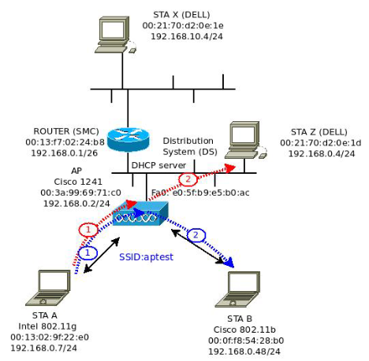

# Práctica 11 - Capa de Enlace (P2)

## 2. ¿Qué es 802.11? Compare las direcciones MAC que contiene el encabezado de una trama 802.11 con los de una trama Ethernet, ¿cuál es la principal diferencia que encuentra? Investigue por qué cambian en 802.11 y para qué se usan.

- 802.11 en un conjunto de estándares de la IEEE en las cuáles se redactan los métodos de transmisión en redes wireless. Es la forma más apropiada de llamar a la tecnología Wi-Fi.
- Las direcciones MAC se usan para identificar unívocamente a los dispositivos en una red.
  - En Ethernet, solo necesitamos 2 direcciones MAC (origen y destino).
  - En 802.11 se pueden utilizar hasta 4 direcciones MAC.
    - 1ra dirección: Se indica el receptor. Puede ser el Access Point u otro dispositivo en función del salto.
    - 2da dirección: Se indica el emisor, que podría ser el AP u otro dispositivo.
    - 3ra dirección:
      - Si el mensaje va de un dispositivo al AP, se indica el otro dispositivo receptor.
      - Si el mensaje va de AP a un dispositivo, se indica el otro dispositivo emisor.
      - Si el mensaje va de AP a AP, se indica el dispositivo receptor.
    - 4ta dirección: Solo está cuando hay intercambio entre APs, donde se indica la MAC del dispositivo que generó la trama.

## 3. Complete el siguiente cuadro y luego investigue qué estándar utilizan los dispositivos inalámbricos que tiene en su poder (su celular, su computadora, etc.)

| Estándar | Año | Frecuencia | Velocidad máxima |
| -------- | --- | ---------- | ---------------- |
| 802.11a | 1999 | 5GHz | 54Mbps |
| 802.11ac | 2013-2014 | 5GHz | 1.3 Gbps |
| 802.11b | 1999 | 2.4GHz | 11 Mbps |
| 802.11g | 2003 | 2.4GHz | 54Mbps |
| 802.11n | 2009 | 2.4GHz - 5GHz | 600Mbps |

## 4. Dada la siguiente topología, donde se pueden apreciar cuatro estaciones de trabajo, dos conectadas mediante un cable UTP y dos de forma inalámbrica, responda las siguientes preguntas.

### Suponiendo que las tablas ARP están completas y que STA A realiza un ping a STA B:

#### a. Indique, entre STA A y el AP (1 azul) y entre el AP y STA B (2 azul):

- Tipo de trama MAC (indicar si es 802.11 o Ethernet).
- Direcciones MAC de la trama.
- IP origen e IP destino.

Entre STA A - AP y AP STA B, la trama sigue siendo de tipo 802.11 (ya que no están cableadas).

Tramas:
- Trama 1:
  - Dirección 1 -> aptest
  - Dirección 2 -> 00:13:02:9f:22:e0
  - Dirección 3 -> 00:0f:f8:54:28:b0

- Trama 2:
  - Dirección 1 -> 00:0f:f8:54:28:b0
  - Dirección 2 -> aptest
  - Dirección 3 -> 00:13:02:9f:22:e0

- IP origen: 192.168.0.7/24
- IP destino: 192.168.0.48/24
  
### Suponiendo que las tablas ARP están completas y que STA A realiza un ping a STA Z:

#### a. Indique, entre STA A y el AP (1 rojo) y entre el AP y STA Z (2 rojo):

- Tipo de trama MAC (indicar si es 802.11 o Ethernet).
- Direcciones MAC de la trama.
- IP origen e IP destino.

De STA A -> AP la trama MAC es de tipo 802.11
De AP -> STA Z es de tipo Ethernet.

Tramas:
- Trama 1:
  - Dirección 1 -> aptest
  - Dirección 2 -> 00:13:02:9f:22:e0
  - Dirección 3 -> 00:21:70:d2:0e:1d
- Trama 2:
  - Dirección origen -> 00:13:02:9f:22:e0
  - Dirección destino -> 00:21:70:d2:0e:1d

- IP Origen -> 192.168.0.7/24
- IP Destino -> 192.168.0.4/24

### Suponiendo que las tablas ARP están vacías y que STA A debe realizar un ARP Request para averiguar la MAC de STA B:

#### a. Indique, entre STA A y el AP (1 azul) y entre el AP y STA B (2 azul):

- Tipo de trama MAC (indicar si es 802.11 o Ethernet).
- Direcciones MAC de la trama.

El ARP request es un mensaje de tipo broadcast que le llega a todos los dispositivos de la red. La trama que recibe AP es 802.11, al igual que la que le retransmite a STA B. La que recibe STA Z es de tipo Ethernet.

- Trama 1 (STA A -> AP):
  - Dirección 1 -> aptest
  - Dirección 2 -> 00:13:02:9f:22:e0
  - Dirección 3 -> FF:FF:FF:FF:FF:FF
- Trama 2 (AP -> STA B):
  - Dirección 1 -> 00:0f:f8:54:28:b0
  - Dirección 2 -> aptest
  - Dirección 3 -> 00:13:02:9f:22:e0
- Trama 3 (AP -> STA Z):
  - Dirección MAC origen -> 00:13:02:9f:22:e0
  - Dirección MAC destino -> 00:21:70:d2:0e:1d

### ¿Cómo sería el ARP Reply que va desde STA B hacia el AP? Indique las direcciones MAC de la trama.

- Dirección 1 -> aptest
- Dirección 2 -> 00:0f:f8:54:28:b0
- Dirección 3 -> 00:13:02:0f:22:e0