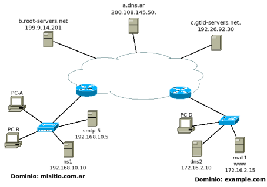

# Practica 4 - Correo electrónico

## 1. ¿Qué protocolos se utilizan para el envío de mails entre el cliente y su servidor de correo? ¿Y entre servidores de correo?

- El protocolo que se usa para el envío de mail tanto entre cliente-servidores y los servidores, es SMTP.

## 2. ¿Qué protocolos se utilizan para la recepción de mails? Enumere y explique características y diferencias entre las alternativas posibles?

- Los protocolos que se usan para la recepción de mail son POP3 y IMAP.
  - POP3 es un protocolo más sencillo, el usuario cuando quiere acceder a sus mails, los descarga y se borran del servidor. Con esto, no podría volver a ver los mails desde otro dispositivo.
  - IMAP es un protocolo más complejo, el servidor permite que el usuario lea, borre y organice los mails como si fuera un systemfile.

## 3. Utilizando la VM y teniendo en cuenta los siguientes datos, abra el cliente de correo (thunderbird) y configure dos cuentas de correo. Una de las cuentas utilizará POP para solicitar al servidor los mails recibidos para la misma mientras que la otra utilizará IMAP

### a. Verificar el correcto funcionamiento enviando un email desde el cliente de una cuenta a la otra y luego desde la otra responder el mail hacia la primera

### b. Análisis del protocolo SMTP

#### i. Utilizando Wireshark, capture el tráfico de red contra el servidor de correo mientras desde la cuenta <alumnopop@redes.unlp.edu.ar> envía un correo a <alumnoimap@redes.unlp.edu.ar>

#### ii. Utilice el filtro SMTP para observar los paquetes del protocolo SMTP en la captura generada y analice el intercambio de dicho protocolo entre el cliente y el servidor para observar los distintos comandos utilizados y su correspondiente respuesta. Ayuda: filtre por protocolo SMTP y sobre alguna de las líneas del intercambio haga click derecho y seleccione Follow TCP Stream

- El agente de usuario de alumnopop se conecta con su servidor de mail (redes.unlp.edu.ar). El cliente SMTP indica al servidor que enviará un mail con los correspondientes encabezados (MAIL FROM, RCPT TO). Después ingresa todos los encabezados necesarios del mensaje y seguido por el cuerpo del mismo.

### c. Usando el cliente de correo, thunderbird del usuario <alumnopop@redes.unlp.edu.ar> envíe un correo electrónico <alumnoimap@redes.unlp.edu.ar> el cual debe tener: un asunto, datos en el body y una imagen adjunta

#### i. Verifique los fuentes del correo recibido para entender como se utiliza el header “Content-Type: multipart/mixed“ para poder realizar el envío de distintos archivos adjuntos´

- El header __Content-Type: multipart/mixed__ se usa para indicar que en el mensaje se envía más de un contenido. En este caso, se envía el texto (datos del body) y la imagen.
- Además de este header, también se declara un __Boundary__ que es un delimitador para todos los datos del body (cuerpo del mensaje e imagen).
- Cada contenido que enviemos tendrá cómo se encriptó a texto plano junto con qué clase de contenido es y su formato.

#### ii. Extraiga la imagen adjunta del mismo modo que lo hace el cliente de correo a partir de los fuentes del mensaje

## 4. Análisis del protocolo POP

### a. Utilizando Wireshark, capture el tráfico de red contra el servidor de correo mientras desde la cuenta <alumnoimap@redes.unlp.edu.ar> le envía una correo a <alumnopop@redes.unlp.edu.ar> y mientras <alumnopop@redes.unlp.edu.ar> recepciona dicho correo

### b. Utilice el filtro POP para observar los paquetes del protocolo POP en la captura generada y analice el intercambio de dicho protocolo entre el cliente y el servidor para observar los distintos comandos utilizados y su correspondiente respuesta

- Al principio, el cliente POP envía el comando __CAPA__, el servidor responde con un listado de los comandos que el cliente puede usar.
- El cliente envía el comando __AUTH PLAIN__ y a continuación envía la contraseña encodeada en base64 que representa al usuario. El servidor responde que la operación salió bien.
- El cliente solicita el listado de mensajes disponibles del servidor con el comando __LIST__, el servidor responde con dicho listado, cada mensaje está escrito como número de mensaje y tamaño.
- Con el comando __UIDL__ hace algo similar, muestra los mensajes en un listado con número de mensaje y id del mensaje.
- El cliente obtiene el mensaje deseado con el comando __RETR #MSJ__ y el servidor imprime el mensaje solicitado (cuerpo y encabezados).
- Finalmente el cliente cierra la conexión con __QUIT__.

## 5. Análisis del protocolo IMAP

### a. Utilizando Wireshark, capture el tráfico de red contra el servidor de correo mientras desde la cuenta <alumnopop@redes.unlp.edu.ar> le envía una correo a <alumnoimap@redes.unlp.edu.ar> y mientras <alumnoimap@redes.unlp.edu.ar> recepciona dicho correo

### b. Utilice el filtro IMAP para observar los paquetes del protocolo IMAP en la captura generada y analice el intercambio de dicho protocolo entre el cliente y el servidor para observar los distintos comandos utilizados y su correspondiente respuesta

- Al principio, el servidor IMAP dice la cantidad de mensajes recientes y existentes.
- El cliente IMAP, mediante un número de mensaje, solicita ver dicho mensaje (además puede indicar ciertos parámetros de como verlo, por ejemplo, seleccionar algunos encabezados en específio).
- El servidor IMAP resuelve la petición y muestra el mensaje de la manera solicitada por el cliente.
- A continuación, el cliente procede a marcar el mensaje como leido (activando un flag) y cierra la conexión.
- El comando __IDLE__ sirve para poner en espera la conexión hasta que se produzca algún evento. Se sale de dicho estado con el comando __DONE__.

## 6. POP vs. IMAP

### a. Marque como leídos todos los correos que tenga en el buzón de entrada de alumnopop y de alumnoimap. Luego, cree una carpeta llamada POP en la cuenta de alumnopop y una llamada IMAP en la cuenta de alumnoimap. Asegurese que tiene mails en el inbox y en la carpeta recientemente creada en cada una de las cuentas

### b. Cierre la sesión iniciada e ingrese nuevamente identificandose como usuario root y password packer, ejecute el cliente de correos. De esta forma, iniciará el cliente de correo con el perfil del superusuario (diferente del usuario con el que ya configuró las cuentas antes mencionadas). Luego configure las cuentas POP e IMAP de los usuarios alumnopop y alumnoimap como se describió anteriormente pero desde el cliente de correos ejecutado con el usuario root. Luego responda

#### i. ¿Qué correos ve en el buzón de entrada de ambas cuentas? ¿Están marcados como leídos o como no leídos? ¿Por qué?

- Para el caso de POP, los mensajes que leí anteriormente no están, en cambio los que no leí si están. Esto sucede porque POP3 descarga los mensajes leidos en el dispositivo que se leyó.
- Para el caso de IMAP, todo está exactamente igual que en el otro usuario. A diferencia de POP, IMAP mantiene un estado de los mensajes para cada usuario, sin importar desde qué dispositivo o plataforma ingrese.

#### ii. ¿Qué pasó con las carpetas POP e IMAP que creó en el paso anterior?

- En el caso de POP, la carpeta que cree no se mantuvo.
- Caso contrario es el de IMAP, donde la carpeta si se mantuvo, incluso los mensajes que copie en ella.

### c. En base a lo observado. ¿Qué protocolo le parece mejor? ¿POP o IMAP? ¿Por qué? ¿Qué protocolo considera que utiliza más recursos del servidor? ¿Por qué?

- Para mi IMAP es mejor que POP, sin embargo, esto también depende de las necesidades y el contexto que se maneje.
  - Por ejemplo, si soy un usuario nomada que entra desde su PC personal, desde el telefóno y computadora de la oficina, claramente POP no me sirviría, ya que no podría releer mails desde cada dispositivo.
- Así como IMAP es un protocolo que ofrece más funcionalidades, también es un protocolo muy demandante en cuanto a recursos, ya que este debe mantener un estado del usuario en el servidor (por ejemplo: en qué directorio se encuentra en la jerarquía de directorios).

### 7. ¿En algún caso es posible enviar más de un correo durante una misma conexión tcp? Considere

#### Destinatarios múltiples del mismo dominio entre MUA-MSA y entre MTA-MTA

- En la comunicación MUA-MSA, el agente de usuario podría usar el comando __DATA__ (SMTP) para enviar más de un correcto secuencialmente antes de que la conexión finalice.
- De MTA-MTA se puede lograr mediante conexiones persistentes (no todos los servidores de correo lo permiten) y así envíar varios mensajes iterativamente.

#### Destinatarios múltiples de diferentes dominios entre MUA-MSA y entre MTA-MTA

- También es posible, ya que el MUA en ese caso indicaría un dominio distinto según los recipientes.
- Para la comunicación entre MTAs, ya no sería posible esto (salvo que se envien más de un correo al mismo dominio), ya que si mi MTA le tiene que enviar mails al MTA del dominio X y después al MTA del dominio Y, mi MTA debería establecer dos conexiones TCP diferentes.

## 8. Indique sí es posible que el MSA escuche en un puerto TCP diferente a los convencionales y qué implicancias tendría

- Si es posible, en ese caso habría que avisarle al resto de los MUA del dominio para que se conecten al nuevo puerto del MSA.

## 9. Indique sí es posible que el MTA escuche en un puerto TCP diferente a los convencionales y qué implicancias tendría

- No es posible. Ya que debería avisarle a los MSA del cambio y a los otros MTA (muy costoso).

## 10. Ejercicio integrador HTTP, DNS y MAIL

Suponga que registró bajo su propiedad el dominio redes2022.com.ar y dispone de 4 servidores:

- Un servidor DNS instalado configurado como primario de la zona redes2022.com.ar. (hostname: ns1 / ip: 203.0.113.65).
- Un servidor DNS instalado configurado como secundario de la zona redes2022.com.ar. (hostname: ns2 / ip: 203.0.113.66).
- Un servidor de correo electrónico (hostname: mail / ip: 203.0.113.111). Permitirá a los usuarios envíar y recibir correos a cualquier dominio de Internet.
- Un servidor WEB para el acceso a un webmail (hostname: correo / ip: 203.0.113.8). Permitirá a los usuarios gestionar vía web sus correos electrónicos a través de la URL https://webmail.redes2022.com.ar

### a. ¿Qué información debería informar al momento del registro para hacer visible a Internet el dominio registrado?

- Debería registrar los nameservers y las direcciones IP (NS y A) de los servidores DNS de redes2022.com.ar en el dominio "padre" (com.ar).

### b. ¿Qué registros sería necesario configurar en el servidor de nombres? Indique toda la información necesaria del archivo de zona. Puede utilizar la siguiente tabla de referencia (evalúe la necesidad de usar cada caso los siguientes campos): Nombre del registro, Tipo de registro, Prioridad, TTL, Valor del registro

- A (ns1, 203.0.113.65, -, 68)
- A (ns2, 203.0.113.66, -, 68)
- A (mail, 203.0.113.111, -, 68)
- A (correo, 203.0.113.8, -, 68)
- CNAME (webmail.redes2022.com.ar, correo, -, 68)
- SOA (ns1, ...)
- MX (redes2022.com.ar, mail, 5, 68)
- web-mail no es un servidor de correo por lo tanto no necesita un MX.

### c. ¿Es necesario que el servidor de DNS acepte consultas recursivas? Justifique

- No sería necesario, porque es autoritario para el dominio redes2022.com.ar, por tanto no necesitaría resolver la petición consultando a otros servidores.

### d. ¿Qué servicios/protocolos de capa de aplicación configuraría en cada servidor?

- ns1 --> DNS
- ns2 --> DNS
- mail --> SMTP, IMAP
- correo --> HTTP, SMTP, IMAP

### e. Para cada servidor, ¿qué puertos considera necesarios dejar abiertos a Internet?. A modo de referencia, para cada puerto indique: servidor, protocolo de transporte y número de puerto.

- ns1, UDP, 53
- ns2, UDP, 53
- mail, TCP, 25
- mail, TCP, 143
- correo, TCP, 80
- correo, TCP, 25
- correo, TCP, 143

### f. ¿Cómo cree que se conectaría el webmail del servidor web con el servidor de correo? ¿Qué protocolos usaría y para qué?

- Cuando algún cliente HTTP se comunique con el webmail, este se conectará con el servidor de correo
  - Para obtener los mails, el webmail sería como el cliente, se conecta con el mail vía IMAP y obtiene los directorios del usuario junto con los mails de este.
  - Y para envíar mails, de manera similar, el webmail establece una conexión SMTP con el servidor de correo. El servidor de correo hará lo propio comunicandose con el MTA del recipiente.

### g. ¿Cómo se podría hacer para que cualquier MTA reconozca como válidos los mails provienentes del dominio redes2022.com.ar solamente a los que llegan de la dirección 203.0.113.111? ¿Afectaría esto a los mails enviados desde el Webmail? Justifique

- //Consultar
- No sé si es posible que cualquier MTA reconozca sólo como válidos los mails de 203.0.113.111 de redes2022.com.a, ya que deberían contar con un registro de configuración (SPF) para dicha zona donde se especifique que para X dominio solo se aceptan los mails de un MTA específico.
- Esto no debería afectar a los mails enviados desde el Webmail, ya que este es una solo es una interfaz web para que el usuario pueda enviar y ver sus mails.

### h. ¿Qué característica propia de SMTP, IMAP y POP hace que al adjuntar una imagen o un ejecutable sea necesario aplicar un encoding (ej. base64)?

- En concreto, estos protocolos funcionan con texto plano, esto significa que todo archivo binario deba ser encodeado a texto plano usando, por ejemplo, base64.

### i. ¿Se podría enviar un mail a un usuario de modo que el receptor vea que el remitente es un usuario distinto? En caso afirmativo, ¿Cómo? ¿Es una indicación de una estafa? Justifique

...
- Si, es posible, con herramientas como _swaks_ podríamos decir que somos un emisor distinto al que realmente somos, cambiando el header MAIL FROM.
- Si, podría serlo, ya que es un indicio de una posible suplantación de identidad. Supongamos que le envíe un mail a una persona haciendole creer que soy un empleado de MercadoLibre, y ahí le pido cierta información que me permita acceder a su cuenta.

### j. ¿Se podría enviar un mail a un usuario de modo que el receptor vea que el destinatario es un usuario distinto? En caso afirmativo, ¿Cómo? ¿Por qué no le llegaría al destinatario que el receptor vé? ¿Es esto una indicación de una estafa? Justifique

- También es posible, podríamos ...

### k. ¿Qué protocolo usará nuestro MUA para enviar un correo con remitente redes@info.unlp.edu.ar? ¿Con quién se conectará? ¿Qué información será necesaria y cómo la obtendría?

- Nuestro MUA (navegador web) se conecta con el WebMail mediante HTTP, pero primero necesita la dirección IP. Así que con DNS la obtiene
  - Usa el resolver @8.8.8.8, consulta en un servidor root, después en .ar, después en .com y finalmente en redes donde el ns1 me da la IP del webmail.
- Primero, necesitaría la IP del remitente. Para eso usa el protocolo DNS
  - Supongamos que usa @8.8.8.8, en ese caso va consultando por la jerarquía, empezando por los servidores root, después por .ar, .edu, .unlp, hasta llegar a .info donde el servidor DNS de dicha zona me daría la IP de ese receptor.
- Después, mi webmail envía mediante SMTP el mensaje al servidor de correo de la zona para que este se lo envíe al MTA de redes@info.unlp.edu.ar

### l. Dado que solo disponemos de un servidor de correo, ¿qué sucederá con los mails que intenten ingresar durante un reinicio del servidor?

//CONSULTAR

- Dichos mails se quedarán en una cola de espera hasta que el servidor de correo pueda atenderlos.

### m. Suponga que contratamos un servidor de correo electrónico en la nube para integrarlo con nuestra arquitectura de servicios

#### i. ¿Cómo configuraría el DNS para que ambos servidores de correo se comporten de manera de dar un servicio de correo tolerante a fallos?

//Consultar

- En este caso, deberíamos agregar un registro MX para dicho servidor de correo
- Deberíamos también agregar el registro A?

## 11. Utilizando la herramienta Swaks envíe un correo electrónico con las siguientes características:

- Dirección destino: Dirección de correo de alumnoimap@redes.unlp.edu.ar
- Dirección origen: redesycomunicaciones@redes.unlp.edu.ar
- Asunto: SMTP-Práctica4
- Archivo adjunto: PDF del enunciado de la práctica
- Cuerpo del mensaje: Esto es una prueba del protocolo SMTP

### a. Analice tanto la salida del comando swaks como los fuentes del mensaje recibido para responder las siguientes preguntas:

#### i. ¿A qué corresponde la información enviada por el servidor destino como respuesta al comando EHLO? Elija dos de las opciones del listado e investigue la funcionalidad de la misma.

- La información que brinda el servidor destino son las funcionalidades y comandos que este acepta. Por ejemplo:
  - __STARTTLS:__ El servidor SMTP admite la negociación de la Capa de Seguridad.
  - __VRFY__: Esta funcionalidad sirve para verificar que cierta dirección de correo electrónico es conocida por el servidor SMTP destino.

#### ii. Indicar cuáles cabeceras fueron agregadas por la herramienta swaks.

- Al menos en mi caso, ninguna. Ya que yo definí un par de headers en un archivo aparte (To, From, MIME-Version, Content-Type, Boundary, etc.)

#### iii. ¿Cuál es el message-id del correo enviado? ¿Quién asigna dicho valor?

- El message-id del correo es 6459C60147.
- El encargado de dicha asignación es el servidor SMTP destino.

#### iv. ¿Cuál es el software utilizado como servidor de correo electrónico?

//CONSULTAR
- Swaks?

#### v. Adjunte la salida del comando swaks y los fuentes del correo electrónico.

- No entendí.

### b. Descargue de la plataforma la captura de tráfico smtp.pcang y la salida del comando swaks smtp.swaks para responder y justificar los siguientes ejercicios.

#### i. ¿Por qué el contenido del mail no puede ser leido en la captura de tráfico?

- En el proceso de negociación, el cliente envía el comando _STARTTLS_, de esta forma el mensaje se envía de manera cifrada.
- Recordar que por defecto, SMTP envía los datos en ASCII, pero con TLS/SSL podemos cifrar los mensajes para que no puedan ser leidos por alguien que se ponga a escuchar en la red.

### c. Realice una consulta de DNS por registros TXT al dominio info.unlp.edu.ar y entre dichos registros evalúe la información del registro SPF. ¿Por qué cree que aparecen muchos servidores autorizados?

- Antes vimos se pueden enviar correos en nombre de otros servidores o cuentas, dando lugar al phishing. Este registro lo que permite es definir qué servidores de correo pueden enviar mails en nombre del dominio.

### d. Realice una consulta de DNS por registros TXT al dominio outlook.com y analice el registro correspondiente a SPF. ¿Cuáles son los bloques de red autorizados para enviar mails?. Investigue para qué se utiliza la directiva "~all"

- spf-a.outlook.com, spf-b.outlook.com, spf-a.hotmail.com, _spf-ssg-b.microsoft.com, _spf-ssg-c.microsoft.com
- La directiva ~all sirve para que las cuentas de correo electrónico del dominio que reciban mails de servidores que no sean los que están autorizados, pasen esos mails a la carpeta de SPAM o los marquen como Peligrosos.

## 12. Observar el gráfico a continuación y teniendo en cuenta lo siguiente , responder:

- El usuario juan@misitio.com.ar en PC-A desea enviar un mail al usuario alicia@example.com
- Cada organización tiene su propios servidores de DNS y Mail
- El servidor ns1 no tiene la recursión habilitada para consultas realizadas desde fuera del dominio misitio.com.ar

### a. El servidor de mail, mail1, y de HTTP, www, de example.com tienen la misma IP, ¿es posible esto? Si lo es, ¿cómo lo resolvería?

- Si es posible. Podría ser que ambos servidores estén en un mismo dispositivo. Recordar que en una misma computadora se puede levantar más de un servicio, lo que va a diferenciar a cada uno es el puerto, con el podemos distinguir si nos comunicamos con el servidor de mail o con el host www.example.com.

### b. Al enviar el mail, ¿por qué registro de DNS consultará el MUA?

- Cuando desee envíar el mail, el MUA consultará por el registro MX de la zona misitio.com.ar

### c. Una vez que el mail fue recibido por el servidor smtp-5, ¿por qué registro de DNS consultará?

- El servidor SMTP-5 consultará por los registros MX del dominio example.com

### d. Si en el punto anterior smtp-5 recibiese un listado de nombres de servidores de correo, ¿será necesario realizar una consulta de DNS adicional? Si es afirmativo, ¿por qué tipo de registro y de cuál servidor preguntaría?

- Depende. Una vez consultado el o los servidores de correo del dominio, smtp-5 necesitaría la dirección IP (registro A) del servidor de correo con mayor prioridad. Digo depende porque a veces en la misma respuesta DNS esa información puede estar incluida en la sección _Aditional_.
- En el caso de que esa información no se incluya, debería consultar por el registro A del servidor de correo con mayor prioridad.

### e. Indicar todo el proceso que deberá realizar el servidor ns1 de misitio.com.ar para obtener los servidores de mail de example.com

- ns1 recibe la consulta DNS de los registros MX de la zona example.com
- ns1 hace una consulta DNS a uno de los registros root (b.root-servers.net, por ejemplo) y le da esa respuesta al cliente DNS.
- En la respuesta se obtienen los ns del dominio .com, entonces el cliente DNS le solicita a ns1 que consulte a dicha zona.
- ns1 consulta a uno de los ns del dominio .com, obtiene la respuesta y se la pasa al cliente (iterativo).
- El cliente DNS obtiene el ns de la zona example.com (dns2), entonces le dice a ns1 que le envie la consulta a dicho servidor DNS.
- Finalmente, ns1 consulta los registros MX de dicha zona y se los pasa al cliente.
- Si las direcciones IP no vinieron en esa consulta, entonces el cliente deberá solicitar otra consulta DNS pero por los registros A (para el servidor de correo deseado).

### f. Teniendo en cuenta el proceso de encapsulación/desencapsulación y definición de protocolos, responder V o F y justificar:

#### - Los datos de la cabecera de SMTP deben ser analizados por el servidor DNS para responder a la consulta de los registros MX

- Falso. El componente de mail que posea el mensaje extrae dichos datos y se los consulta a su servidor DNS local (Por ejemplo, el MUA consultará por la dirección IP de su servidor de correo).

#### - Al ser recibidos por el servidor smtp-5 los datos agregados por el protocolo SMTP serán analizados por cada una de las capas inferiores

- Falso. Las capas inferiores se encargan de analizar sus propios datos. SMTP se encargaría de analizar los datos agregados de su propio protocolo.

#### - Cada protocolo de la capa de aplicación agregará una cabecera con información propia de ese protocolo

- Verdadero. Cada protocolo hace esto para poder comunicarse y analizar el estado de los mensajes.

#### - Como son todos protocolos de la capa de aplicación, las cabeceras agregadas por el protocolo de DNS puede ser analizadas y comprendidas por el protocolo SMTP o HTTP

- Falso. Cada protocolo se limita a analizar y comprender sus propios mensajes.

#### - Para que los cliente en misitio.com.ar puedan acceder el servidor HTTP www.example.com y mostrar correctamente su contenido deben tener el mismo sistema operativo

- Falso. Los estándares de red permiten que más allá de la plataforma de cada dispositivo, todos puedan interactuar, comunicarse e intercambiar información. Con esta idea fueron concebidos los distintos protocolos y capas.

### g. Un cliente web que desea acceder al servidor www.example.com y que no pertenece a ninguno de estos dos dominios puede usar a ns1 de misitio.com.ar como servidor de DNS para resolver la consulta.

- No, pensar que ns1 es autoritativo para su zona, además no puede resolver consultas recursivas que no sean para su dominio.

### h. Cuando Alicia quiera ver sus mails desde PC-D, ¿qué registro de DNS deberá consultarse?

- Alicia debería consultar por el registro MX de su dominio.

### i. Indicar todos los protocolos de mail involucrados, puerto y si usan TCP o UDP, en el envío y recepción de dicho mail

- Antes de enviar el mail, es necesario que el MUA consulte el registro MX de su dominio (DNS - UDP - 53).
- El MUA el envía el mail a smtp-5 (SMTP - TCP - 25)
- smtp-5 consulta la dirección IP del servidor de correo destino (DNS - UDP - 53)
- smtp-5 le envía el mail a mail1 (SMTP - TCP - 25)
- mail1 recepciona el mail que llegó en el inbox del usuario (supongamos que sea IMAP, IMAP - TCP - 143)
- Cuando PC-D desea leer el mail, se comunica con mail1, para eso necesita saber su dirección IP (DNS - UDP - 53)
- Finalmente, el MUA de PC-D obtiene el mail del servidor mail1 (IMAP - TCP 143)