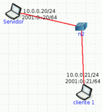
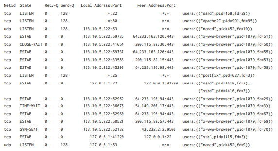
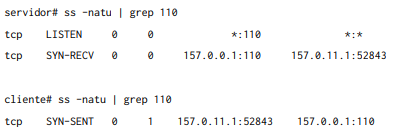

## 1. ¿Cuál es la función de la capa de transporte?

- La función de la Capa de Transporte es transportar los datos de una aplicación de un host a otro host, pasandole los datos a la capa inferior.
## 2. Describa la estructura del segmento TCP y UDP.

- El datagrama UDP es muy sencillo. Posee el número de puerto origen y número de puerto destino, el tamaño del datagrama, el checksum y el payload.
- El segmento TCP ya es más complejo (al ofrecer más funcionalidades), tiene casi los mismos campos que el detagrama UDP, cuenta con flags para el estado de la conexión, tiene un apartado de opciones, campos para saber el número de bit que se envía del stream TCP, número de ACK, campos de opciones, tamaño de ventana de recepción, etc.
## 3. ¿Cuál es el objetivo del uso de puertos en el modelo TCP/IP?

- En particular, un mismo host (que tiene una dirección IP), puede estar manteniendo más de una aplicación con la cuál se puede comunicar con otros (por ejemplo, un servidor puede ser un servidor HTTP y un servidor de correo a la vez). El uso de los puertos permite distinguir con qué aplicación de un host nos estamos comunicando.
## 4. Compare TCP y UDP en cuanto a:

### a. Confiabilidad.

- UDP es un protocolo no confiable best-effort. Esto significa que UDP no asegura de que el paquete llegue a su destino. Lo único que posee es el checksum para control de errores.
- TCP es un protocolo confiable. Asegura que el paquete llegue a destino, además ofrece control de errores, control de flujo y control de congestión.

### b. Multiplexación.

- Tanto TCP como UDP permiten multiplexación, pero cada uno lo hace a su manera:
  - En el datagrama UDP viene incluido la dirección ip y el puerto del emisor, y la dirección ip y el puerto del destino. Se puede lograr la multiplexación cambiando de lugar estos valores (es decir, si el receptor desea contestar el mensaje, podría decir que ahora los valores de emisor son los suyos y los valores de receptor son del que envió el mensaje).
  - En TCP se establece una conexión entre los dos extremos. Esto me permite que ambos extremos puedan enviarse mensajes mutuamente.

### c. Orientado a la conexión.

- UDP no es orientado a conexión, simplemente se envía el paquete al host destino.
- TCP si es orientado a conexión, antes de enviar los datos, se establece la conexión entre ambos extremos donde se negocian ciertos parámetros.

### d. Controles de congestión.

- UDP no ofrece controles de congestión, es decir, no se fija en cuál es el estado de la red.
- TCP si cuenta con controles de congestión.

### e. Utilización de puertos.

//CONSULTAR
- Tanto UDP como TCP hacen uso de los puertos. La diferncia está en que TCP no necesita tener que invertir los valores de puertos para hacer MUX/DEMUX.

## 5. La PDU de la capa de transporte es el segmento. Sin embargo, en algunos contextos suele utilizarse el término datagrama. Indique cuando.

//CONSULTAR
- La PDU de la Capa de Red es el _datagrama_, ese término es utilizado en Capa de Transporte para referirse a la PDU de UDP. Es llamado así, ya que la información que agrega a la PDU de transporte es poca.

## 6. Describa el saludo de tres vías de TCP. ¿Se utiliza algo similar en UDP?

- El saludo de 3 vías de TCP es el proceso donde se establece la conexión entre ambos extremos (recordar que TCP es orientado a conexión) y se negocian ciertos parámetros. Consiste en un primer mensaje del que inicia la conexión (con el flag SYN), después del otro lado debería responder con otro mensaje (con los flags SYN y ACK) y finalmente el que inició la conexión responde con otro mensaje (con el flag ACK). A partir de este punto se empiezan a mandar datos.
  - Tener en cuenta que si del otro lado no se estaba esperando una conexión (_LISTEN_), responderá con un segmento y el flag RST estará activado.
- No hay algo similar en UDP, ya que este no es orientado a conexión.

## 7. Investigue qué es el ISN (Initial Sequence Number). Relaciónelo con el saludo de tres vías.

- El ISN es el número por el cuál cada extremos empieza a contar los bytes que tiene para envíar. Este número es seleccionado aleatoriamente y cada host tiene el suyo propio (para evitar problemas de phishing).
  - Ejemplo: El ISN del cliente es el 1000 y el ISN del servidor es el 300. Cuando el cliente le envíe al principio 150 bytes, el servidor confirmará que espera a partir del byte 1151.
- Dicho parámetro se negocia en el 3WH.

## 8. Investigue qué es el MSS. ¿Cuándo y cómo se negocia?

- El MSS (Maximum Segment Size) es un parámetro que indica cuál es el tamaño máximo que puede tener un segmento, esto depende del bandwidth y del ancho de banda (entre otras cosas). Este parámetro se negocia durante el 3WH.

## 9. Utilice el comando ss (reemplazo de netstat) para obtener la siguiente información de su PC:

### a. Para listar las comunicaciones TCP establecidas.

`ss -t`

### b. Para listar las comunicaciones UDP establecidas.

`ss -u`

### c. Obtener sólo los servicios TCP que están esperando comunicaciones.

`ss -lt`

### d. Obtener sólo los servicios UDP que están esperando comunicaciones.

`ss -lu`

### e. Repetir los anteriores para visualizar el proceso del sistema asociado a la conexión.

`ss -tua | grep boot*`

### f. Obtenga la misma información planteada en los items anteriores usando el comando netstat.

`netstat -t`
`netstat -u`
`netstat -lt`
`netstat -lu`
`netstat -tua | grep boot*`

## 10. ¿Qué sucede si llega un segmento TCP con el flag SYN activo a un host que no tiene ningún proceso esperando en el puerto destino de dicho segmento (es decir, que dicho puerto no está en estado LISTEN)?

- En ese caso, el host responde con un segmento con el flag __RST__ activo.

### a. Utilice hping3 para enviar paquetes TCP al puerto destino 22 de la máquina virtual con el flag SYN activado.

`hping3 -S -p 22 127.0.0.1`

### b. Utilice hping3 para enviar paquetes TCP al puerto destino 40 de la máquina virtual con el flag SYN activado.

`hping3 -S -p 40 127.0.0.1`

### c. ¿Qué diferencias nota en las respuestas obtenidas en los dos casos anteriores? ¿Puede explicar a qué se debe? (Ayuda: utilice el comando ss visto anteriormente).

- La diferencia entre los casos anteriores es que cuando nos intentamos contectas a 127.0.0.1:40, recibimos un RST. Lo cuál indica que no hay ningún proceso escuchando en ese puerto.
- En cambio, cuando nos conectamos a 127.0.0.1:22 recibimos un SYN+ACK, ya que en dicho puerto hay un proceso escuchando (ssh).

## 11. ¿Qué sucede si llega un datagrama UDP a un host que no tiene a ningún proceso esperando en el puerto destino de dicho datagrama (es decir, que dicho puerto no está en estado LISTEN)?

- En dicho caso, no pasa nada. Como UDP no es un protocolo orientado a conexión, no es necesario que se le avise al emisor si le llegó el datagrama o algo así.
- Lo que sí, el protocolo ICMP (de la Capa de Red) nos avisa que el datagrama no pudo llegar (__PORT UNREACHABLE__)

### a. Utilice hping3 para enviar datagramas UDP al puerto destino 5353 de la máquina virtual.

`hping3 -2 -p 5353 127.0.0.1`

### b. Utilice hping3 para enviar datagramas UDP al puerto destino 40 de la máquina virtual.

`hping3 -2 -p 40 127.0.0.1`

### c. ¿Qué diferencias nota en las respuestas obtenidas en los dos casos anteriores? ¿Puede explicar a qué se debe? (Ayuda: utilice el comando ss visto anteriormente).

- En la primera conexión, no recibimos nada. Esto es porque hay un proceso escuchando en el puerto 5353 (mdns).
- En la segunda conexión gracias a IMAP podemos ver que no se pudo establecer la conexión. Si bien hay un proceso escuchando en ese puerto, este no pertenece a un socket UDP.

## 12. Investigue los distintos tipos de estado que puede tener una conexión TCP. Ver https://users.cs.northwestern.edu/~agupta/cs340/project2/TCPIP_State_Transition_Diagram.pdf

- __LISTEN__: Representa que se está esperando en un puerto para la solicitud de una conexión TCP.
- __SYN-SENT__: Estado en el que está el proceso que envía la solicitud de conexión.
- __SYN-RECEIVED__: El proceso que estaba escuchando recibe la solicitud de conexión y envía un segmento con el flag __SYN__ activado.
- __ESTABLISHED__: Es el estado normal de la conexión. En dicho estado los procesos intercambian datos.
- __FIN-WAIT-1__: Uno de los procesos envía un segmento con el flag __FIN__ activado indicando que de su parte se cierra la conexión. Espera el ACK del otro.
- __FIN-WAIT-2__: El proceso que envío el primero __FIN__ recibió un ACK y está esperando que se cierre la conexión desde el otro extremo.
- __CLOSE-WAIT__: El otro proceso (el que recibió el segmento con el __FIN__) puede seguirle enviando datos al proceso hasta que le envíe también un segmento con el flag de __FIN__.
- __CLOSING__: El proceso que envió el segmento __FIN__ recibe un __ACK__ y un __FIN__ del otro lado.
- __LAST-ACK__: Ahora el último proceso envía el segmento __FIN__ para cerrar toda la conexión. Se queda en este estado hasta que reciba el __ACK__ del otro proceso (proceso que ya cerró la conexión).
- __TIME-WAIT__: El proceso que ya había cerrado la conexión de su parte, recibe el segmento __FIN__ y responde con __ACK__. El estado indica que el proceso se queda esperando un tiempo hasta que el otro proceso reciba el ACK y la conexión se cierre adecuadamente.
- __CLOSED__: La conexión se cerró en ambos extremos.

## 13. Use CORE para armar una topología como la siguiente, sobre la cual deberá realizar:

### a. En ambos equipos inspeccionar el estado de las conexiones y mantener abiertas ambas ventanas con el comando corriendo para poder visualizar los cambios a medida que se realiza el ejercicio. Ayuda: watch -n1 ’ss -nat’.

- `watch -n1 ss -nat`
- `watch -n2 ss -nat`

### b. En Servidor, utilice la herramienta ncat para levantar un servicio que escuche en el puerto 8001/TCP. Utilice la opcion -k para que el servicio sea persistente. Verifique el estado de las conexiones.

- `watch -n1 ncat -lk 8001`

### c. Desde CLIENTE1 conectarse a dicho servicio utilizando también la herramienta ncat. Inspeccione el estado de las conexiones.

- `watch -n2 ncat 127.0.0.1 8001`

### d. Iniciar otra conexión desde CLIENTE1 de la misma manera que la anterior y verificar el estado de las conexiones. ¿De qué manera puede identificar cada conexión?

- `watch -n2 ncat 127.0.0.1 8001`
- Viendo la terminal de n1 (SERVIDOR), podemos distinguir las conexiones gracias al número de puerto que usa CLIENTE1 para cada una de ellas.

### e. En base a lo observado en el item anterior, ¿es posible iniciar más de una conexión desde el cliente al servidor en el mismo puerto destino? ¿Por qué? ¿Cómo se garantiza que los datos de una conexión no se mezclarán con los de la otra?

- Si, es posible. Ya que lo que identifica a cada conexión es la _tupla de conexión_ (IP destino, puerto destino, IP origen, puerto origen), con esto es posible que los datos no sean mezclados con los de otra conexión al mismo puerto destino.

### f. Analice en el tráfico de red, los flags de los segmentos TCP que ocurren cuando:

#### i. Cierra la última conexión establecida desde CLIENTE1. Evalúe los estados de las conexiones en ambos equipos.

- 59238 -> 8001 [FIN, ACK]
- 8001 -> 59238 [FIN, ACK]
- 59238 -> 8001 [ACK]
- En ambos equipos, la conexión entre 8001 y 59238 ya no figura.

#### ii. Corta el servicio de ncat en el servidor (Ctrl+C). Evalúe los estados de las conexiones en ambos equipos.

- 8001 -> 33880 [FIN, ACK]
- 33880 -> 8001 [ACK]
- CLOSE-WAIT  127.0.0.1:33880  127.0.0.1:8001

#### iii. Cierra la conexión en el cliente. Evalúe nuevamente los estados de las conexiones.

- 33880 -> 8001 [FIN, ACK]
- 8001 -> 33880 [RST] // Probablemente hice algo mal
- En ambos equipos, la conexión ya no figura.

## 14. Dada la siguiente salida del comando ss, responda:

### a. ¿Cuántas conexiones hay establecidas?

- 8

### b. ¿Cuántos puertos hay abiertos a la espera de posibles nuevas conexiones?

- 4

### c. El cliente y el servidor de las comunicaciones HTTPS (puerto 443), ¿residen en la misma máquina?

- No. Ya que la dirección IP origen es diferente a la dirección IP destino.

### d. El cliente y el servidor de la comunicación SSH (puerto 22), ¿residen en la misma máquina?

- Si. Esto lo podemos ver porque ambos usan la misma dirección IP (127.0.0.1 se usa para referencias a la misma PC, _loopback_).

### e. Liste los nombres de todos los procesos asociados con cada comunicación. Indique para cada uno si se trata de un proceso cliente o uno servidor.

Tener en cuenta que los procesos que están en estado __LISTEN__ y usan puertos entre 0 y 1023 son procesos de tipo servidor.

- SSHD -> Servidor
- Apache2 -> Servidor
- Named -> Servidor
- x-www-browser -> Cliente
- postfix -> Servidor
- SSH -> Cliente

### f. ¿Cuáles conexiones tuvieron el cierre iniciado por el host local y cuáles por el remoto?

//CONSULTAR

- El cierre de la conexión  163.10.5.222:41654 200.115.89.30:443 fue iniciado por el remoto __(CLOSE-WAIT)__
- El cierre de la conexión 163.10.5.222:36676 54.149.207.17:443 fue iniciado por el local __(TIME-WAIT)__

### g. ¿Cuántas conexiones están aún pendientes por establecerse?

- Una sola __(SYN-SENT)__

## 15. Dadas las salidas de los siguientes comandos ejecutados en el cliente y el servidor, responder:

### a. ¿Qué segmentos llegaron y cuáles se están perdiendo en la red?

- El segmento que llegó es el __SYN__ del cliente al servidor. El que se perdió (o está delayed) es el __SYN+ACK__ del servidor al cliente.

### b. ¿A qué protocolo de capa de aplicación y de transporte se está intentando conectar el cliente?

- El cliente se está intentando conectar al protocolo POP3 que utiliza TCP.

### c. ¿Qué flags tendría seteado el segmento perdido?

- El segmento perdido tendría seteado los flags __SYN__ y __ACK__.
