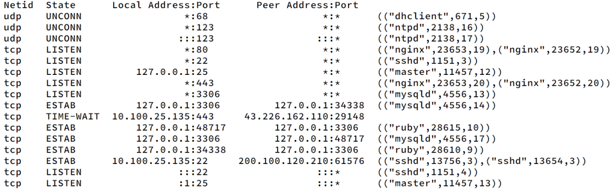

# Capa de Transporte - Parte II

## 1. ¿Cual es el puerto por defecto que se utiliza en los siguientes servicios?

Web / SSH / DNS / Web Seguro / POP3 / IMAP / SMTP

- Web -> 80
- SSH -> 22
- DNS -> 43
- Web Seguro -> 443
- POP3 -> 110
- IMAP -> 143
- SMTP -> 25

Investigue en qué lugar en Linux y en Windows está descripta la asociación utilizada por defecto para cada servicio.

- Linux -> /etc/services
- Windows -> HKEY_LOCAL_MACHINE\SYSTEM\CurrentControlSet\Services


## 2. Investigue qué es multicast. ¿Sobre cuál de los protocolos de capa de transporte funciona? ¿Se podría adaptar para que funcione sobre el otro protocolo de capa de transporte? ¿Por qué?

- Multicast es un tipo de envío, en el cuál desde un emisor se envía un mensaje a múltiples receptores.
- Multicast puede funcionar junto con UDP pero no con TCP, ya que este es end-to-end (de host a host), se establece una conexión entre ellos.

## 3. Investigue cómo funciona el protocolo de aplicación FTP teniendo en cuenta las diferencias en su funcionamiento cuando se utiliza el modo activo de cuando se utiliza el modo pasivo ¿En qué se diferencian estos tipos de comunicaciones del resto de los protocolos de aplicación vistos?

- FTP es un protocolo de la capa de aplicación que permite el intercambio de información (cliente-servidor). Lo que lo distingue de los otros protocolos es que este utiliza dos conexiones, una para control (puerto 21) y otra para datos. FTP tiene dos modos, FTP activo y FTP pasivo.
  - En el modo activo, el servidor inicia la conexión de datos con el cliente al puerto 20.
  - En el modo pasivo, el cliente le dice al servidor a cuál de sus puertos debe conectarse para la conexión de datos.

## 4. Suponiendo Selective Repeat; tamaño de ventana 4 y sabiendo que E indica que el mensaje llegó con errores. Indique en el siguiente gráfico, la numeración de los ACK que el host B envía al Host A.


- ACK = 0
- ACK = 1
- ACK = 3
- ACK = 4
- ACK = 5
- ACK = 2

## 5. ¿Qué restricción existe sobre el tamaño de ventanas en el protocolo Selective Repeat?

- El tamaño de la ventana debe ser menos que (M-1)/2
  - Siendo M la enumeración de los segmentos de una ráfaga.

## 6. De acuerdo a la captura TCP de la siguiente figura, indique los valores de los campos borroneados.


1. 172.20.1.1 - 172.20.1.100 [__SYN__] Seq=__3933822138__, ...
2. 172.20.1.100 - 172.20.1.1 [__SYN, ACK__] Seq=1047471501, Ack=3933822138
3. __172.20.1.1__ - __172.10.1.100__ [__ACK__] Seq=__3933822138__, Ack=__1047471501__

## 7. Dada la sesión TCP de la figura, completar los valores marcados con un signo de interrogación.


- Seq=1, Ack=1
- Seq=1, Ack=8
- Seq=1, Ack=17
- Seq=1, Ack=22
- Seq=22, Ack=1
- Ack=1, Seq=23
- Seq=23, Ack=2 

## 8. ¿Qué es el RTT y cómo se calcula? Investigue la opción TCP timestamp y los campos TSval y TSecr.

- El RTT (Round-Trip Time) es el tiempo de un segmento en ir y volver. Se calcula restando el tiempo de recepción al emisor y el tiempo en el que se envió.
- La opción TCP timestamp es un mecanismo que nos permite medir y sincronizar el tiempo entre los extremos. Es un campo del header TCP que tiene una marca de tiempo escrita por el emisor, después también la escribe el receptor y en función de eso se puede obtener el RTT
  - __TSVal (TimeStamp Value):__ Valor de la marca de tiempo generada por el emisor.
  - __TSecr (TimeStamp Echo Reply):__ Valor de la marca de tiempo que recibe el emisor. Es retornada al emisor.

## 9. Para la captura dada, responder las siguientes preguntas.

### a. ¿Cuántos intentos de conexiones TCP hay?

- En total, hay 5 intentos de conexión (3 de ellos exitosos).

### b. ¿Cuáles son la fuente y el destino (IP:port) para c/u?

- 10.0.2.10:46907 -> 10.0.4.10:5001
- 10.0.2.10:45670 -> 10.0.4.10:7002
- 10.0.2.10:45671 -> 10.0.4.10:7002
- 10.0.2.10:46910 -> 10.0.4.10:5001
- 10.0.2.10:54424 -> 10.0.4.10:9000

### c. ¿Cuántas conexiones TCP exitosas hay en la captura? ¿Cómo diferencia las exitosas de las que no lo son? ¿Cuáles flags encuentra en cada una?

- Hay 3 conexiones exitosas en la captura. Se pueden diferenciar ya que se puede ver la secuencia de mensajes del 3WH (SYN, SYN+ACK, ACK).

### d. Dada la primera conexión exitosa responder:

#### i. ¿Quién inicia la conexión?

- 10.0.2.10:46907 (el que envía el SYN).

#### ii. ¿Quién es el servidor y quién el cliente?

- El servidor es 10.0.4.10:5001 y el cliente 10.0.2.10:46907

#### iii. ¿En qué segmentos se ve el 3-way handshake?

- En los 3 primeros.

#### iv. ¿Cuáles ISNs se intercambian?

- El cliente usará el ISN 221848254
- El servidor usará el ISN 1292618479

#### v. ¿Cuál MSS se negoció?

- El MSS que se negoció es de 1460 bytes.

#### vi. ¿Cuál de los dos hosts envia la mayor cantidad de datos (IP:port)?

- El que envía la mayor cantidad de datos es el 10.0.2.10:46907
  - Para verificar esto, se puede ir hasta el final de la conexión y ver los #SEQ y #ACK de cada uno (para 10.0.2.10:46907 tiene #ACK=2 y #SEQ=786458)

### e. Identificar primer segmento de datos (origen, destino, tiempo, número de fila y número de secuencia TCP).

- Origen => 10.0.2.10:46907
- Destino => 10.0.4.10:5001
- Tiempo => 20 ms
- Número de fila => 6
- Número de secuencia TCP => 1

#### i. ¿Cuántos datos lleva?

- Tiene un payload de 24 bytes.

#### ii. ¿Cuándo es confirmado (tiempo, número de fila y número de secuencia TCP)?

- Tiempo => 18ms
- Número de fila => 7
- Número de secuencia TCP => 1

#### iii. La confirmación, ¿qué cantidad de bytes confirma?

- Confirma los 25 bytes que se recibieron (espera a partir del byte 26).

### f. ¿Quién inicia el cierre de la conexión? ¿Qué flags se utilizan? ¿En cuáles segmentos se ve (tiempo, número de fila y número de secuencia TCP)?

- El que inicia el cierre de la conexión es 10.0.2.10:46907
- Utiliza los flags FYN, ACK y PSH (el PSH no es necesario para el 4/3WH-Close, pero lo usa para indicar que la aplicación debe leer lo que se envía).
- 1er segmento: 19ms, 958, SEQ=786289
- 2do segmento: 1697ms, 959, SEQ=1
- 3er segmento: 20ms, 960, SEQ=786458

## 10. Responda las siguientes preguntas respecto del mecanismo de control de flujo.

### a. ¿Quién lo activa? ¿De qué forma lo hace?

- Lo activa el proceso receptor (Receiver). En función del estado del buffer de recepción, achica o agranda la ventana cuando le envía el segmento al otro extremo (en el campo Window Size).

### b. ¿Qué problema resuelve?

- No satura al proceso receptor (además ayuda a no congestionar a la red).

### c. ¿Cuánto tiempo dura activo y qué situación lo desactiva?

- Se mantiene activo hasta que la aplicación lee los datos que haya en el buffer de recepción. Cuando eso sucede, se libera espacio y el receiver actualiza el tamaño de la ventana.

## 12. Para la captura dada, responder las siguientes preguntas.

### a. ¿Cuántas comunicaciones (srcIP,srcPort,dstIP,dstPort) UDP hay en la captura?

- 10.0.2.10:0, 10.0.30.10:8003
- 10.0.2.10:9000, 10.0.3.10:13
- 10.0.2.10:9004, 10.0.3.10:4555
- 10.0.2.10:9004, 10.0.3.10:9045
- 10.0.3.10:9045, 10.0.2.10:9004
- 10.0.2.10:9004, 1.1.1.1:9045
- 10.0.2.10:53300, 10.0.4.10:9045
- 10.0.2.10:59053, 10.0.4.10:8003
- 10.0.4.10:8003, 10.0.2.10:59053
- 10.0.2.10:8003, 10.0.4.10:8003

### b. ¿Cómo se podrían identificar las exitosas de las que no lo son?

- UDP no provee ningún clase de feedback acerca de si las conexiones son exitosas o no. Dentro de los protocolos de red hay llamado ICMP que nos brinda información sobre el estado de las conexiones, gracias a este podemos ver cuáles de ellas fallaron.

### c. ¿UDP sigue el modelo cliente/servidor?

- No necesariamente, ya que no se establece una conexión entre los dos extremos. Sin embargo podría funcionar como cliente/servidor, esto se haría invirtiendo los valores de src_ip:src_port y dst_ip:dst_port

### d. ¿Qué servicios o aplicaciones suelen utilizar este protocolo?

- Las aplicaciones o servicios que usan este protocolo son aquellas en las que la pérdida de paquetes no es critica y la latencia es más importante, por ejemplo DNS.

### e. ¿Qué hace el protocolo UDP en relación al control de errores?

- UDP no realiza un control de errores exhaustivo como TCP. UDP solo tiene un campo de checksum para verificar si el datagrama está corrupto.

### f. Con respecto a los puertos vistos en las capturas, ¿observa algo particular que lo diferencie de TCP?

- Cuando ambos extremos se envían mensajes, solo se invierten los valores de src_ip:src_port y dst_ip:dst_port

### g. Dada la primera comunicación en la cual se ven datos en ambos sentidos (identificar el primer datagrama):

#### i. ¿Quién envía el primer datagrama (srcIP,srcPort)?

- 10.0.2.10:9004

#### ii. ¿Cuantos datos se envían en un sentido y en el otro?

- De 10.0.2.10:9004 a 10.0.3.10:9045 se envían dos datagramas (Len=4, Len=5)
- De 10.0.3.10:9045 a 10.0.2.10:9004 se envían dos datagramas también (Len=7, Len=5)

### h. ¿Se puede calcular un RTT?

- Wireshark nos brinda una columna _TIME_ la cuál tiene el tiempo en el que se manda un datagrama. Podríamos restar el tiempo en el que se envía un datagrama y el tiempo en el que se obtiene una respuesta.

## 13. Desarrolle un cliente y un servidor, donde el cliente envíe un mensaje al servidor y este último imprima en pantalla el contenido del mismo.

### a. Utilizando UDP.

```ruby
require 'socket'

class UDPServer
  def initialize(port)
    @port = port
    @server = UDPSocket.new
    @server.bind('0.0.0.0', @port)
  end

  def start
    loop do
      data, sender = @server.recvfrom(1024)
      sender_ip = sender[3]
      sender_port = sender[1]
      puts "Mensaje recibido de #{sender_ip}:#{sender_port}: #{data}"
    end
  end

  def close
    @server.close
  end
end

class UDPClient
  def initialize(server_ip, server_port)
    @server_ip = server_ip
    @server_port = server_port
    @client = UDPSocket.new
  end

  def send_msg(msg)
    @client.send(msg, 0, @server_ip, @server_port)
  end

  def close
    @client.close
  end
end

server = UDPServer.new(12345)
client = UDPClient.new('127.0.0.1', 12345)
server.start
client.send_message("Hola, servidor UDP")
client.close
```

### b. Utilizando TCP.

```ruby
require 'socket'

class TCPServerApp
  def initialize(port)
    @port = port
    @server = TCPServer.new('0.0.0.0', @port)
  end

  def start
    loop do
      client = @server.accept
      handle_client(client)
    end
  end

  def handle_client(client)
    message = client.gets.chomp
    puts "Mensaje recibido del cliente: #{message}"
    client.close
  end
end

class TCPClient
  def initialize(server_ip, server_port)
    @server_ip = server_ip
    @server_port = server_port
  end

  def send_message(message)
    client = TCPSocket.new(@server_ip, @server_port)
    client.puts(message)
    client.close
  end
end

server_app = TCPServerApp.new(12345)
server_app.start
client = TCPClient.new('127.0.0.1', 12345)
client.send_message("Hola, servidor TCP")
```

## 14. Compare ambas implementaciones. ¿Qué diferencia nota entre la implementación de cada una? ¿Cuál le parece más simple?

//Ver resumen

## 15. Dada la salida que se muestra en la imagen, responda los ítems debajo.



### Suponga que ejecuta los siguientes comandos desde un host con la IP 10.100.25.90. Responda qué devuelve la ejecución de los siguientes comandos y, en caso que corresponda, especifique los flags.

- hping3 -p 3306 –udp 10.100.25.135
  - ICMP - Port Unreacheable  
- hping3 -S -p 25 10.100.25.135
  - La respuesta es un segmento TCP del servidor con los flags SYN+ACK
- hping3 -S -p 22 10.100.25.135
  - La respuesta es un segmento TCP del servidor con los flags SYN+ACK
- hping3 -S -p 110 10.100.25.135
  - La respuesta es un segmento TCP del servidor con los flags RST+ACK

### ¿Cuántas conexiones distintas hay establecidas? Justifique.

- //Consulta: La conexión TIME-WAIT cuenta?
- En total, hay 3 conexiones establecidas.
  - Si bien, podemos ver más de 3 renglones con el estado __ESTAB__, varias de ellas son repetidas pero con los hosts invertidos. Esto se da porque el proceso cliente y el proceso servidor están en el mismo host
  - Por ejemplo, tenemos la conexión entre 127.0.0.1:3306 y 127.0.0.1:34338. Dicha conexión aparece dos veces (127.0.0.1:3306, 127.0.0.1:34338 y 127.0.0.1:34338 y 127.0.0.1:3306)
  - En el caso de 10.100.25.135:22 y 200.100.120.210:61576 no aparece dos veces ya que 200.100.120.210:61576 es otro host.

## 16. Complete en la columna Orden, el orden de aparición de los paquetes representados en cada fila.

//Lo dejo de repaso para el parcial =)

