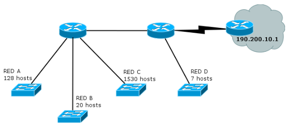
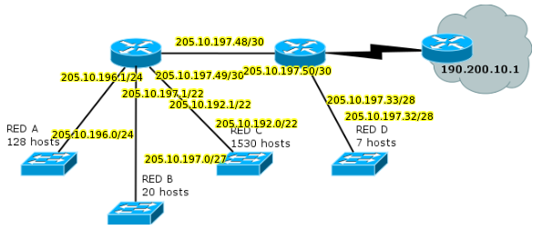
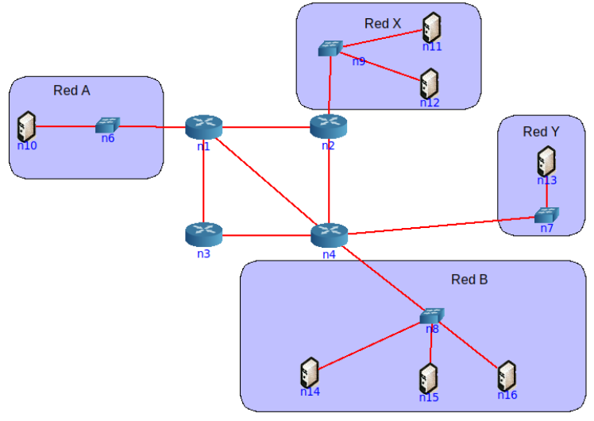
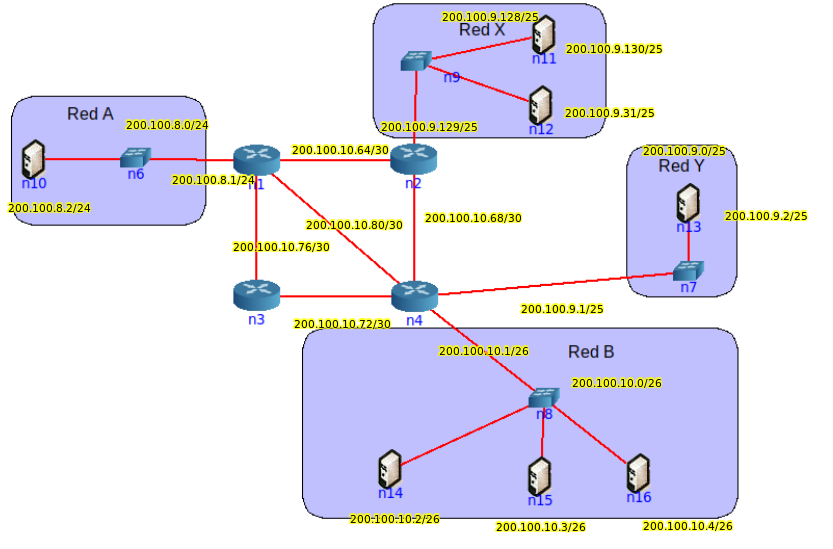

# Práctica 7 - Capa de Red - Direccionamiento

# Introducción

## 1. ¿Qué servicios presta la capa de red? ¿Cuál es la PDU en esta capa? ¿Qué dispositivo es considerado sólo de la capa de red?

- Los servicios que sirve la Capa de Red son: Enrutamiento y reenvío de paquetes entre distintos hosts.
- La PDU de la Capa de Red es el paquete (aunque también se lo puede encontrar como datagrama IP).
- El router es un dispositivo considerado sólo de capa de red (aunque también tiene acciones en Capa de Enlace).

## 2. ¿Por qué se lo considera un protocolo de mejor esfuerzo?

- IP (Internet Protocol) es un protocolo Best-Effort ya que hace lo justo y necesario para que el paquete llega.

## 3. ¿Cuántas redes clase A, B y C hay? ¿Cuántos hosts como máximo pueden tener cada una?

| Clase Redes | Nro Redes | Nro Hosts |
|-------------|-----------|-----------|
| Clase A | 2⁷ | 2²⁴ - 2 |
| Clase B | 2¹⁴ | 2¹⁶ - 2 |
| Clase C | 2²¹ | 2⁸ - 2 |

## 4. ¿Qué son las subredes? ¿Por qué es importante siempre especificar la máscara de subred asociada?

- Las subredes son sub-divisiones de redes más grandes. De esta manera nos permite hacer un mejor uso del número de redes y de hosts que disponemos de un bloque.
- La máscara de subred es importante, ya que nos permite saber cuál es la IP de una subred
  - Consta de una secuencia de bits en 1 igual a la longitud de bits designados para red y subred.
  - A esa maścara se la aplica un AND lógico a una dirección IP y obtenemos la IP de esa red o subred.

## 5. ¿Cuál es la finalidad del campo Protocol en la cabecera IP? ¿A qué campos de la capa de transporte se asemeja en su funcionalidad?

- La finalidad del campo _Protocol_ del datagrama IP es saber a qué protocolo de transporte se le tiene que pasar el paquete una vez llegue a destino. Este campo permite al receptor saber cómo interpretar y procesar esos datos.
- Se asemeja al campo donde se indica el puerto destino.

# División de redes

## 6. Para cada una de las siguientes direcciones IP (172.16.58.223/26, 163.10.5.49/27, 128.10.1.0/23, 10.1.0.0/24, 8.40.11.179/12) determine:

### a. ¿De qué clase de red es la dirección dada (Clase A, B o C)?

- 172.16.58.223/26 -> Clase B
- 163.10.5.49/27 -> Clase B
- 128.10.1.0/23 -> Clase B
- 10.1.0.0/24 -> Clase A
- 8.40.11.179/12 -> Clase A

### b. ¿Cuál es la dirección de subred?

- 172.16.58.223/26
  - IP: 10101101 00010000 00111010 11011111
  - Mask: 11111111 11111111 11111111 11000000
  - Subred: 10101101 00010000 00111010 11000000 => 172.16.58.192
- 163.10.5.49/27
  - IP: 10100011 00001010 00000101 00110001 
  - Mask: 11111111 11111111 11111111 11100000
  - Subred: 10100011 00001010 00000101 00100000 => 163.10.5.32
- 128.10.1.0/23
  - IP: 10000000 00001010 00000001 00000000
  - Mask: 11111111 11111111 11111110 00000000
  - Subred: 10000000 00001010 00000000 00000000 => 128.10.0.0
- 10.1.0.0/24
  - IP: 00001010 00000001 00000000 00000000
  - Mask: 11111111 11111111 11111111 00000000
  - Subred: 00001010 00000001 00000000 00000000 => 10.1.0.0
- 8.40.11.179/12
  - IP: 00001000 00101000 00001011 10110011
  - Mask: 11111111 11110000 00000000 00000000
  - Subred: 00001000 00100000 00000000 00000000 => 8.32.0.0

### c. ¿Cuál es la cantidad máxima de hosts que pueden estar en esa subred?

- 172.16.58.192/26
  - Cantidad de hosts => 2⁶ - 2
- 163.10.5.32/27
  - Cantidad de hosts => 2⁵ - 2
- 128.10.0.0/23
  - Cantidad de hosts => 2⁹ - 2
- 10.1.0.0/24
  - Cantidad de hosts => 2⁸ - 2
- 8.32.0.0/12
  - Cantidad de hosts => 2²⁰ - 2

### d. ¿Cuál es la dirección de broadcast de esa subred?

- 172.16.58.192/26
  - Dir. Broadcast => 172.16.58.255/26
- 163.10.5.32/27
  - Dir. Broadcast => 163.10.5.63/27
- 128.10.0.0/23
  - Dir. Broadcast => 128.10.1.255/23
- 10.1.0.0/24
  - Dir. Broadcast => 10.1.0.255/24
- 8.32.0.0/12
  - Dir. Broadcast => 8.47.255.255/12

### e. ¿Cuál es el rango de direcciones IP válidas dentro de la subred?

// A qué se refiere con válidas??

- 172.16.58.192/26
  - 172.16.58.193 - 172.16.58.254
- 163.10.5.32/27
  - 163.10.5.33 - 163.10.5.62
- 128.10.0.0/23
  - 128.10.0.1 - 128.10.1.254
- 10.1.0.0/24
  - 10.1.0.1 - 10.1.0.254
- 8.32.0.0/12
  - 8.32.0.1 - 8.47.255.254

### Resumen:

| Dir. inicial | Clase | Dir. Subred | N° Hosts | Dir. Broadcast | Rango |
|--------------|-------|-------------|----------|---------------|-----|
| 172.16.58.223/26 | B | 172.16.58.192/26 | 2⁶ - 2 | 172.16.58.255/26 | 172.16.58.193 - 172.16.58.254 |
| 163.10.5.49/27 | B | 163.10.5.32/27 | 2⁵ - 2 | 163.10.5.63/27 | 163.10.5.33 - 163.10.5.62 |
| 128.10.1.0/23 | B | 128.10.0.0/23 | 2⁹ - 2 | 128.10.1.255/23 | 128.10.0.1 - 128.10.1.254 |
| 10.1.0.0/24 | A | 10.1.0.0/24 | 2⁸ - 2 | 10.1.0.255/24 | 10.1.0.1 - 10.1.0.254 |
| 8.40.11.179/12 | A | 8.32.0.0/12 | 2²⁰ - 2 | 8.47.255.255/12 | 8.32.0.1 - 8.47.255.254 |

## 7. Su organización cuenta con la dirección de red 128.50.10.0. Indique:

### a. ¿Es una dirección de red o de host?

- Es una dirección de host.

### b. Clase a la que pertenece y máscara de clase.

- Es de clase B. Su máscara es /16 (255.255.0.0)
  - Con esto en mente, podemos ver que el 3er octeto (destinado a los hosts) tiene el valor 10, por eso es que 128.50.10.0 es una dirección de host y no de red.

### c. Cantidad de hosts posibles.

- 2¹⁶ - 2

### d. Se necesitan crear, al menos, 513 subredes. Indique:

#### i. Máscara necesaria.

- Para crear 513 subredes necesitamos 10 bits, ya que 2¹⁰ = 1024 subredes (teniendo un desperdicio de 511 subredes).
- La máscara sería /26 (255.255.192.0).

#### ii. Cantidad de redes asignables.

- Tenemos un total de 1024 redes asignables

#### iii. Cantidad de hosts por subred.

- Nos quedaron 6 bits para host. Por lo cuál, cada subred tendrá un máximo de 2⁶ - 2 hosts.

#### iv. Dirección de la subred 710.

// Siempre que se calcule una dirección IP de una subred específica, se le resta 1 ya que la 1er subred válida es la 0

- La dirección de red que nos queda es 128.50.10.0/26.
- 709 en binario => 10110001 01
- 128.50.10.0 => 10000000 00110010 00001010 00000000
- La dirección IP de la subred N° 710 es 128.50.177.64/26

#### v. Dirección de broadcast de la subred 710.

- La dirección de broadcast de la subred N° 710 es: 128.50.177.127/26

## 8. Si usted estuviese a cargo de la administración del bloque IP 195.200.45.0/24

### a. ¿Qué máscara utilizaría si necesita definir al menos 9 subredes?

- Para tener 9 subredes necesitamos 4 bits (2⁴ = 16). Por lo tanto, nuestra máscara sería /28

### b. Indique la dirección de subred de las primeras 9 subredes.

1. 195.200.45.0
2. 195.200.45.16
3. 195.200.45.32
4. 195.200.45.48
5. 195.200.45.64
6. 195.200.45.80
7. 195.200.45.96
8. 195.200.45.112
9. 195.200.45.128

### c. Seleccione una e indique dirección de broadcast y rango de direcciones asignables en esa subred.

- 195.200.45.0
  - Dir. Broadcast => 195.200.45.15
  - Rango de direcciones => 195.200.45.1 - 195.200.45.14

## 9. Dado el siguiente gráfico:

### a. Verifique si es correcta la asignación de direcciones IP y, en caso de no serlo, modifique la misma para que lo sea.

La asignación de direcciones IP no es correcta.
- Entre el router B y el router A la dirección es 172.26.22.0/30
  - Del lado de A la dirección IP que tiene es la 172.26.22.3 lo cuál no es correcto, ya que esa IP es la Dir. de Broadcast de esa red.
  - El único cambio que haría sería asignarle 172.26.22.2 al router A.
- Entre el router B y el router C la dirección es 172.17.10.0/28
  - El problema acá está con respecto a la máscara. Ya que con esa máscara tenemos 2⁴ - 2 direcciones IP para hosts, pero en este caso tenemos solo 2 hosts (Router B y C).
  - Le cambiaría la máscara a /30, a un router le daría 172.17.10.1 y al otro 172.17.10.2

### b. ¿Cuántos bits se tomaron para hacer subredes en la red 10.0.10.0/24? ¿Cuántas subredes se podrían generar?

- La dirección 10.0.10.0 es de clase A, cuya máscara por defecto es /8. Por lo tanto se tomaron 16 bits para subredes.
- En total hay 2¹⁶ subredes posibles.

### c. Para cada una de las redes utilizadas indique si son públicas o privadas.

- 191.26.145.0/24 -> Pública
- 172.26.22.0/30 -> Privada
- 172.17.10.0/30 -> Privada
- 192.168.5.0/24 -> Privada
- 10.0.10.0/24 -> Privada

# CIDR

## 10. ¿Qué es CIDR (Class Interdomain routing)? ¿Por qué resulta útil?

- CIDR es una estrategía implementada con el fin de reducir los problemas que aparecieron debido al crecimiento de Internet (agotamiento de direcciones B, sobre-crecimiento de la tabla de ruteo, desperdicio de direcciones). Consiste en permitir máscaras de longitud variable.
- Es útil ya que nos permite hacer una asignación más optima de direcciones IP y reducir el tamaño de las tablas de ruteo.

## 11. ¿Cómo publicaría un router las siguientes redes si se aplica CIDR?

- 198.10.1.0/24
- 198.10.0.0/24
- 198.10.3.0/24
- 198.10.2.0/24

198.10.0.0/22

## 12. Listar las redes involucradas en los siguientes bloques CIDR:

### a. 200.56.168.0/21

- 200.56.168.0/24
- 200.56.169.0/24
- 200.56.170.0/24
- 200.56.171.0/24
- 200.56.172.0/24
- 200.56.173.0/24
- 200.56.174.0/24
- 200.56.175.0/24

### b. 195.24.0.0/13

- 195.24.0.0/16
- 195.25.0.0/16
- 195.26.0.0/16
- 195.27.0.0/16
- 195.28.0.0/16
- 195.29.0.0/16
- 195.30.0.0/16
- 195.31.0.0/16

### c. 195.24/13

// Sería lo mismo que el inciso b?

## 13. El bloque CIDR 128.0.0.0/2 o 128/2, ¿Equivale a listar todas las direcciones de red de clase B? ¿Cuál sería el bloque CIDR que agrupa todas las redes de clase A?

- Si, el bloque CIDR 128/2 equivale a listar las direcciones de red de la clase B. Ya que con la máscara /2 (192.0.0.0) nos permite tener hasta 2¹⁴ redes.

- El bloque CIDR que agrupa todas las redes de clase A es el bloque 0.0.0.0/1

# VLSM

## 14. ¿Qué es y para qué se usa VLSM?

- VLSM (Variable-Length Subnet Masking) es una técnica que consiste en sub-dividir redes en base a máscaras de longitud variable. Sugiere hacer varios niveles de división en redes para lograr máscaras más óptimas para cada una de las subredes necesarias.

## 15. Describa, con sus palabras, el mecanismo para dividir subredes utilizando VLSM.

- Supongamos que tengo una red que la quiero subdividir en X sub-redes. Una de esas sub-redes necesita 126 hosts, pero el resto solo necesita 30 hosts, por lo que el resto de esas sub-redes van a desperdiciar mas o menos 90 direcciones IP, por lo que es mejor tener una máscara /25 para la red que requiere 126 hosts y máscaras de /27 para aquellas que necesitan 30 hosts (con la posibilidad de tener más subredes, 4 más).

## 16. Suponga que trabaja en una organización que tiene la red que se ve en el gráfico y debe armar el direccionamiento para la misma, minimizando el desperdicio de direcciones IP. Dicha organización posee la red 205.10.192.0/19, que es la que usted deberá utilizar.

### a. ¿Es posible asignar las subredes correspondientes a la topología utilizando subnetting sin vlsm? Indique la cantidad de hosts que se desperdicia en cada subred.

- No es posible. Necesitamos 3 bits para representar 5 redes (una extra que es la punto a punto), lo cuál conlleva a que no nos alcancen los bits para cubrir la cantidad de hosts que necesita la red C.
- La red qué más hosts necesita es la red C, con 1530 hosts. Para cubrir eso se necesitan 11 bits (2¹¹ - 2 = 2046). Cada red tendría un desperdicio de:
  - Red A -> 1918 hosts
  - Red B -> 2026 hosts
  - Red C -> 516 hosts
  - Red D -> 2039 hosts

### b. Asigne direcciones a todas las redes de la topología. Tome siempre en cada paso la primer dirección de red posible.

Tenemos la red C que necesita 1530 hosts, para eso necesitamos 11 bits (2046 hosts).

- Dirección IP -> 205.10.192.0 = 11001101 00001010 11000000 00000000
- Mask -> 11111111 11111111 111|111|00 00000000 -> /22
- Se usaron 11 bits para hosts y quedaron 3 bits para subred. Vamos a asignar el 1er segmento de 2046 hosts para la red B.
- Dirección IP de Red C -> 205.10.192.0/22
- Bloque de direcciones libres:
  - 205.10.196.0/22
  - 205.10.200.0/22
  - 205.10.204.0/22
  - 205.10.208.0/22
  - 205.10.212.0/22
  - 205.10.216.0/22
  - 205.10.220.0/22

Tenemos la red A que necesita 128 hosts. Para esto necesitamos 8 bits (254 hosts). Usamos el bloque 205.10.196.0/22

- Dirección IP -> 205.10.196.0 = 11001101 00001010 11000100 00000000
- Mask -> 11111111 11111111 111111|11 00000000 = /24
- Se usaron 8 bits para host y quedaron 2 bits para subred. Vamos a asignar el 1er segmento de 254 hosts para la red A.
- Dirección IP de Red A -> 205.10.196.0/24
- Bloque de direcciones disponibles:
  - 205.10.197.0/24
  - 205.10.198.0/24
  - 205.10.199.0/24

Tenemos la red B que necesita 20 hosts. Para esto necesitamos 5 bits (30 hosts). Usamos el bloque 205.10.197.0/24
- Dirección IP -> 205.10.197.0 = 11001101 00001010 11000101 00000000
- Mask -> 11111111 11111111 11111111 111|00000 = /27
- Se usaron 5 bits para host y quedaron 3 bits para subred. Vamos a asignar el 1er segmento de 30 hosts para la red B.
- Dirección IP de Red B -> 205.10.197.0/27
- Bloque de direcciones disponibles:
  - 205.10.197.32/27
  - 205.10.197.64/27
  - 205.10.197.96/27
  - 205.10.197.128/27
  - 205.10.197.160/27
  - 205.10.197.192/27
  - 205.10.197.224/27

Tenemos la red D que necesita 7 hosts. Para esto necesitamos 4 bits (14 hots). Usamos el bloque 205.10.197.32/27
- Dirección IP -> 205.10.197.32 = 11001101 00001010 11000101 00100000
- Mask -> 11111111 11111111 11111111 111|1|0000 = /28
- Se usaron 4 bits para host y quedó 1 bit para subred. Vamos a asignar el 1er segmento de 14 hosts para la red D.
- Dirección IP de red D -> 205.10.197.32/28
- Bloque de direcciones disponibles:
  - 205.10.197.48/28

Por último, necesitamos una red punto a punto para los routers. Como solo son dos routers conectados, sabemos que son dos hosts, por lo tanto necesitamos 2 bits (2 hosts). Para esta red vamos a usar el bloque libre 205.10.197.48/29
- Dirección IP -> 205.10.197.48 = 11001101 00001010 11000101 00110000
- Mask -> 11111111 11111111 11111111 1111|11|00 = /30
- Se usaron 2 bits para host y quedaron 2 bits para subred. Vamos a asignar el 1er segmento de 2 hosts para la red punto a punto.
- Dirección IP de red punto a punto -> 205.10.197.48/30
- Bloque de direcciones disponibles:
  - 205.10.197.52/30
  - 205.10.197.56/30
  - 205.10.197.60/30

Resumen:

- Red A: 205.10.196.0/24
- Red B: 205.10.197.0/27
- Red C: 205.10.192.0/22
- Red D: 205.10.197.32/28
- Red Punto a Punto: 205.10.197.48/30

### c. Para mantener el orden y el inventario de direcciones disponibles, haga un listado de todas las direcciones libres que le quedaron, agrupándolas utilizando CIDR.

Direcciones disponibles:

- 205.10.200.0/22
- 205.10.204.0/22
- 205.10.208.0/22
- 205.10.212.0/22
- 205.10.216.0/22
- 205.10.220.0/22

- 205.10.198.0/24
- 205.10.199.0/24

- 205.10.197.64/27
- 205.10.197.96/27
- 205.10.197.128/27
- 205.10.197.160/27
- 205.10.197.192/27
- 205.10.197.224/27

- 205.10.197.52/30
- 205.10.197.56/30
- 205.10.197.60/30

CIDR:
- 205.10.200.0/19
- 205.10.198.0/22
- 204.10.197.64/24
- 205.10.197.52/28

### d. Asigne direcciones IP a todas las interfaces de la topología que sea posible.

## 17. Utilizando la siguiente topología y el bloque asignado, arme el plan de direccionamiento IPv4 teniendo en cuenta las siguientes restricciones:

Utilizar el bloque IPv4 200.100.8.0/22

- a. La red A tiene 125 hosts y se espera un crecimiento máximo de 20 hosts.
- b. La red X tiene 63 hosts.
- c. La red B cuenta con 60 hosts
- d. La red Y tiene 46 hosts y se espera un crecimiento máximo de 18 hosts.
- e. En cada red, se debe desperciciar la menor cantidad de direcciones IP posibles. En este sentido, las redes utilizadas para conectar los routers deberán utilizar segmentos de red /30 de modo de desperdiciar la menor cantidad posible de direcciones IP.

Tomamos la Red A, ya que es la que más hosts necesita. La red A necesita 125 hosts (en un futuro 145), por lo que se necesitan 8 bits para host (254 hosts).
- Dirección IP -> 200.100.8.0/22 = 11001000 01100100 00001000 00000000
- Mask -> 11111111 11111111 111111|11 00000000 = /24
- Se usaron 8 bits para host y quedaron 2 bits para subred. Asignamos el 1er segmento libre de 254 hosts para la Red A.
- Dirección IP de Red A -> 200.100.8.0/24
- Bloque de direcciones disponibles:
  - 200.100.9.0/24 (usado por Red Y)
  - 200.100.10.0/24 (usado por Red B)
  - 200.100.11.0/24

La Red Y necesita 46 hosts (en un futuro 64), por lo que se necesitan 7 bits de host (126 hosts). Le asigno el bloque de direcciones 200.100.9.0/24
- Dirección IP -> 200.100.9.0 = 11001000 01100100 00001001 00000000
- Mask -> 11111111 11111111 11111111 10000000 = /25
- Se usaron 7 bits para host y quedó uno para subred. Asignamos el 1er segmento libre de 126 hosts para la Red Y.
- Dirección IP de Red Y -> 200.100.9.0/25
- Bloque de direcciones disponibles:
  - 200.100.9.128/25 (usado por Red X)

La Red X necesita 63 hosts, por lo que se necesitan 7 bits de host (126 hosts). Le asigno el bloque de direcciones 200.100.9.128/25
- En este caso, ese bloque alberga 126 hosts, por lo que no es necesario subdividir esa red.
- Dirección IP de Red X -> 200.100.9.128/25

La Red B necesita 60 hosts, por lo que se necesita 6 bits de host (62 hosts). Le asigno el bloque de direcciones 200.100.10.0/24
- Dirección IP -> 200.100.10.0 = 11001000 01100100 00001010 00000000
- Mask -> 11111111 11111111 11111111 11|000000 = /26
- Se usaron 6 bits para host y quedaron 2 para subred. Asignamos el 1er segmento libre de 62 hosts para la Red B.
- Dirección IP de Red B -> 200.100.10.0/26
- Bloque de direcciones disponibles:
  - 200.100.10.64/26 (para redes punto a punto)
  - 200.100.10.128/26
  - 200.100.10.192/26

Ahora necesitamos las redes punto a punto para los routers. En concreto, necesitamos 5 redes punto a punto. Para cada red se necesita 2 hosts (por lo tanto, necesitamos 2 bits, 2²-2=2). Tomamos el bloque de direcciones disponible 200.100.10.64/26
- Dirección IP -> 200.100.10.64 = 11001000 01100100 00001010 01000000
- Mask -> 11111111 11111111 11111111 11|1111|00 = /30
- Se usaron 2 bits para host y quedaron 4 para subred.
- Bloque de direcciones disponibles
  - 200.100.10.64/30 (usado)
  - 200.100.10.68/30 (usado)
  - 200.100.10.72/30 (usado)
  - 200.100.10.76/30 (usado)
  - 200.100.10.80/30 (usado)
  - 200.100.10.84/30
  - 200.100.10.88/30
  - 200.100.10.92/30
  - 200.100.10.96/30
  - 200.100.10.100/30
  - 200.100.10.104/30
  - 200.100.10.108/30
  - 200.100.10.112/30
  - 200.100.10.116/30
  - 200.100.10.120/30
  - 200.100.10.124/30

Resumen:

- Red A: 200.100.8.0/24
- Red X: 200.100.9.128/25
- Red B: 200.100.10.0/26
- Red Y: 200.100.9.0/25
- Redes punto a punto:
  - 200.100.10.64/30
  - 200.100.10.68/30
  - 200.100.10.72/30
  - 200.100.10.76/30
  - 200.100.10.80/30

## 18. Asigne direcciones IP en los equipos de la topología según el plan anterior.

# ICMP y Configuración IP

## 19. Describa qué es y para qué sirve el protocolo ICMP.

### a. Analice cómo funciona el comando ping.

#### i. Indique el tipo y código ICMP que usa el ping.

#### ii. Indique el tipo y código ICMP que usa la respuesta de un ping.

### b. Analice cómo funcionan comandos como traceroute/tracert de Linux/Windows y cómo manipulan el campo TTL de los paquetes IP.

### c. Indique la cantidad de saltos realizados desde su computadora hasta el sitio www.nasa.gov. Analice:

#### i. Cómo hacer para que no muestre el nombre del dominio asociado a la IP de cada salta.

#### ii. La razón de la aparición de * en parte o toda la respuesta de un salto.

### d. Verifique el recorrido hacia los servidores de nombre del dominio unlp.edu.ar. En base al recorrido realizado, ¿podría confirmar cuál de ellos toma un camino distinto?

## 20. ¿Para que se usa el bloque 127.0.0.0/8? ¿Qué PC responde a los siguientes comandos?

## 21. Investigue para qué sirven los comandos ifconfig y route. ¿Qué comandos podría utilizar en su reemplazo? Inicie una topología con CORE, cree una máquina y utilice en ella los comandos anteriores para practicar sus diferentes opciones, mínimamente:

- Configurar y quitar una dirección IP en una interfaz.
- Ver la tabla de ruteo de la máquina.
