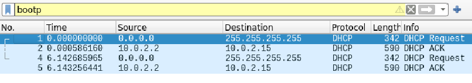
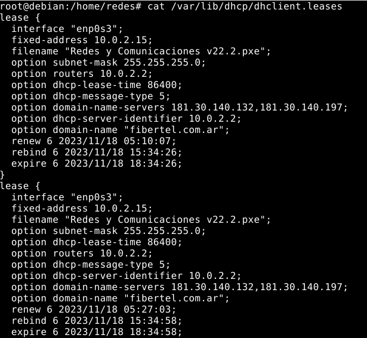
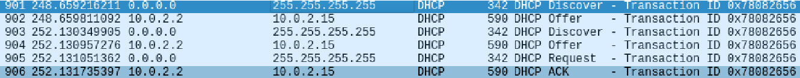
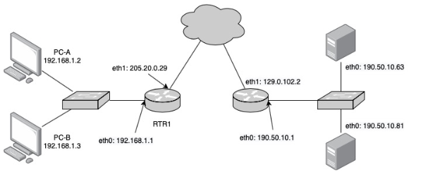
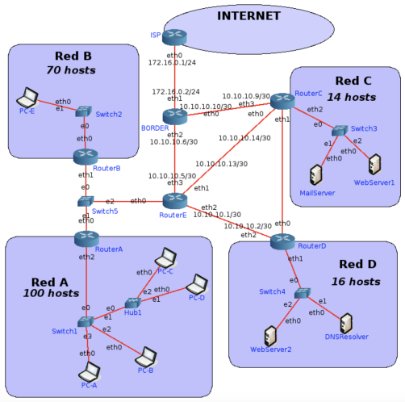
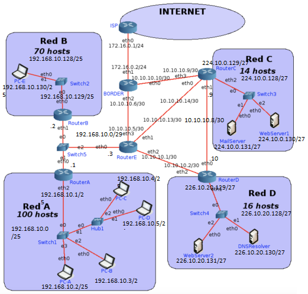
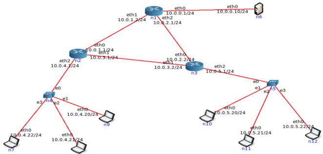

# Práctica 8 - Capa de Red - Ruteo

# Recomendación

## 1. Al final de la práctica se encuentra un ejercicio para ser realizado en la herramienta CORE. Si bien el ejercicio no agrega conceptos nuevos a los vistos previamente recomendamos su resolución para que puedan configurar, probar y analizar todo lo aprendido en una simulación de una red

# Fragmentación

## 2. Se tiene la siguiente red con los MTUs indicados en la misma. Si desde pc1 se envía un paquete IP a pc2 con un tamaño total de 1500 bytes (cabecera IP más payload) con el campo Identification = 20543, responder:

- Indicar IPs origen y destino y campos correspondientes a la fragmentación cuando el paquete sale de pc1

  - IP Origen: 10.0.0.20/24
  - IP Destino: 10.0.2.20/24
  - Header: 20
  - Length: 1500
  - Identificación: 20543
  - DF Flag: 0
  - MF Flag: 0
  - Fragment offset: 0
  
- ¿Qué sucede cuando el paquete debe ser reenviado por el router R1?

  - El enlace entre el router R1 y R2 tiene un MTU de 600, por lo tanto, el paquete se fragmentará.

- Indicar cómo quedarían las paquetes fragmentados para ser enviados por el enlace entre R1 y R2.

  - Para fragmentar debemos tomar el MTU y restarle el valor del header (20B)
    - 600B - 20B = 580B
  - Después debemos encontrar el múltiplo de 8 más cercano a ese número y sumarle el header (que sería el tamaño total).
    - En este caso hay dos múltiplos cercanos, 584 y 576, pero usamos 576 ya que si le sumamos el header no se pasa de los 600B, por lo tanto, el Length sería de 596B
    - Entonces, en este caso vamos a tener dos fragmentos de 596B. Para el último fragmento vamos a tener 348 pero a ese último fragmento no se le suma 20 del header (por qué?).
    - El tamaño del payload debe ser múltiplo de 8.
  - Para el caso del offset, lo que tenemos que hacer es agarrar el Length obtenido, restarle el header (20) y dividirlo por 3, eso nos da 72.
  - El primer fragmento tendría offset 0
  - El último segmento tendría MF Flag en 0
  - La suma de los length de los fragmentos es igual al length del paquete original (1500B) + 20 * (#fragmentos - 1)

| Fragmento 1 | Fragmento 2 | Fragmento 3 |
|-------------|-------------|-------------|
| Header: 20  |  Header: 20 |  Header: 20 |
| Length: 596 | Length: 596 | Length: 348 |
|  ID: 20543  |  ID: 20543  |  ID: 20543  |
|  DF Flag: 0 |  DF Flag: 0 |  DF Flag: 0 |
|  MF Flag: 1 |  MF Flag: 1 |  MF Flag: 0 |
| Frag. offset: 0 | Frag. offset: 72 | Frag. offset: 144 |   

- ¿Dónde se unen nuevamente los fragmentos? ¿Qué sucede si un fragmento no llega?

  - Los fragmentos se vuelven a unir en los sistemas terminales. Si un fragmento se pierde, se tienen que retransmitir todos los fragmentos del paquete original.
  - Esto depende de los protocolos de las capas superiores, recordar que IP es Best-Effort. 

- Si un fragmento tiene que ser reenviado por un enlace con un MTU menor al tamaño del fragmento, ¿qué hará el router con ese fragmento?

  - En este caso, se vuelve a fragmentar en función del nuevo MTU.

# Ruteo

## 3. ¿Qué es el ruteo? ¿Por qué es necesario?

- El ruteo es la acción de seleccionar la interfaz de salida y el próximo salto a partir de la tabla de ruteo de un dispositivo (router o host).
- Es necesario para que el paquete viaje desde un origen hasta un destino.

## 4. En las redes IP el ruteo puede configurarse en forma estática o en forma dinámica. Indique ventajas y desventajas de cada método.

| Forma | Ventajas | Desventajas |
| ----- | -------- | ----------- |
| Estática | Fácil de configurar en redes pequeñas. Se tiene un control total sobre las rutas. Genera menos tráfico. | No se adapta a cambios. No es escalable. Menos eficiente en cuanto a tiempo en redes grandes. |
| Dinámica | Es más adaptable a cambios. Es más escalable y usa más eficientemente los recursos. | Es muy compleja y difícil de mantener. El tráfico de red tiende a ser mayor, lo cuál además genera inestabilidad si no se la configura correctamente. |

## 5. Una máquina conectada a una red pero no a Internet, ¿tiene tabla de ruteo?

- Si, esa tabla de ruteo sirve para que la máquina pueda comunicarse en dicha red.

## 6. Observando el siguiente gráfico y la tabla de ruteo del router D, responder:

### a. ¿Está correcta esa tabla de ruteo? En caso de no estarlo, indicar el o los errores encontrados. Escribir la tabla correctamente (no es necesario agregar las redes que conectan contra los ISPs)

- La entrada a la red 205.10.280.0 está mal escrita, en realidad la red (A) es 205.10.0.280 y el next hop sería 10.0.0.1 no 10.0.0.2 (que esa es una IP del router).
- Falta la red 10.0.0.8 (las redes directamente conectadas SIEMPRE tienen que estar).
- La red 205.20.0.193 no existe.
- La entrada a la red 10.0.0.12, el next hop no debe tener prefijo.
- La conexión con la red B en realidad sería con la IP 205.20.0.192, por el Rtr-B sería un camino más óptimo (no es un error lo último).

escribir tabla.

- Si el enunciado no aclara, el router debe alcanzar todas las redes (+ el Default Gateway)

### b. Con la tabla de ruteo del punto anterior, Red D, ¿tiene salida a Internet? ¿Por qué? ¿Cómo lo solucionaría? Suponga que los demás routers están correctamente configurados, con salida a Internet y que Rtr-D debe salir a Internet por Rtr-C.

- No, con la configuración dada la Red D no tiene sálida a Internet ya que el router no tiene ninguna configuración hacía algunos de los routers ISP.
- Una forma de solucionarlo es agregar un default gateway que mande el tráfico que va hacía internet a través del router C por ejemplo (suponiendo que Rtr-C también tendrá un Default Gateway a su ISP).

| Red Destino | Mask | Next-Hop | Interface |
| ----------- | ---- | -------- | --------- |
|   0.0.0.0   |  /0  | 10.0.0.10 |   eth3   |

### c. Teniendo en cuenta lo aplicado en el punto anterior, si en Rtr-C estuviese la siguiente entrada en su tabla de ruteo qué sucedería si desde una PC en Red D se quiere acceder un servidor con IP 163.10.5.15.

| Red Destino | Mask | Next-Hop | Interface |
|-------------|------|----------|-----------|
| 163.10.5.0  | /24  | 10.0.0.9 |   eth1    |

- El Rtr-D recibe el paquete y lo reenvía por el Default Gateway, ya que la IP 163.10.5.15 no coincide con ninguna otra entrada al aplicarle el AND lógico con las máscaras.
- El Rtr-C recibe el paquete, ve que la IP destino es 163.10.5.15 y calcula la entrada correspondiente aplicando el AND lógico con las máscaras.
- En este caso, el router vuelve a mandar el paquete al Rtr-D y se produce un bucle hasta que el TTL expire.
- Siempre se rutea en función de la IP destino. Se va aplicando el AND lógico con las máscaras más especificas a las menos específicas.

### d. ¿Es posible aplicar sumarización en esa tabla, la del router Rtr-D? ¿Por qué? ¿Qué debería suceder para poder aplicarla?

- No es posible (con la tabla por defecto), si bien algunas de las redes son continuas, no podemos sumarizar porque además de ser continuas deben tener el mismo Next-Hop y la misma Interface, sino perdemos información.

### e. La sumarización aplicada en el punto anterior, ¿se podría aplicar en Rtr-B? ¿Por qué?

- Se podría aplicar siempre y cuando tenga redes que son continuas y que compartan Next-Hop y Interface.

### f. Escriba la tabla de ruteo de Rtr-B teniendo en cuenta lo siguiente:

- Debe llegarse a todas las redes del gráfico
- Debe salir a Internet por Rtr-A
- Debe pasar por Rtr-D para llegar a Red D
- Sumarizar si es posible

| Red Destino | Mask | Next-Hop | Iface |
| ----------- | ---- | -------- | ----- |
| 205.20.0.192 | /26 |  0.0.0.0 | eth0  |
| 205.20.0.128 | /26 |  0.0.0.0 | eth2  |
|   10.0.0.4   | /30 |  0.0.0.0 | eth1  |
|   10.0.0.12  | /30 |  0.0.0.0 | eth3  |
| 153.10.20.128 | /27 | 10.0.0.6 | eth1 |
| 163.10.5.64  | /27 | 10.0.0.6 | eth1 |
| 205.10.0.128 | /25 | 10.0.0.13 | eth3 |
| 10.0.0.0 | /30 | 10.0.0.6 | eth1 |
| 10.0.0.8 | /30 | 10.0.0.6 | eth1 |
| 10.0.0.16 | /30 | 10.0.0.13 | eth3 |
| 120.0.0.0 | /30 | 10.0.0.13 | eth3 |
| 130.0.10.0 | /30 | 10.0.0.6 | eth1 |
| 0.0.0.0 | /0 | 10.0.0.13 | eth3 |

- Sumarizando me queda:

| Red Destino | Mask | Next-Hop | Iface |
| ----------- | ---- | -------- | ----- |
| 205.20.0.192 | /26 |  0.0.0.0 | eth0  |
| 205.20.0.128 | /26 |  0.0.0.0 | eth2  |
|   10.0.0.4   | /30 |  0.0.0.0 | eth1  |
|   10.0.0.12  | /30 |  0.0.0.0 | eth3  |
| 153.10.20.128 | /27 | 10.0.0.6 | eth1 |
| 163.10.5.64  | /27 | 10.0.0.6 | eth1 |
| 205.10.0.128 | /25 | 10.0.0.13 | eth3 |
| 10.0.0.0 | /28 | 10.0.0.6 | eth1 |
| 10.0.0.16 | /30 | 10.0.0.13 | eth3 |
| 120.0.0.0 | /30 | 10.0.0.13 | eth3 |
| 130.0.10.0 | /30 | 10.0.0.6 | eth1 |
| 0.0.0.0 | /0 | 10.0.0.13 | eth3 |

### g. Si Rtr-C pierde conectividad contra ISP-2, ¿es posible restablecer el acceso a Internet sin esperar a que vuelva la conectividad entre esos dispositivos?

- Es posible pero tenemos que configurar las tablas de ruteo. Podríamos hacer que Rtr-C redirija el tráfico que iba a ISP-2 hacia ISP-1 pasando por el Rtr-A (10.0.0.17). 

## 7. Evalúe para cada caso si el mensaje llegará a destino, saltos que tomará y tipo de respuesta recibida el emisor

### Un mensaje ICMP enviado por PC-B a PC-C.

- PC-B -> 10.0.5.20
- PC-C -> 10.0.7.20
- PC-B le envía el paquete al router2.
- El router2 no tiene configurada la red de PC-C (10.0.7.0) pero tiene un Default Gateway que dirige el tráfico hacía el router1. Entonces el router2 le envía el paquete al router1.
- El router1 parece que no tiene configurada la red 10.0.7.0 pero en realidad si la tiene, ya que su tabla tiene la entrada 10.0.0.0 cuya máscara es /16 y abarca a la red 10.0.7.0, además si aplicamos esa máscara al destino 10.0.7.20, nos da 10.0.0.0 (red destino), entonces el router1 le envía el paquete al router3 (10.0.3.1).
- El router3 tiene la red 10.0.7.0, entonces la envía a dicha red para que PC-C obtenga el paquete.
- Entonces el mensaje llega a su destino, la respuesta recibida por PC-B sería ICMP Echo Reply.
- Los saltos fueron:
  - PC-B - 10.0.5.20/24
  - Router2 - 10.0.5.1/24
  - Router1 - 10.0.0.1/24
  - Router3 - 10.0.3.1/24
  - PC-C - 10.0.7.20

### Un mensaje ICMP enviado por PC-C a PC-B.

- PC-C -> 10.0.7.20/24
- PC-B -> 10.0.5.20/24
- PC-C le envía el paquete al router3
- El router3 no conoce a 10.0.5.20, entonces envía el paquete a su Default Gateway que sería al router4 (10.0.2.1)
- El router4 tiene la entrada 10.0.0.0 con máscara /8, si le aplicamos esa máscara a la IP destino obtenemos 10.0.0.0, por lo tanto usamos esa entrada para rutear el paquete y lo recibe el router2 (10.0.1.1)
- El router2 conoce la red 10.0.5.0 ya que es una red directamente conectada, entonces lo envía por la interface eth2 para que PC-B lo reciba.
- La respuesta es un ICMP Echo Reply.
- Los saltos fueron:
  - PC-C - 10.0.7.20/24
  - Router3 - 10.0.7.1/24
  - Router4 - 10.0.2.1/24
  - Router2 - 10.0.1.1/24
  - PC-B - 10.0.5.20/24

### Un mensaje ICMP enviado por PC-C a 8.8.8.8.

- El router3 recibe el paquete de PC-C y no conoce 8.8.8.8, por lo tanto se lo envía al router4 por su Default Gateway.
- El router4 no conoce la red 8.8.8.8 y como no tiene Default Gateway, el paquete se queda ahí.
- La respuesta es un ICMP Network Unreacheable.

### Un mensaje ICMP enviado por PC-B a 8.8.8.8.

- El router2 recibe el paquete de PC-B, no conoce a 8.8.8.8, por lo tanto envía el paquete a su Default Gateway que es Router1.
- El router1 recibe el paquete, tampoco conoce a 8.8.8.8, entonces envía el paquete a su Default Gateway que es el router2 de nuevo.
- Esto causa un loop, por lo tanto PC-B recibiría un ICMP TTL Expired o un ICMP Network Unreachable.

# DHCP y NAT

## 8. Con la máquina virtual con acceso a Internet realice las siguientes observaciones respecto de la auto-configuración IP vía DHCP:

### a. Inicie una captura de tráfico Wireshark utilizando el filtro bootp para visualizar únicamente tráfico de DHCP.

### b. En una terminal de root, ejecute el comando sudo /sbin/dhclient eth0 y analice el intercambio de paquetes capturado.

- `sudo /sbin/dhclient enp0s3`

### c. Analice la información registrada en el archivo /var/lib/dhcp/dhclient.leases, ¿cuál parece su función?

- La función de este archivo es almacenar las configuraciones de red asignadas. Además de otra información relacionada al DHCP-Server.

### d. Ejecute el siguiente comando para eliminar información temporal asignada por el servidor DHCP. rm /var/lib/dhcp/dhclient.leases

### e. En una terminal de root, vuelva a ejecutar el comando sudo /sbin/dhclient eth0 y analice el intercambio de paquetes capturado nuevamente ¿a que se debió la diferencia con lo observado en el punto “b”?

- La diferencia está porque eliminamos la configuración de red. Entonces se vuelve a pedir pero empieza el proceso desde 0.

### f. Tanto en “b” como en “e”, ¿qué información es brindada al host que realiza la petición DHCP, además de la dirección IP que tiene que utilizar?

- Dirección IP.
- Máscara de red.
- Servidor DNS.
- Default gateway.
- Dirección IP del DHCP-Server.
- Duracción de la configuración.

## 9. ¿Qué es NAT y para qué sirve? De un ejemplo de su uso y analice cómo funcionaría en ese entorno. Ayuda: analizar el servicio de Internet hogareño en el cual varios dispositivos usan Internet simultáneamente.

- NAT (Network Address Traslation) es un mecanismo que sirve para mapear direcciones privadas a direcciones públicas.
- En mi red local provista por Fibertel, hay varios dispositivos, cada dispositivo tiene su dirección IP privada. Entre los dispositivos de la WLAN nos comunicamos internamente con las direcciones privadas. Cuando nos dirigimos a Internet/Un dispositivo fuera de la WLAN, nuestro trafico es redirigido al router borde (default gateway), este hace el mapeo de la dirección IP privada a una dirección IP pública enrutable en Internet.

## 10. ¿Qué especifica la RFC 1918 y cómo se relaciona con NAT?

- La RFC-1918 (si, la leí 🤓) propone bloques de direcciones IP para las redes privadas. Especifíca 3 bloques.
- 10.0.0.0 - 10.255.255.255
- 172.16.0.0 - 172.31.255.255
- 192.168.0.0 - 192.168.255.255

## 11. En la red de su casa o trabajo verifique la dirección IP de su computadora y luego acceda a www.cualesmiip.com. ¿Qué observa? ¿Puede explicar qué sucede?

- `ipconfig` -> Ver mi IP.
- `ipconfig` nos muestra las direcciones IP de nuestras interfaces.
- www.cualesmiip.com nos muestra nuestra dirección IP pública.

## 12. Resuelva las consignas que se dan a continuación.

### a. En base a la siguiente topología y a las tablas que se muestran, complete los datos que faltan.

PC-A (ss)

|Local Address:Port|Peer Address:Port|
|------------------|-----------------|
|192.168.1.2:49273 |**190.50.10.63:80**|
|**192.168.1.2:37484** |190.50.10.63:25|
|192.168.1.2:**51238**| 190.50.10.81:8080 |

PC-B (ss)

|Local Address:Port|Peer Address:Port|
|------------------|-----------------|
|192.168.1.3:52734|**190.50.10.81:8081**|
|192.168.1.3:39275|**190.50.10.81:8080**|

RTR-1 (Tabla de NAT)

|Lado LAN |Lado WAN|
|---------|--------|
|192.168.1.2:49273 |205.20.0.29:25192|
|192.168.1.2:51238 |**205.20.0.29:16345**|
|192.168.1.3:52734 |205.20.0.29:51091|
|192.168.1.2:37484 |205.20.0.29:41823|
|192.168.1.3:39275 |205.20.0.29:9123|

SRV-A (ss)

|Local Address:Port |Peer Address:Port|
|-------------------|----------------|
|190.50.10.63:80 |205.20.0.29:25192|
|190.50.10.63:25 |205.20.0.29:41823|

SRV-B (ss)

|Local Address:Port |Peer Address:Port|
|------------------|------------------|
|190.50.10.81:8080 |205.20.0.29:16345|
|190.50.10.81:8081 |205.20.0.29:51091|
|190.50.10.81:8080 |205.20.0.29:9123|

### b. En base a lo anterior, responda:

#### i. ¿Cuántas conexiones establecidas hay y entre qué dispositivos?

- Entre PC-A y SRV-A hay 2 conexiones.
- Entre PC-A y SRV-B hay una conexión.
- Entre PC-B y SRV-B hay 2 conexiones.

#### ii. ¿Quién inició cada una de las conexiones? ¿Podrían haberse iniciado en sentido inverso? ¿Por qué? Investigue qué es port forwarding y si serviría como solución en este caso.

- Las conexiones fueron iniciadas por los hosts, ya que en las tablas podemos ver que utilizan sus direcciones IP privadas.
- El *port forwarding* es una funcionalidad de los routers que permite redirigir el tráfico que viene desde Internet a un host específico.

# Ejercicio de repaso

## 13. Asigne las redes que faltan utilizando los siguientes bloques y las consideraciones debajo:

- 226.10.20.128/27
- 224.10.0.128/27
- 200.30.55.64/26
- 224.10.0.64/26
- 127.0.0.0/24
- 192.168.10.0/24
- 192.168.10.0/29
- 10.10.10.0/27

- Red C y la Red D deben ser públicas.
- Los enlaces entre routers deben utilizar redes privadas.
- Se debe desperdiciar la menor cantidad de IP posibles.
- Si va a utilizar un bloque para dividir en subredes, asignar primero la red con más cantidad de hosts y luego las que tienen menos.
- Las redes elegidas deben ser válidas.

La red que más hosts necesita es la red A, por lo tanto arrancamos con esa.
La red A necesita 100 hosts, para eso necesitamos 7 bits. Para eso uso el segmento **192.168.10.0/24** (127.0.0.0/24 no porque es de Loopback).

- Dirección IP => 192.168.10.0 = 11000000 10101000 00001010 00000000
- Mask => /24 => 11111111 11111111 11111111 00000000
- New Mask => 11111111 11111111 11111111 **1**0000000 = /25

La red que nos queda para la red A es 192.168.10.0/25, la cuál puede albergar 126 hosts y dos subredes.

- 192.168.10.128/25 -> Libre

La Red B requiere de 70 hosts, para eso necesitamos 7 bits también. Podemos partir del segmento libre que nos quedó de antes, de este modo la Red B será 192.168.10.128/25

La Red D requiere de 16 hosts, para eso necesitamos 5 bits. Para eso usamos el segmento 226.10.20.128/27 (IPs públicas).

- Dirección IP => 226.10.20.128 = 11100010 00001010 00010100 10000000
- Mask => /27 = 11111111 11111111 11111111 11100000

Esa red ya contiene la máscara que necesitamos para representar los 16 hosts necesarios. Por lo tanto la red D será 226.10.20.128/27

La Red C requiere de 14 hosts, para eso necesitamos 4 bits. Usamos el bloque 224.10.0.128/27.

- Dirección IP => 224.10.0.128 => 11100000 00001010 00000000 10000000
- Mask => /27 = 11111111 11111111 11111111 11100000
- New Mask => /28 = 11111111 1111111 11111111 111**1**0000

La Red C es 224.10.0.128/28, puede albergar hasta 14 hosts.

- 224.10.0.144/28 -> Libre

La red entre el RouterA-RouterB-RouterE necesita 3 hosts (por los 3 routers) y para eso necesitamos 3 bits, como la red tiene que ser privada, usamos el bloque 192.168.10.0/29 cuya máscara ya usa 3 bits para host.

Para la red entre RouterE-RouterD necesitamos 2 hosts (2 bits), para eso usamos el bloque 10.10.10.0/27 (privado).

- Dirección IP => 10.10.10.0 = 00001010 00001010 00001010 00000000
- Mask => /27 = 11111111 11111111 11111111 11100000
- New Mask = 11111111 11111111 11111111 111**111**00 = /30

La red RouterE-RouterD queda como 10.10.10.0/30, la cuál alberga 2 hosts. Nos quedaron en 8 subredes, como las otras redes entre routers también necesitan solo 2 hosts, podemos usar las que generamos.

- 10.10.10.4/30 -> RouterE-BORDER
- 10.10.10.8/30 -> RouterC-RouterD
- 10.10.10.12/30 -> RouterE-RouterC
- 10.10.10.16/30 -> BORDER-RouterC
- 10.10.10.20/30 -> Libre
- 10.10.10.24/30 -> Libre
- 10.10.10.28/30 -> Libre

## 14. Asigne IP a todas las interfaces de las redes listadas a continuación. Nota: Los routers deben tener asignadas las primeras IP de la red. Para enlaces entre routers, asignar en el siguiente orden: RouterA, RouterB, RouterC, RouterD y RouterE

- Red A, Red B, Red C y Red D.
- Red entre RouterA-RouterB-RouterE.
- Red entre RouterC-RouterD.

Me equivoqué en la red RouterC-RouterD xd, sería la red 10.10.10.16/30

## 15. Realice las tablas de rutas de RouterE y BORDER considerando:

- Siempre se deberá tomar la ruta más corta.
- Sumarizar siempre que sea posible.
- El tráfico de Internet a la Red D y viceversa debe atravesar el RouterC.
- Todos los hosts deben poder conectarse entre sí y a Internet.

RouterE

| Dir. Destino | Mask | Next Hop | Iface |
|--------------|------|----------|-------|
|192.168.10.0  |  /29 | 0.0.0.0  | eth0  |
|10.10.10.0    |  /30 | 0.0.0.0  | eth2  |
| 10.10.10.4   | /30  | 0.0.0.0  | eth3  |
| 10.10.10.12  | /30  | 0.0.0.0  | eth1  |
| 192.168.10.0 | /25  | 192.168.10.1 | eth0 |
| 192.168.10.128 | /25 | 192.168.10.2 | eth0 |
| 224.10.0.128 | /27 | 10.10.10.14 | eth1 |
| 226.10.20.128 | /27 | 10.10.10.14 | eth1 |
| 10.10.10.16 | /30 | 10.10.10.2 | eth2 |
| 10.10.10.8 | /30 | 10.10.10.14 | eth1 |
| 172.16.0.0 | /24 | 10.10.10.6 | eth3 |
| 0.0.0.0 | /0 | 10.10.10.6 | eth3 |

Router BORDER

| Dir. Destino | Mask | Next Hop | Iface |
|--------------|------|----------|-------|
|172.16.0.0    | /24  | 0.0.0.0  | eth1  |
| 10.10.10.8   | /30  | 0.0.0.0  | eth0  |
| 10.10.10.4   | /30  | 0.0.0.0  | eth2  |
| 192.168.10.0 | /24  | 10.10.10.5 | eth2 |
| 224.10.0.128 | /27  | 10.10.10.9 | eth0 |
| 226.10.20.128 | /27 | 10.10.10.9 | eth0 |
| 192.168.10.0 | /29 | 10.10.10.5 | eht2 |
| 10.10.10.0 | /30 | 10.10.10.5 | eth2 |
| 10.10.10.12 | /30 | 10.10.10.9 | eth0 |
| 10.10.10.16 | /30 | 10.10.10.9 | eth0 |
| 0.0.0.0 | /0 | 172.16.0.1 | eth1 |

## 16. Utilizando la máquina virtual, se configurará ruteo estático en la red que se muestra en el siguiente gráfico:

### a. Antes de empezar el ejercicio ejecute en una terminal el siguiente comando: `sudo iptables -P FORWARD ACCEPT`

### b. Inicie la herramienta CORE y abra el archivo 1-ruteo-estatico.imn.

- Donde está ese archivo??

### c. Inicie la virtualización de la topología.

### d. Analice las tablas de ruteo de las diferentes PCs y de los routers. ¿Qué observa? ¿Puede explicar por qué?

### e. Configure las las direcciones IP de las interfaces según lo que muestra el gráfico (para entrar a configurar cada equipo (PC o router) debe hacer doble click sobre el mismo, lo cual abre una terminal de comandos). Por ejemplo:

- En la PC n6 debe configurar la interfaz eth0 con la IP 10.0.0.10.
- En el Router n1 debe configurar la eth0 con la IP 10.0.0.1, la eth1 con la IP 10.0.1.2 y la eth2 con la 10.0.2.1.

### f. Analice las tablas de ruteo de las diferentes PCs y de los routers. ¿Qué observa? ¿Puede explicar por qué?

### g. Compruebe conectividad. Para ello, tome por ejemplo la PC n7 y haga un ping a cada una de las diferentes IPs que configuró. ¿Qué ocurre y por qué?

### h. Configure una ruta por defecto en todas las computadoras y analice los cambios en las tablas de ruteo.

### i. Compruebe conectividad repitiendo el mismo procedimiento que hizo anteriormente. ¿Qué ocurre y por qué?

### j. Función de ruteo: un dispositivo que actúe como router requiere tener habilitado el encaminamiento de paquetes entre sus interfaces.

- Verificar IP_FORWARD, en los routers y las PCs, obteniendo la configuración con: `cat /proc/sys/net/ipv4/ip_forward` El valor 0 indica funcionalidad desactivada (esto es correcto para las PCs). 1 indica que está habilitado (esto es requerido para los routers).

### k. Configure en los routers rutas estáticas a cada una de las redes de la topología (no utilice rutas por defecto).

### l. Compruebe conectividad entre todos los dispositivos de la red. Si algún dispositivo no puede comunicarse con otro revise las tablas de ruteo y solucione los inconvenientes hasta que la conectividad sea completa.

### m. Modifique ahora las tablas de ruteo de los routers, eliminando todas las rutas configuradas hasta el momento y vuelva a configurarlas en base al siguiente criterio.

- Router n1 envía todo el tráfico desconocido a Router n2.
- Router n2 envía todo el tráfico desconocido a Router n3.
- Router n3 envía todo el tráfico desconocido a Router n1.

### n. Compruebe conectividad entre todos los dispositivos de la red. Si algún dispositivo no puede comunicarse con otro revise las tablas de ruteo y solucione los inconvenientes hasta que la conectividad sea completa.

### ñ. En base a las dos configuraciones de las tablas de ruteo anteriores, responda:

- ¿Cuál opción le resultó más sencilla y por qué?
- Considerando el tamaño de las tablas de ruteo en cada situación, ¿cuál de las dos opciones la parece más conveniente y por qué?
- ¿Puede pensar en algún caso donde la segunda opción sea la única posible?
- Suponga que realiza un ping a un host que tiene la IP 190.50.12.34. ¿Qué ocurrirá en cada caso? ¿Cuál le parece mejor?