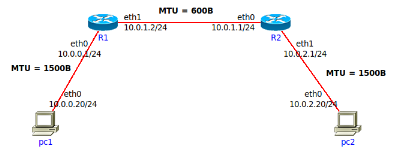
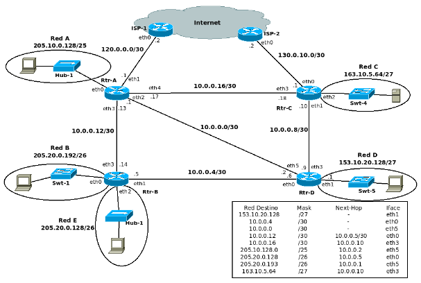
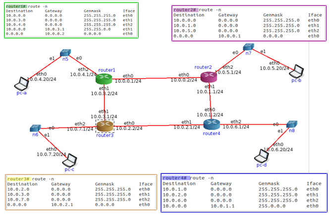

# Práctica 8 - Capa de Red - Ruteo

# Recomendación

## 1. Al final de la práctica se encuentra un ejercicio para ser realizado en la herramienta CORE. Si bien el ejercicio no agrega conceptos nuevos a los vistos previamente recomendamos su resolución para que puedan configurar, probar y analizar todo lo aprendido en una simulación de una red

# Fragmentación

## 2. Se tiene la siguiente red con los MTUs indicados en la misma. Si desde pc1 se envía un paquete IP a pc2 con un tamaño total de 1500 bytes (cabecera IP más payload) con el campo Identification = 20543, responder:

- Indicar IPs origen y destino y campos correspondientes a la fragmentación cuando el paquete sale de pc1

  - IP Origen: 10.0.0.20/24
  - IP Destino: 10.0.2.20/24
  - Header: 20
  - Length: 1500
  - Identificación: 20543
  - DF Flag: 0
  - MF Flag: 0
  - Fragment offset: 0
  
- ¿Qué sucede cuando el paquete debe ser reenviado por el router R1?

  - El enlace entre el router R1 y R2 tiene un MTU de 600, por lo tanto, el paquete se fragmentará.

- Indicar cómo quedarían las paquetes fragmentados para ser enviados por el enlace entre R1 y R2.

  - Para fragmentar debemos tomar el MTU y restarle el valor del header (20B)
    - 600B - 20B = 580B
  - Después debemos encontrar el múltiplo de 8 más cercano a ese número y sumarle el header (que sería el tamaño total).
    - En este caso hay dos múltiplos cercanos, 584 y 576, pero usamos 576 ya que si le sumamos el header no se pasa de los 600B, por lo tanto, el Length sería de 596B
    - Entonces, en este caso vamos a tener dos fragmentos de 596B. Para el último fragmento vamos a tener 348 pero a ese último fragmento no se le suma 20 del header (por qué?).
  - Para el caso del offset, lo que tenemos que hacer es agarrar el Length obtenido, restarle el header (20) y dividirlo por 3, eso nos da 72.
  - El primer fragmento tendría offset 0
  - El último segmento tendría MF Flag en 0
  - La suma de los length de los fragmentos es igual al length del paquete original (1500B) + 20 * (#fragmentos - 1)

| Fragmento 1 | Fragmento 2 | Fragmento 3 |
|-------------|-------------|-------------|
| Header: 20  |  Header: 20 |  Header: 20 |
| Length: 596 | Length: 596 | Length: 348 |
|  ID: 20543  |  ID: 20543  |  ID: 20543  |
|  DF Flag: 0 |  DF Flag: 0 |  DF Flag: 0 |
|  MF Flag: 1 |  MF Flag: 1 |  MF Flag: 0 |
| Frag. offset: 0 | Frag. offset: 72 | Frag. offset: 144 |   

- ¿Dónde se unen nuevamente los fragmentos? ¿Qué sucede si un fragmento no llega?

  - Los fragmentos se vuelven a unir en los sistemas terminales. Si un fragmento se pierde, se tienen que retransmitir todos los fragmentos del paquete original.
  - Esto depende de los protocolos de las capas superiores, recordar que IP es Best-Effort. 

- Si un fragmento tiene que ser reenviado por un enlace con un MTU menor al tamaño del fragmento, ¿qué hará el router con ese fragmento?

  - En este caso, se vuelve a fragmentar en función del nuevo MTU.

# Ruteo

## 3. ¿Qué es el ruteo? ¿Por qué es necesario?

## 4. En las redes IP el ruteo puede configurarse en forma estática o en forma dinámica. Indique ventajas y desventajas de cada método.

## 5. Una máquina conectada a una red pero no a Internet, ¿tiene tabla de ruteo?

## 6. Observando el siguiente gráfico y la tabla de ruteo del router D, responder:

### a. ¿Está correcta esa tabla de ruteo? En caso de no estarlo, indicar el o los errores encontrados. Escribir la tabla correctamente (no es necesario agregar las redes que conectan contra los ISPs)

### b. Con la tabla de ruteo del punto anterior, Red D, ¿tiene salida a Internet? ¿Por qué? ¿Cómo lo solucionaría? Suponga que los demás routers están correctamente configurados, con salida a Internet y que Rtr-D debe salir a Internet por Rtr-C.

### c. Teniendo en cuenta lo aplicado en el punto anterior, si en Rtr-C estuviese la siguiente entrada en su tabla de ruteo qué sucedería si desde una PC en Red D se quiere acceder un servidor con IP 163.10.5.15.

| Red Destino | Mask | Next-Hop | Interface |
|-------------|------|----------|-----------|
| 163.10.5.0  | /24  | 10.0.0.9 |   eth1    |

### d. ¿Es posible aplicar sumarización en esa tabla, la del router Rtr-D? ¿Por qué? ¿Qué debería suceder para poder aplicarla?

### e. La sumarización aplicada en el punto anterior, ¿se podría aplicar en Rtr-B? ¿Por qué?

### f. Escriba la tabla de ruteo de Rtr-B teniendo en cuenta lo siguiente:

- Debe llegarse a todas las redes del gráfico
- Debe salir a Internet por Rtr-A
- Debe pasar por Rtr-D para llegar a Red D
- Sumarizar si es posible

### g. Si Rtr-C pierde conectividad contra ISP-2, ¿es posible restablecer el acceso a Internet sin esperar a que vuelva la conectividad entre esos dispositivos?

## 7. Evalúe para cada caso si el mensaje llegará a destino, saltos que tomará y tipo de respuesta recibida el emisor

- Un mensaje ICMP enviado por PC-B a PC-C.
- Un mensaje ICMP enviado por PC-C a PC-B.
- Un mensaje ICMP enviado por PC-C a 8.8.8.8.
- Un mensaje ICMP enviado por PC-B a 8.8.8.8.