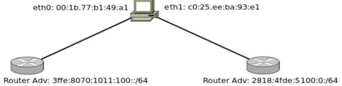

# Practica 9 - Capa de red - IPv6

# IPv6

## 1. ¿Qué es IPv6? ¿Por qué es necesaria su implementación?

- IPv6 es otra implementación del protocolo IP.
- Su implementación es necesaria ya que es una solución permanente a los problemas de IPv4 (escasez de direcciones IP, tablas de ruteo muy grandes, overloading en los routers).

## 2. ¿Por qué no es necesario el campo Header Length en IPv6?

- El campo *Header Length* no es necesario ya que el header de IPv6 es siempre del mismo tamaño (40 bytes)

## 3. ¿En qué se diferencia el checksum de IPv4 e IPv6? Y en cuánto a los campos checksum de TCP y UDP, ¿sufren alguna modificación en cuanto a su obligatoriedad de cálculo?

- IPv4 tiene un campo checksum, IPv6 no (por lo tanto no ofrece detección de errores). Sin embargo, es necesario que en el protocolo superior se use el campo (tanto TCP como UDP).

## 4. ¿Qué sucede con el campo Opciones en IPv6? ¿Existe, en IPv6, algún forma de enviar información opcional?

- El campo *Options* en IPv6 no existe, es reemplazado por el campo *Next Header* que es similar al options ya que permite añadir ciertas opciones a IPv6.

## 5. Si quisiese que IPv6 soporte una nueva funcionalidad, ¿cómo lo haría?

- Utilizando el propio *Next Header*, de este modo podemos dotar de más funcionalidades a IPv6 "encadenando" servicios a través de dicho campo.

## 6. ¿Es necesario el protocolo ICMP en IPv6? ¿Cumple las mismas funciones que en IPv4?

- Si, ICMP (formalmente ICMPv6 en IPv6) es necesario en IPv6.
- Cumple las mismas funciones que en IPv4 pero además tiene otras nuevas funcionalidades para los servicios de ND y manejo de grupos de multicast.

## 7. Transforme las siguientes direcciones MACs en Identificadores de Interfaces de 64 bits.

- 00:1b:77:b1:49:a1
    - 1) Cambiar el 7mo bit del primer bit.
        - 02:1b:77:b1:49:a1
    - 2) Poner fffe en el medio.
        - 02:1b:77:ff:fe:b1:49:a1
    - 3) Colocar el prefijo fe80::
        - fe80::021b:77ff:feb1:49a1
- e8:1c:23:a3:21:f4
    - 1) Cambiar el 7mo bit del primer bit.
        - ea:1c:23:a3:21:f4
    - 2) Poner fffe en el medio.
        - ea:1c:23:ff:fe:a3:21:f4
    - 3) Colocar el prefijo fe80::
        - fe80::ea1c:23ff:fea3:21f4

## 8. ¿Cuál de las siguientes direcciones IPv6 no son válidas?

- 2001:0:1019:afde::1 
- 2001::1871::4 ❌ => Solo puede haber "::" una sola vez
- 3ffg:8712:0:1:0000:aede:aaaa:1211 ❌ => En hexadecimal no hay g.
- 3::1
- ::
- 2001::
- 3ffe:1080:1212:56ed:75da:43ff:fe90:affe
- 3ffe:1080:1212:56ed:75da:43ff:fe90:affe:1001 ❌ => Son más de 128 bits (144).

## 9. ¿Cuál sería una abreviatura correcta de 3f80:0000:0000:0a00:0000:0000:0000:0845?

- 3f80::a00::845
- 3f80::a:845
- 3f80::a00:0:0:0:845:4567
- 3f80:0:0:a00::845 ✅
- 3f8:0:0:a00::845

## 10 Indique si las siguientes direcciones son de link-local, global-address, multicast, etc.

- fe80::1/64 -> Link-local
- 3ffe:4543:2:100:4398::1/64 -> Global-address
- :: -> Any
- ::1 -> Loopback
- ff02::2 -> Multicast
- 2818:edbc:43e1::8721:122 -> Global-address
- ff02::9 -> Multicast

## 11. Dado el siguiente diagrama, ¿qué direcciones IPv6 será capaz de autoconfigurar el nodo A en cada una de sus interfaces?

- eth0: 00:1b:77:b1:49:a1
    - IID: 02:1b:77:ff:fe:b1:49:a1
    - Dirección IPv6 Link-Local: fe80::021b:77ff:feb1:49a1
    - Dirección IPv6 Global: 3ffe:8070:1011:100::021b:77ff:feb1:49a1
- eth1: c0:25:ee:ba:93:e1
    - IID: c2:25:ee:ff:fe:ba:93:e1
    - Dirección IPv6 Link-Local: fe80::c225:eeff:feba:93e1
    - Dirección IPv6 Global: 2818:4fde:5100:0:c225:eeff:feba:93e1

## 12. Al autogenerarse una dirección IPv6 sus últimos 64 bits en muchas ocasiones no se deducen de la dirección MAC, se generan de forma random, ¿por qué sucede esto? ¿Qué es lo que se intenta evitar? (Ver direcciones temporarias, RFC 8981)

- Es una mecanismo para solventar la privacidad y seguridad.
- Esto sucede para evitar la relación directa entre la dirección MAC del dispositivo y su dirección IPv6, ya que de esta forma se podría rastrear la identidad de un dispositivo fácilmente.
- En la RFC-8981 (también la leí 🤓) se propusó la idea de las *direcciones temporales* (que ya se habían hablado en la RFC-4941). Permiten generar los últimos 64 bits de una dirección IPv6 de forma aleatoria, dificultando el rastreo de un dispositivo lo que mejora la privacidad/seguridad del usuario.