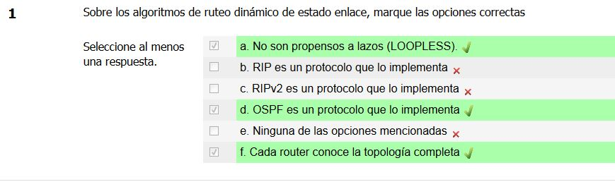
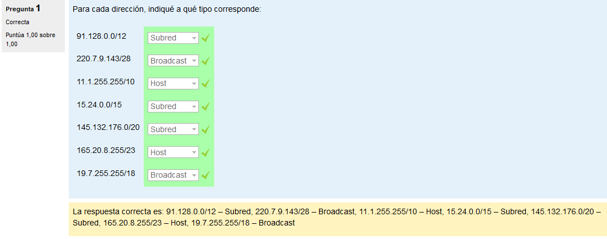
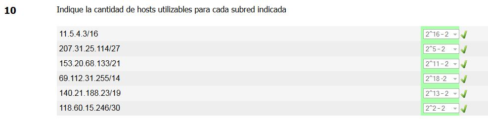

# Repaso - Capa de Red

## 1.

Inciso 1

- Por defecto, la máscara de 200.5.3.0 es /24 (al ser de clase C).
- Para 5 subredes se necesitan 3 bits (recordar que para subredes se empieza desde los más significativos).
- Por lo tanto necesitamos 3 bits para subred (2³ subredes). La máscara que nos queda es /27
- Esos 3 bits son 128, 64 y 32. Por lo tanto, las direcciones de subred válidas serán aquellos donde esos 3 bits esten activos/inactivos.
- Respuesta: 1a, 1b, 1c y 1i.

Inciso 2

- Respuesta: 1d, 1e.

## 2.

- Respuesta: 1a, 1b, 1d, 1f.

## 3.

01011011 100000000
11111111 111100000

- 91.128.0.0/12
  - Por defecto, su máscara sería /8 ya que es de clase A. Tiene una máscara de /12, por lo que podría ser de subred.
  - Si lo llevamos a binario, vemos que todos los bits de host están en 0, por lo tanto la dirección es de subred.
- 200.7.9.143/28
  - Si llevamos la dirección a binario, vemos que todos los bits de host están en 1, por lo tanto se trata de la dirección de broadcast.
- 11.1.255.255/10
  - Algunos bits de host están en 1, por lo tanto se trada de una dirección de host.
- 15.24.0.0/15
  - Todos los bits de host están en 0, por lo tanto se trata de una dirección de subred.
- 145.132.175.0/20
  - 
  
# 4.

