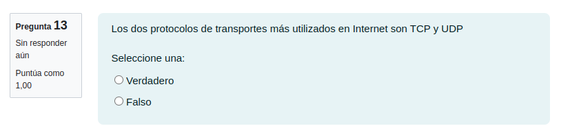

# Repaso examen 2021

## 1.-

Servicios de TCP:
- Control de errores.
- Control de flujo.
- Control de congestión.
- Full Duplex.
- Mux/Demux.

Servicios de UDP:
- Detección de errores.
- Full Duplex.
- Mux/Demux

## 2.-

- La D es correcta.

## 3.-

- La A, la C y la E son correctas.

## 4.-

- La A, la C y la H son correctas.

## 5.-

- La B es correcta.

## 6.-

- La D es correcta.

## 7.-

- La opción B y C son correctas.

## 8.-

- La opción B y la opción D son correctas.

## 9.-

- El campo Window tendrá 1024 bytes.

## 10.-

- La opcion C, la F, la G, la I y la J son correctas.

## 11.-

- El número de ACK sería 121 (o 122 si fuera expectante)

## 12.-

- Falso

## 13.-

- Verdadero

# Repaso examen 2023 (1er semestre)

1.
- La opción D es correcta

2.
- La opción A, B, D, E y F son correctas.

3.
- La opcion A, B, C, E son correctas.

4.
- La opción B, C, y H son correctas.

5.
- La opción A y la D son correctas.

6.
- La opción A y la E son correctas.

7.
- La opción C es correcta.

8.
- La opción A y la C son correctas.

9.
- La opción B, la C, la D y la F son correctas.

10.
- La opción A y B son correctas.